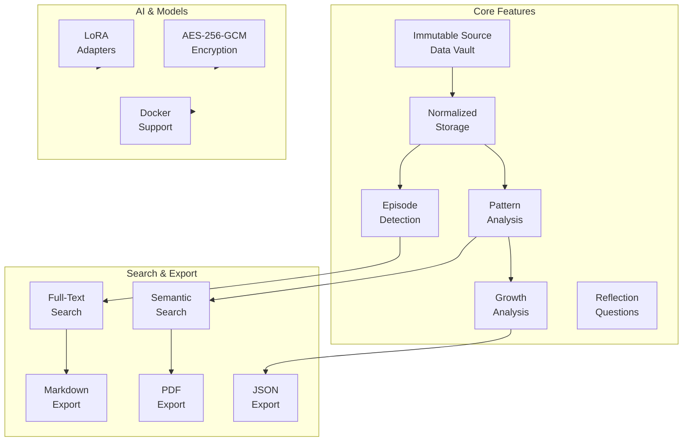
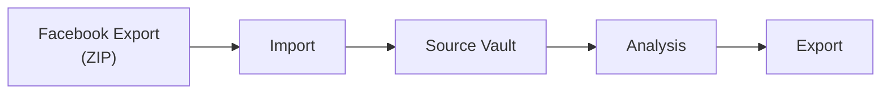
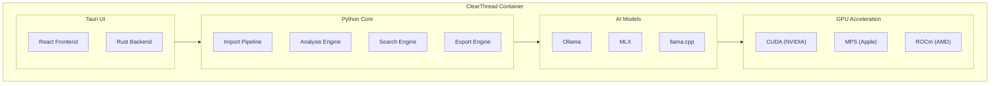

# ClearThread

Local-first desktop application for analyzing Facebook/Messenger data exports with AI-powered pattern detection, episode reconstruction, and therapy brief generation.

## Features



- **Immutable Source Data Vault**: Original data never modified
- **Normalized Storage**: Source-independent canonical storage with referential integrity
- **Episode Detection**: Time-gap analysis, semantic clustering, entity/topic continuity
- **Pattern Analysis**: 12+ communication patterns with counterexample search
- **Growth Analysis**: Patterns That Protected Me, People Who Showed Up, Growth Across Time
- **Reflection Questions**: Non-directive, data-element referencing
- **Full-Text and Semantic Search**: TF/recency ranking, cosine similarity
- **Export**: Markdown, PDF (A4/Letter), JSON
- **LoRA Adapters**: Modular AI for text, vision, and image analysis
- **Encryption**: AES-256-GCM at-rest encryption
- **Docker Support**: CUDA/MPS/ROCm GPU support

## Installation

```bash
pip install clearthread
```

## Usage

```bash
# Import Facebook data export
clearthread import path/to/export.zip

# Run analysis
clearthread analyze

# Search
clearthread search "keyword"

# Export
clearthread export --format markdown
```



## Development

```bash
# Install dependencies
pip install -e ".[dev]"

# Run tests
pytest

# Lint
ruff check
mypy src/
```

## Docker

```bash
docker-compose up -d
```



## Documentation

- [Architecture Overview](docs/docs/architecture-overview.md)
- [Developer Guide](docs/docs/developer-guide.md)
- [User Guide](docs/docs/user-guide.md)
- [API Reference](docs/docs/api-reference.md)
- [Getting Started](docs/docs/getting-started.md)
- [FAQ](docs/docs/faq.md)
- [Contributing](docs/docs/contributing.md)
- [Tasks & Roadmap](docs/tasks.md)
- [Design Specifications](docs/design.md)
