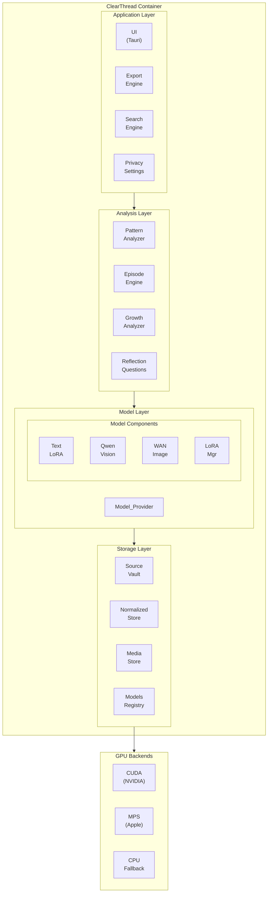
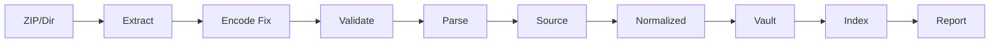
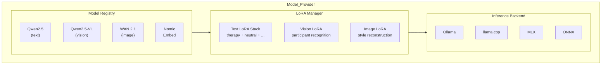
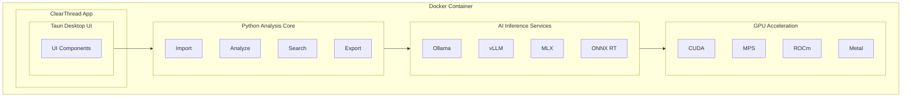
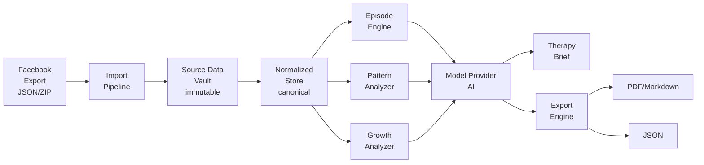

# ClearThread Architecture

## System Overview

ClearThread is a **local-first desktop application** packaged as a **Docker container** with CUDA/MPS GPU support for AI inference. It processes Facebook/Messenger data exports to produce evidence-backed relationship timelines, therapy briefs, and pattern analysis.



## Component Architecture

### 1. Import Pipeline



**Key responsibilities:**
- Extract Facebook Messenger JSON exports (ZIP or directory)
- Fix Latin-1 encoding trap (`.encode('latin1').decode('utf-8)`)
- Parse `posts_1.json` and `message_1.json` schemas
- Handle file splitting (message_1.json, message_2.json, etc.)
- Handle missing keys (use safe `.get()`)
- Deduplicate messages by SHA-256 hash
- Stream large archives (peak memory < 256 MB)
- Generate Data Health Report

### 2. Storage Architecture

```
clearthread_data/
├── source_data/                    # Immutable source (R2)
│   ├── batches/
│   │   └── <batch_id>/
│   │       ├── posts_1.json        # Original file
│   │       ├── message_1.json      # Original file
│   │       └── manifest.json       # Import metadata
│   └── manifest.db                 # SQLite index
│
├── normalized/                     # Canonical store (R3)
│   ├── messages.db                 # SQLite with normalized messages
│   ├── participants.db             # Participant identities
│   ├── conversations.db            # Conversation graph
│   ├── embeddings/                 # Vector embeddings
│   │   └── <content_hash>.bin      # Content-addressed embeddings
│   └── index/                      # Search indexes
│       ├── fulltext/
│       └── semantic/
│
├── media/                          # Extracted images/videos
│   ├── images/
│   │   └── <conversation>/<timestamp>_<sender>_<id>.<ext>
│   ├── videos/
│   │   └── <conversation>/<timestamp>_<sender>_<id>.<ext>
│   └── manifest.json               # Media-to-messages mapping
│
├── models/                         # AI models and personas
│   ├── base/                       # Base models
│   │   ├── qwen2.5-7b/
│   │   ├── qwen2.5-vl-3b/
│   │   ├── wan2.1-1.3b/
│   │   └── nomic-embed-text/
│   ├── tuned/                      # Fine-tuned models
│   │   └── <model_name>-<version>/
│   ├── lora/                       # LoRA adapters
│   │   ├── text/                   # Text analysis LoRA
│   │   │   ├── therapy_focused.safetensors
│   │   │   ├── neutral_tone.safetensors
│   │   │   └── growth_bias.safetensors
│   │   ├── qwen_vision/            # Qwen vision LoRA
│   │   │   └── <participant_id>.safetensors
│   │   └── wan_image/              # WAN image LoRA
│   │       └── <style_id>.safetensors
│   └── personas/                   # Saved persona configs
│       └── <persona_name>.json
│
├── analysis/                       # Analysis results
│   ├── episodes/
│   ├── findings/
│   ├── chapters/
│   └── briefs/
│
├── provenance/                     # Provenance records (R13)
│   └── runs/
│       └── <run_id>.json
│
└── config/                         # Application config
    ├── settings.json
    └── encryption.key
```

### 3. Model Provider Architecture



### 4. Docker Container Architecture



## Technology Stack

| Layer | Technology | Rationale |
|-------|-----------|-----------|
| **UI Framework** | Tauri (Rust + Web) | Lightweight, fast, native feel |
| **Analysis Core** | Python 3.10+ | Rich AI/ML ecosystem |
| **Storage** | SQLite (with encryption) | Local, ACID, encrypted |
| **Vector Index** | FAISS / hnswlib | Fast semantic search |
| **AI Backend** | Ollama (primary), llama.cpp, MLX | Local inference, LoRA support |
| **Base Models** | Qwen2.5 (text), Qwen2.5-VL (vision), WAN 2.1 (image) | Open, efficient, LoRA-compatible |
| **LoRA Format** | safetensors / gguf | Standard, portable |
| **Container** | Docker (multi-stage) | Reproducible builds |
| **GPU** | CUDA (NVIDIA), MPS (Apple), ROCm (AMD) | Cross-platform GPU acceleration |
| **Encryption** | AES-256-GCM | Application-level encryption |
| **Packaging** | Docker + platform installers | Container-first, deployable anywhere |

## Data Flow



## Key Design Decisions

1. **Container-First**: Docker container with CUDA/MPS support for consistent AI inference across platforms
2. **Local-Only by Default**: All analysis runs locally; remote models require explicit opt-in
3. **Immutable Source**: Original data never modified; all transformations tracked
4. **Modular AI**: Text, vision, and image analysis are independent but composable via LoRA
5. **Plugin Architecture**: Import pipeline and analysis modules are pluggable
6. **Provenance-First**: Every derived object tracks its full processing chain
7. **Trauma-Aware UX**: Content protection defaults, easy exit, deferral mechanisms
