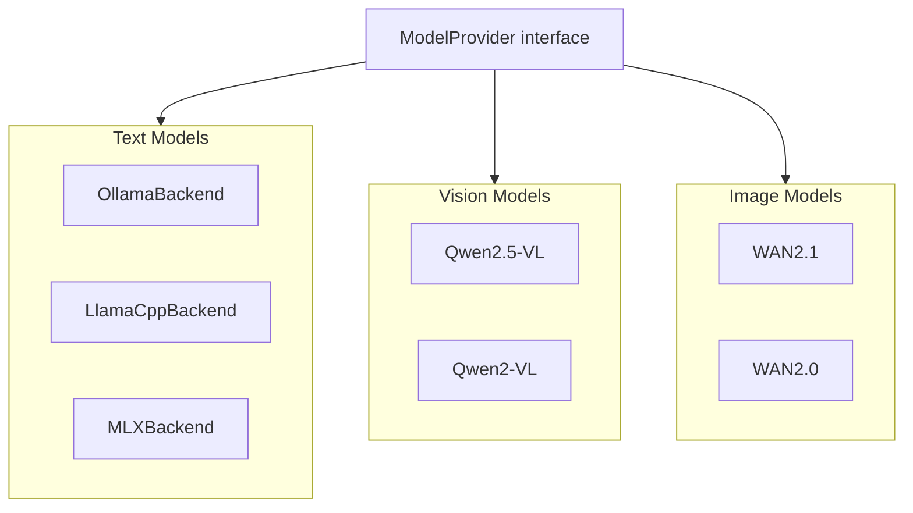
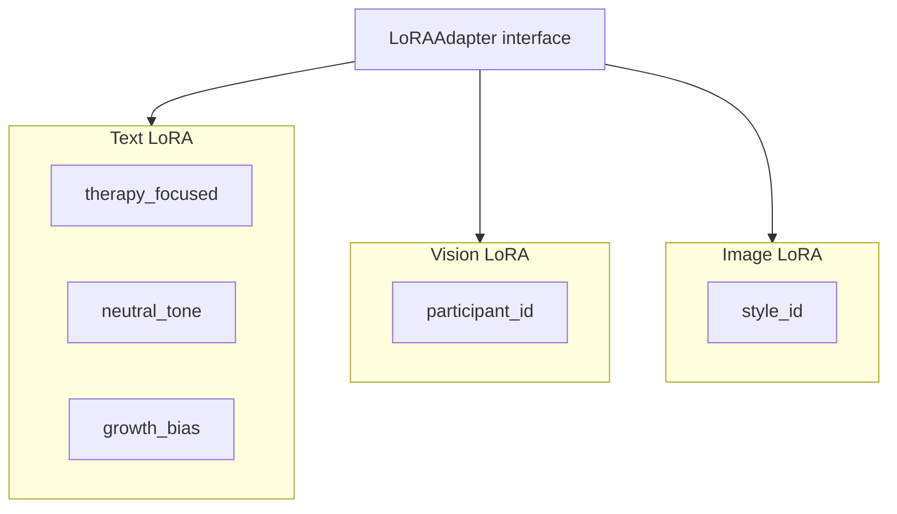
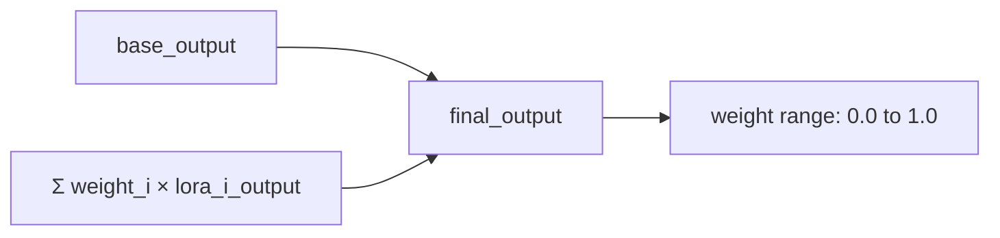
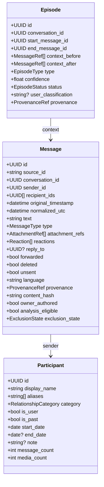
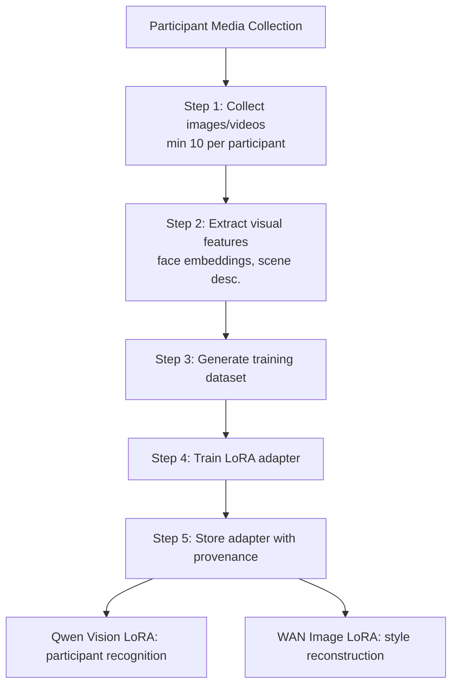
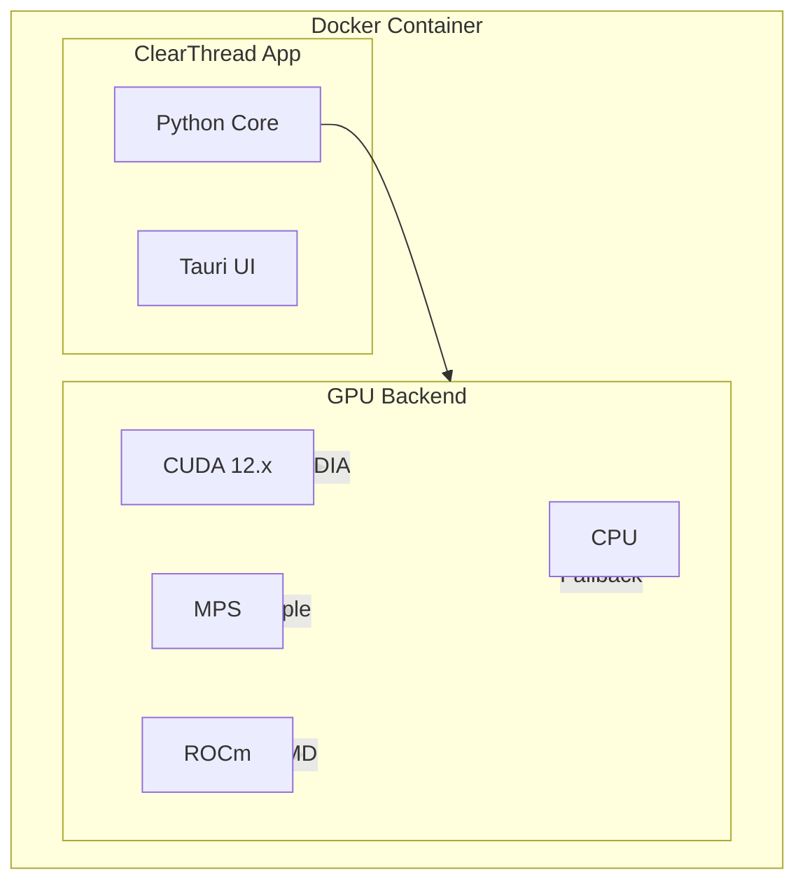

# ClearThread Design Document

## 1. Design Goals

1. **Local-first**: All data and analysis stay on-device by default
2. **Privacy-preserving**: Encryption at rest, no external data transmission
3. **Modular AI**: Text, vision, and image analysis are independent but composable
4. **Container-native**: Docker-first deployment with CUDA/MPS GPU support
5. **Extensible**: Plugin-based architecture for new data sources and analysis modules
6. **Trauma-aware**: Content protection defaults, easy exit, deferral mechanisms

## 2. System Design

### 2.1 Container Structure

```dockerfile
# Multi-stage Dockerfile
FROM python:3.12-slim AS base
# Install system dependencies
RUN apt-get update && apt-get install -y \
    libsqlite3-0 \
    libgl1 \
    libglib2.0-0 \
    && rm -rf /var/lib/apt/lists/*

# Install GPU libraries
ARG CUDA_VERSION=12.2.2
FROM nvidia/cuda:${CUDA_VERSION}-devel-ubuntu22.04 AS gpu-base

# Install Tauri runtime
FROM rust:1.75 AS tauri-builder
RUN cargo install tauri-cli

# Final image
FROM base AS final
COPY --from=gpu-base /usr/local/cuda /usr/local/cuda
COPY --from=tauri-builder /usr/local/cargo/bin/tauri /usr/local/bin/tauri
COPY app/ /app/
WORKDIR /app
CMD ["tauri", "dev"]
```

### 2.2 GPU Support Matrix

| Platform | GPU Backend | Docker Support | Notes |
|----------|------------|----------------|-------|
| NVIDIA Linux | CUDA 12.x | Native via nvidia-container-toolkit | Primary target |
| Apple Silicon | MPS | Native via Docker Desktop | Metal backend |
| AMD Linux | ROCm | Native via ROCm Docker | Secondary target |
| Windows | CUDA / DirectML | Via Docker Desktop | WSL2 recommended |

### 2.3 Model Provider Design



### 2.4 LoRA Architecture



**LoRA Composition Formula:**



Where each `weight_i` is in range [0.0, 1.0].

### 2.5 Data Model



### 2.6 Persona Configuration Schema

```json
{
  "persona": {
    "id": "uuid",
    "name": "string (max 120 chars)",
    "description": "string",
    "base_model": "qwen2.5-7b | qwen2.5-vl-3b | wan2.1-1.3b",
    "text_adapters": [
      {
        "adapter_id": "uuid",
        "file_path": "models/lora/text/therapy_focused.safetensors",
        "weight": 0.8,
        "task": "classification | embedding | reasoning | summarization"
      }
    ],
    "vision_adapter": {
      "adapter_id": "uuid",
      "file_path": "models/lora/qwen_vision/participant_123.safetensors",
      "weight": 0.9,
      "model": "qwen2.5-vl"
    },
    "image_adapter": {
      "adapter_id": "uuid",
      "file_path": "models/lora/wan_image/style_456.safetensors",
      "weight": 0.7,
      "model": "wan2.1"
    },
    "config": {
      "temperature": 0.7,
      "context_length": 4096,
      "max_evidence_window": 50,
      "prompt_version": "v2.1"
    },
    "provenance": {
      "created_at": "timestamp",
      "updated_at": "timestamp",
      "training_data_count": 150,
      "model_version": "string"
    }
  }
}
```

## 3. Facebook Data Schema

### 3.1 Posts Schema (`posts_1.json`)

```json
[
  {
    "timestamp": 1715423400,
    "attachments": [
      {
        "data": [
          {
            "media": {
              "uri": "posts/media/YourPhotos_abc123/image.jpg",
              "creation_timestamp": 1715423390,
              "title": "Summer Trip"
            }
          }
        ]
      }
    ],
    "data": [
      {
        "post": "This is the text content of your timeline post."
      }
    ],
    "title": "John Doe updated his status."
  }
]
```

### 3.2 Messages Schema (`messages/inbox/[chat]/message_1.json`)

```json
{
  "participants": [
    { "name": "John Doe" },
    { "name": "Jane Smith" }
  ],
  "messages": [
    {
      "sender_name": "John Doe",
      "timestamp_ms": 1715423582000,
      "content": "Are you joining the research seminar?",
      "type": "Generic",
      "is_unsent": false,
      "is_taken_down": false,
      "bumped_by_messenger_notification": false,
      "reactions": [
        { "reaction": "👍", "actor": "Jane Smith" }
      ],
      "photos": [
        {
          "uri": "messages/inbox/janesmith_123/photos/slide.jpg",
          "creation_timestamp": 1715423605
        }
      ]
    }
  ],
  "title": "Jane Smith",
  "is_still_participant": true,
  "thread_type": "Regular",
  "thread_path": "messages/inbox/janesmith_123",
  "magic_words": []
}
```

### 3.3 Encoding Fix

```python
def fix_facebook_encoding(raw_bytes: bytes) -> str:
    """Fix the Latin-1 escape sequence in Facebook JSON exports."""
    return raw_bytes.encode('latin-1').decode('utf-8')
```

## 4. AI Persona Design

### 4.1 Text Personas

| Persona | Base Model | Text LoRA Stack | Vision LoRA | Image LoRA | Use Case |
|---------|-----------|-----------------|-------------|------------|----------|
| Neutral Observer | Qwen2.5-7B | neutral_tone (0.8) | - | - | General analysis |
| Therapy-Ready | Qwen2.5-7B | therapy_focused (0.9) + reflection_questions (0.7) | - | - | Therapy prep |
| Growth-Oriented | Qwen2.5-7B | growth_bias (0.85) + positive_framing (0.75) | - | - | Resilience focus |
| Detail-Heavy | Qwen2.5-7B | detail_oriented (0.9) + wider_context (0.6) | - | - | Deep analysis |
| Participant Focused | Qwen2.5-VL | neutral_tone (0.7) | participant_recognition (0.9) | - | Media-rich |
| Visual Storyteller | Qwen2.5-VL | therapy_focused (0.8) | participant_recognition (0.8) | style_reconstruction (0.85) | Visual narratives |

### 4.2 LoRA Training Pipeline



### 4.3 Model Tuning vs. LoRA

| Aspect | Full Tuning | LoRA |
|--------|------------|------|
| **Size** | Full model weights (7B+ params) | Lightweight matrices (1-5% of model) |
| **Storage** | ~14 GB per model | ~100 MB per adapter |
| **Training Time** | Hours | Minutes |
| **Composition** | One model at a time | Multiple adapters stacked |
| **Use Case** | Heavy customization | Modular, flexible |
| **Inference Overhead** | None (native) | ~5-10% |

## 5. Docker Configuration

### 5.1 Docker Compose

```yaml
version: '3.8'

services:
  clearthread:
    build:
      context: .
      dockerfile: Dockerfile
      args:
        CUDA_VERSION: 12.2.2
        PLATFORM: cuda  # cuda | mps | cpu
    volumes:
      - ./data:/app/data
      - ./models:/app/models
    environment:
      - CLEARTHREAD_DATA_DIR=/app/data
      - CLEARTHREAD_MODEL_DIR=/app/models
      - GPU_BACKEND=${GPU_BACKEND:-cuda}
    deploy:
      resources:
        reservations:
          devices:
            - driver: nvidia
              capabilities: [gpu]
    ports:
      - "1420:1420"  # Tauri dev port
```

### 5.2 GPU Detection

```python
class GPUBackend:
    CUDA = "cuda"
    MPS = "mps"
    ROCM = "rocm"
    CPU = "cpu"
    
    @classmethod
    def detect(cls) -> str:
        if torch.cuda.is_available():
            return cls.CUDA
        elif torch.backends.mps.is_available():
            return cls.MPS
        elif torch.cuda.is_available():  # ROCm
            return cls.ROCM
        return cls.CPU
```

### 5.3 GPU Support Architecture



## 6. File Structure

```
clearthread/
├── docs/
│   ├── architecture.md      # System architecture
│   ├── design.md            # This file
│   └── tasks.md             # Implementation tasks
├── src/
│   ├── import/              # Import pipeline
│   │   ├── parser.py
│   │   ├── encoder.py
│   │   └── validator.py
│   ├── storage/             # Storage layer
│   │   ├── source_vault.py
│   │   ├── normalized_store.py
│   │   └── media_store.py
│   ├── analysis/            # Analysis modules
│   │   ├── episode_engine.py
│   │   ├── pattern_analyzer.py
│   │   └── growth_analyzer.py
│   ├── models/              # AI model integration
│   │   ├── model_provider.py
│   │   ├── lora_manager.py
│   │   ├── qwen_vision.py
│   │   └── wan_image.py
│   ├── search/              # Search engine
│   │   ├── fulltext.py
│   │   └── semantic.py
│   ├── export/              # Export engine
│   │   ├── markdown.py
│   │   ├── pdf.py
│   │   └── json.py
│   └── ui/                  # UI components
│       └── tauri/
├── tests/
├── Dockerfile
├── docker-compose.yml
├── pyproject.toml
└── flake.nix
```
