# ClearThread API Reference

## Core Modules

### Import Pipeline

[`ImportPipeline`](src/clearthread/import_pipeline.py:69)

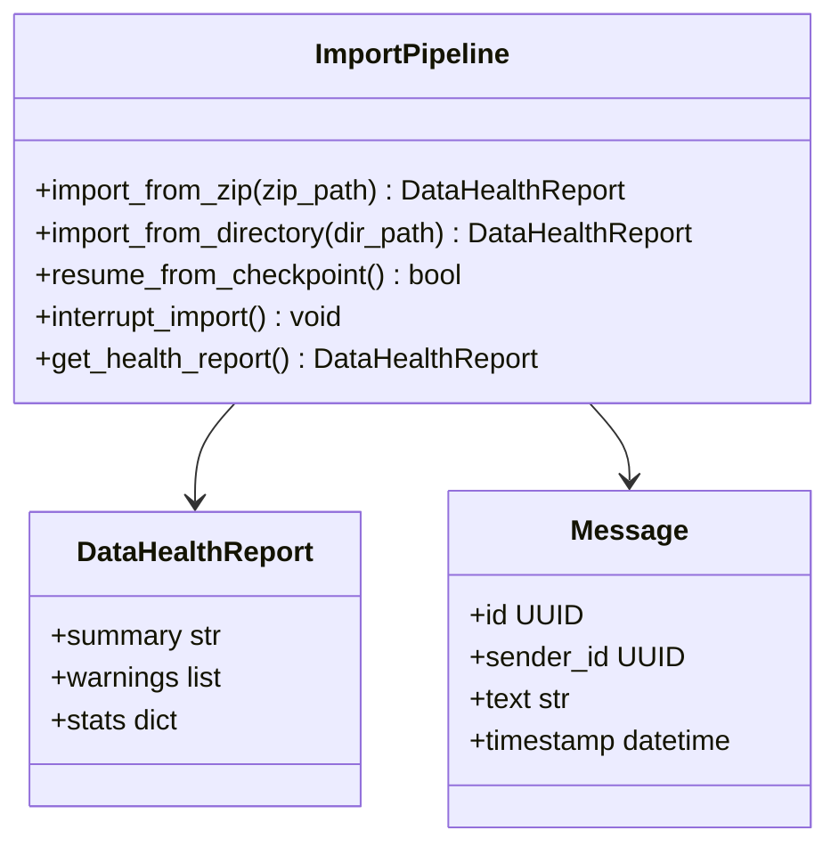

```python
class ImportPipeline:
    def import_from_zip(self, zip_path: Path) -> DataHealthReport
    def import_from_directory(self, dir_path: Path) -> DataHealthReport
    def resume_from_checkpoint(self) -> bool
    def interrupt_import(self) -> None
    def get_health_report(self) -> DataHealthReport
```

### Storage

[`SourceDataVault`](src/clearthread/storage/source_vault.py:70)

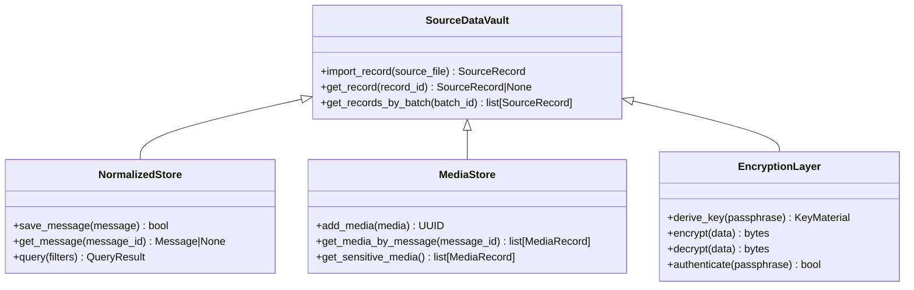

```python
class SourceDataVault:
    def import_record(self, source_file: Path) -> SourceRecord
    def get_record(self, record_id: UUID) -> SourceRecord | None
    def get_records_by_batch(self, batch_id: str) -> list[SourceRecord]

class NormalizedStore:
    def save_message(self, message: Message) -> bool
    def get_message(self, message_id: UUID) -> Message | None
    def query(self, filters: QueryFilter) -> QueryResult

class MediaStore:
    def add_media(self, media: MediaRecord) -> UUID
    def get_media_by_message(self, message_id: UUID) -> list[MediaRecord]
    def get_sensitive_media(self) -> list[MediaRecord]

class EncryptionLayer:
    def derive_key(self, passphrase: str) -> KeyMaterial
    def encrypt(self, data: bytes) -> bytes
    def decrypt(self, data: bytes) -> bytes
    def authenticate(self, passphrase: str) -> bool
```

### Analysis

[`EpisodeEngine`](src/clearthread/analysis/episode_engine.py:47)

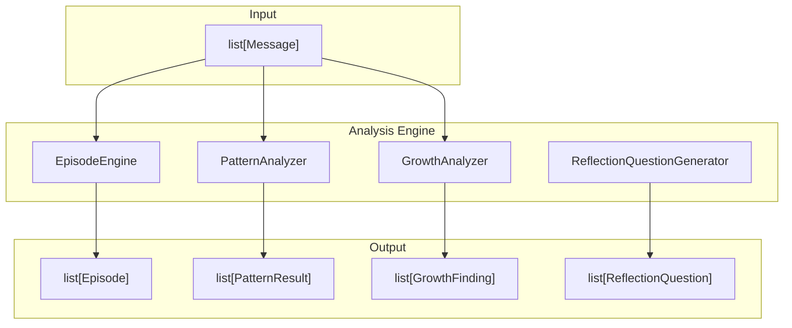

```python
class EpisodeEngine:
    def propose_episodes(self, messages: list[Message]) -> list[EpisodeProposal]
    def accept_episode(self, episode_id: UUID) -> bool
    def reject_episode(self, episode_id: UUID) -> bool
    def get_review_inbox(self, limit: int) -> list[Episode]

class PatternAnalyzer:
    def analyze(self, messages: list[Message]) -> list[PatternResult]
    def get_patterns_by_type(self, pattern_type: PatternType) -> list[PatternResult]

class GrowthAnalyzer:
    def analyze(self, messages: list[Message]) -> list[GrowthFinding]
    def get_growth_indicators(self) -> list[GrowthIndicator]
```

### Search

[`SearchEngine`](src/clearthread/search/engine.py:42)

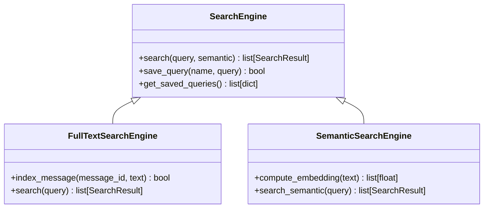

```python
class SearchEngine:
    def search(self, query: str, semantic: bool = False) -> list[SearchResult]
    def save_query(self, name: str, query: SearchQuery) -> bool
    def get_saved_queries(self) -> list[dict]
```

### Export

[`ExportEngine`](src/clearthread/export/engine.py:66)

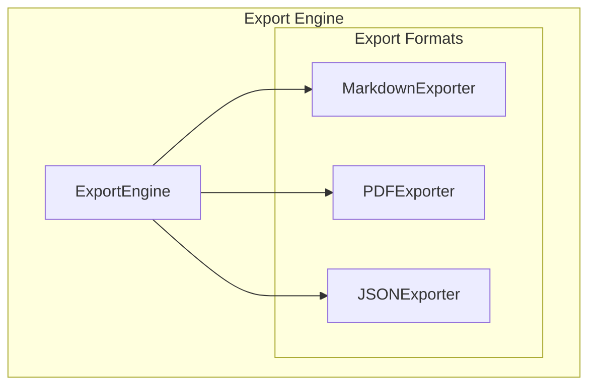

```python
class ExportEngine:
    def export(self, items: list[ExportItem], format: ExportFormat) -> Path
    def export_markdown(self, items: list[ExportItem]) -> Path
    def export_pdf(self, items: list[ExportItem]) -> Path
    def export_json(self, items: list[ExportItem]) -> Path
```

### Models

[`ModelProvider`](src/clearthread/models/model_provider.py:57)

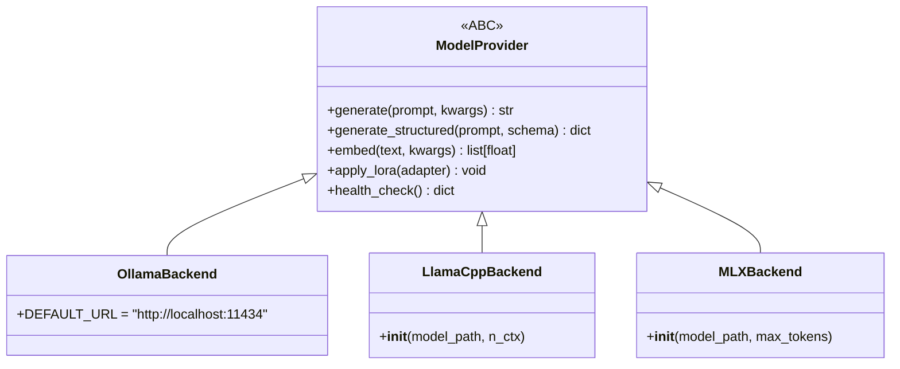

```python
class ModelProvider(ABC):
    def generate(self, prompt: str, **kwargs) -> str
    def generate_structured(self, prompt: str, schema: dict) -> dict
    def embed(self, text: str, **kwargs) -> list[float]
    def apply_lora(self, adapter: LoRAAdapter) -> None
    def health_check(self) -> dict

class OllamaBackend(ModelProvider):
    DEFAULT_URL = "http://localhost:11434"

class LlamaCppBackend(ModelProvider):
    def __init__(self, model_path: Path, n_ctx: int = 4096)

class MLXBackend(ModelProvider):
    def __init__(self, model_path: Path, max_tokens: int = 4096)
```

### LoRA

[`LoRAAdapter`](src/clearthread/models/lora.py:45)

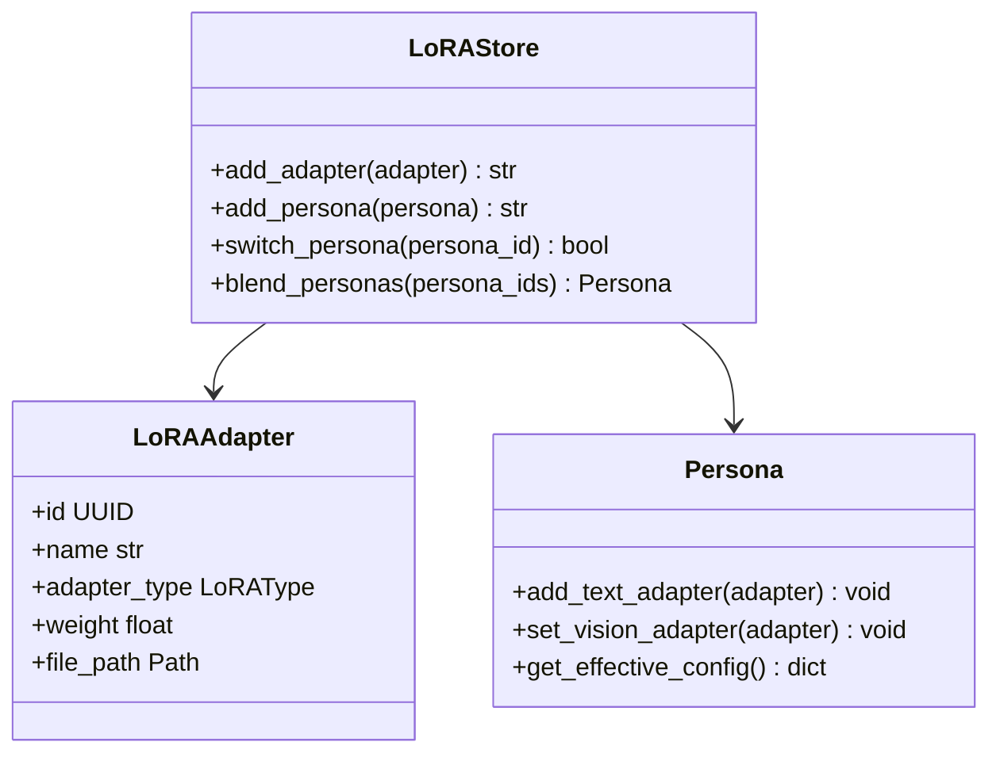

```python
class LoRAAdapter:
    id: UUID
    name: str
    adapter_type: LoRAType
    weight: float
    file_path: Path

class Persona:
    def add_text_adapter(self, adapter: LoRAAdapter)
    def set_vision_adapter(self, adapter: LoRAAdapter)
    def get_effective_config(self) -> dict

class LoRAStore:
    def add_adapter(self, adapter: LoRAAdapter) -> str
    def add_persona(self, persona: Persona) -> str
    def switch_persona(self, persona_id: UUID) -> bool
    def blend_personas(self, persona_ids: list[UUID]) -> Persona
```

## CLI Commands

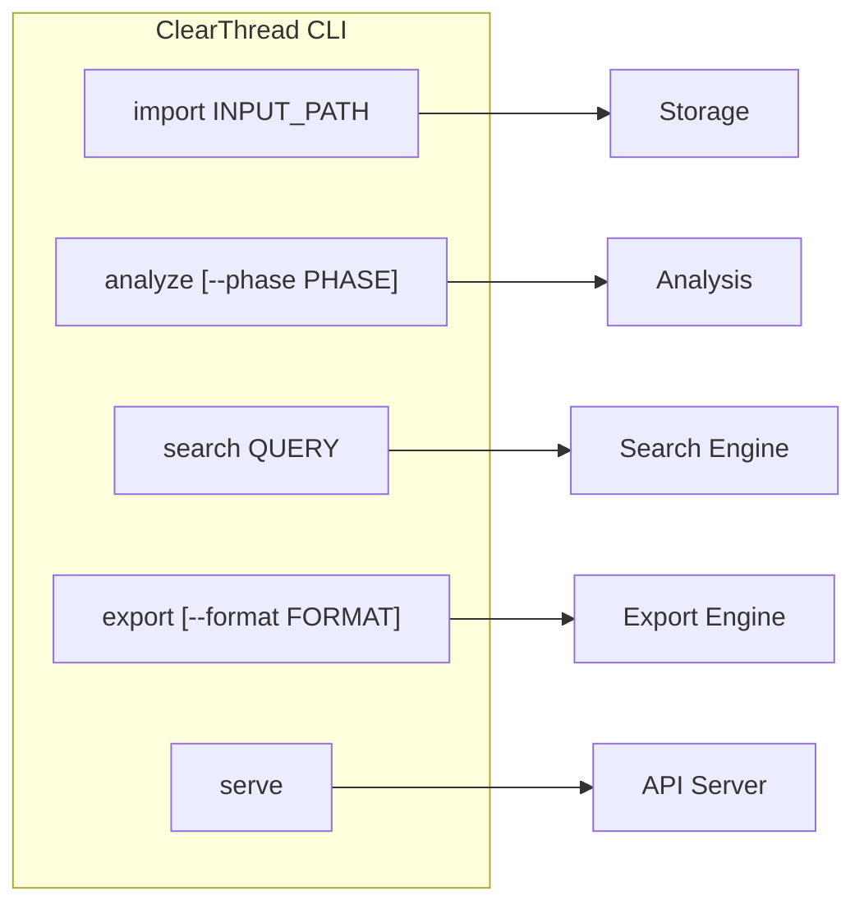

```bash
# Import data
clearthread import INPUT_PATH [--output-dir DIR] [--zip]

# Run analysis
clearthread analyze [--phase PHASE] [--output-dir DIR]

# Search
clearthread search QUERY [--semantic]

# Export
clearthread export [--format FORMAT] [--output-dir DIR]

# Start server
clearthread serve
```

## Data Models

### Message

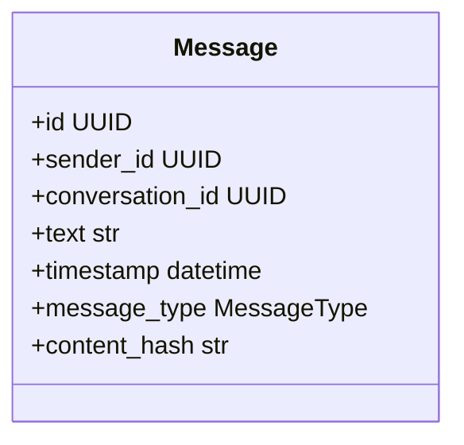

```python
@dataclass
class Message:
    id: UUID
    sender_id: UUID
    conversation_id: UUID
    text: str
    timestamp: datetime
    message_type: MessageType
    content_hash: str
```

### Participant

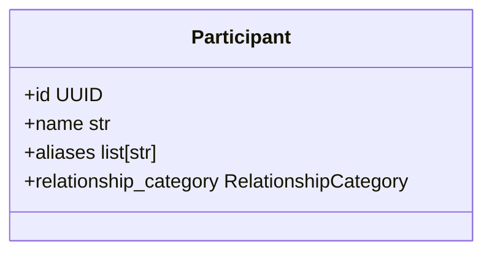

```python
@dataclass
class Participant:
    id: UUID
    name: str
    aliases: list[str]
    relationship_category: RelationshipCategory
```

### Episode

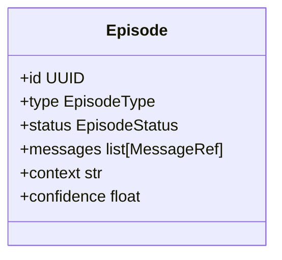

```python
@dataclass
class Episode:
    id: UUID
    type: EpisodeType
    status: EpisodeStatus
    messages: list[MessageRef]
    context: str
    confidence: float
```

### Finding

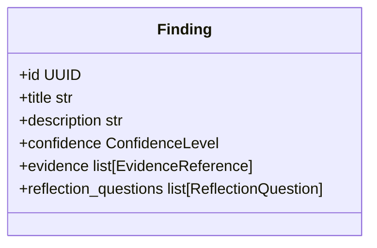

```python
@dataclass
class Finding:
    id: UUID
    title: str
    description: str
    confidence: ConfidenceLevel
    evidence: list[EvidenceReference]
    reflection_questions: list[ReflectionQuestion]
```
