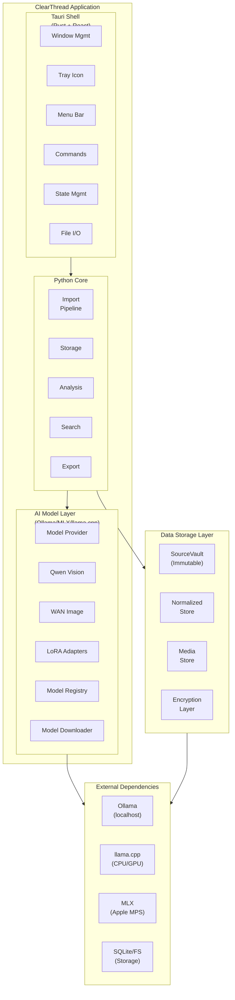
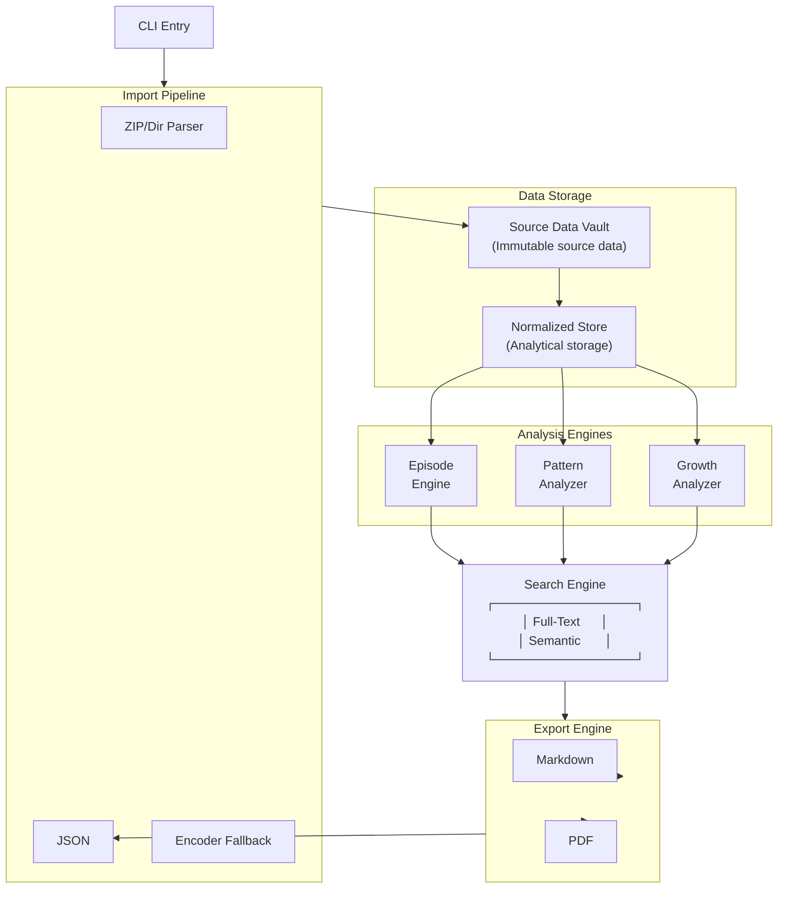
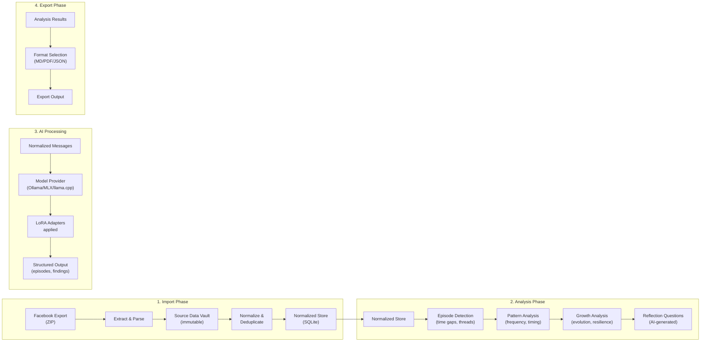

# ClearThread Architecture Overview

## System Architecture

## Component Diagram

## Data Flow

## Key Design Decisions

### Local-First

- All data stored locally in SQLite
- No cloud dependency for core functionality
- AI models can run locally (Ollama, MLX)

### Immutable Source

- Original Facebook exports preserved
- Source vault maintains raw data
- Re-imports are idempotent

### Modular AI

- Model provider abstraction allows swapping backends
- LoRA adapters for fine-tuning without retraining
- GPU acceleration optional

### Extensible Architecture

- Plugin-style command system in Tauri
- Python analysis pipeline is modular
- Storage backend can be swapped
