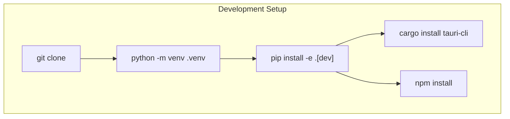
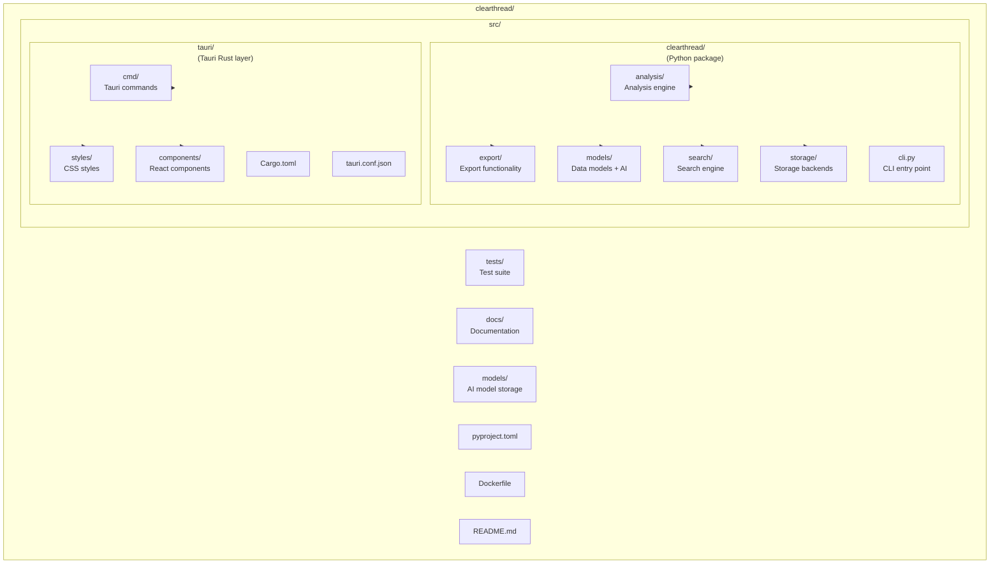
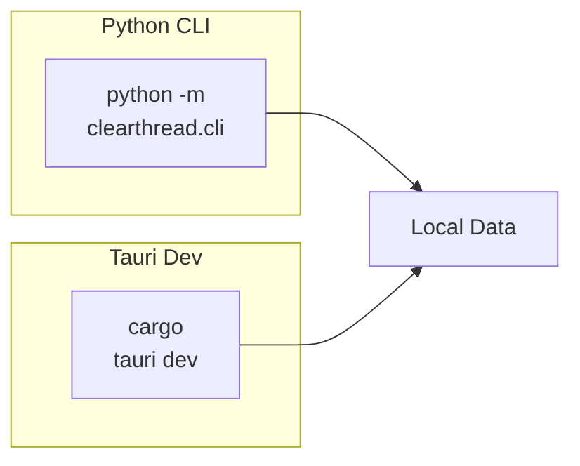
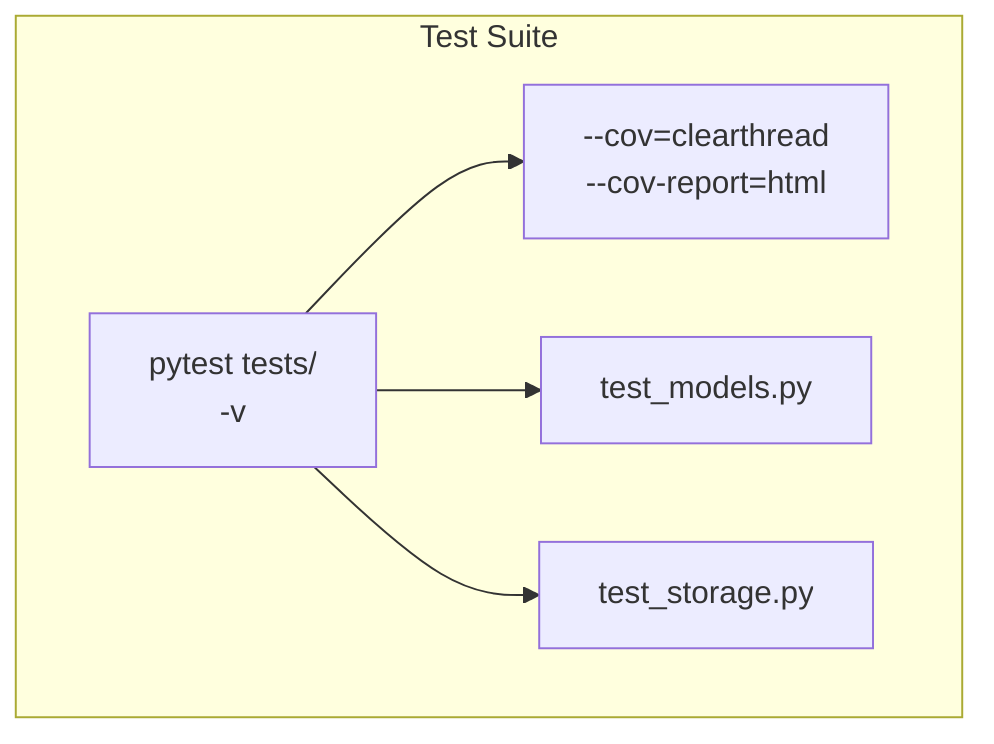
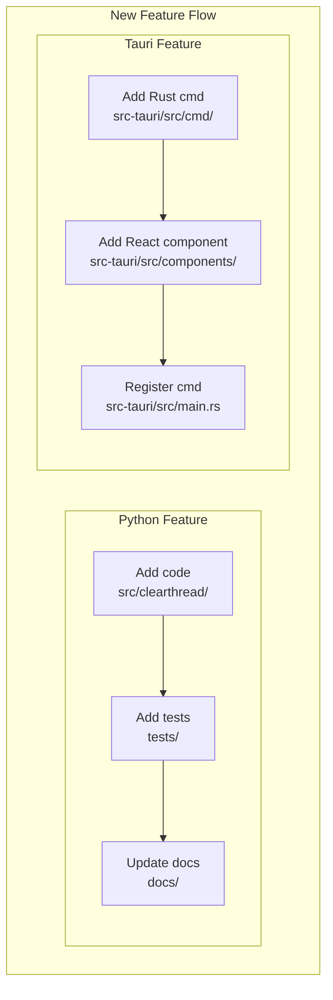
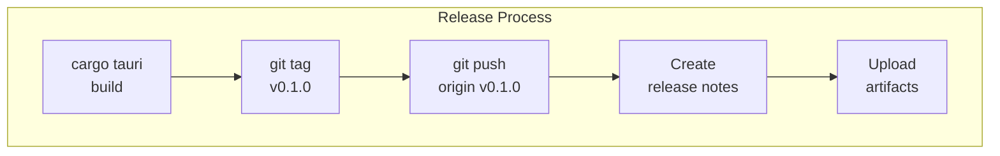

# Contributing to ClearThread

## Development Setup

### Prerequisites

- Python 3.10+
- Rust 1.77+
- Node.js 18+
- Docker (optional, for containerized development)

### Setting Up Your Environment



```bash
# Clone the repository
git clone https://github.com/celesrenata/clearthread.git
cd clearthread

# Create and activate virtual environment
python -m venv .venv
source .venv/bin/activate  # Linux/macOS
# .venv\Scripts\activate  # Windows

# Install dependencies
pip install -e ".[dev]"

# Install Tauri CLI
cargo install tauri-cli --version "^2.0"
cargo install tauri-bundler --version "^2.0"

# Install Node.js dependencies (for frontend)
cd src-tauri
npm install
cd ..
```

## Project Structure



```
clearthread/
├── src/
│   ├── clearthread/          # Python package
│   │   ├── analysis/         # Analysis engine
│   │   ├── export/           # Export functionality
│   │   ├── models/           # Data models + AI
│   │   ├── search/           # Search engine
│   │   ├── storage/          # Storage backends
│   │   └── cli.py            # CLI entry point
│   └── tauri/                # Tauri Rust layer
│       ├── src/
│       │   ├── cmd/          # Tauri commands
│       │   ├── styles/       # CSS styles
│       │   └── components/   # React components
│       ├── Cargo.toml
│       └── tauri.conf.json
├── tests/                    # Test suite
├── docs/                     # Documentation
├── models/                   # AI model storage
├── pyproject.toml
├── Dockerfile
└── README.md
```

## Development Workflow

### Running the Application



```bash
# Run Python CLI
python -m clearthread.cli

# Run Tauri in dev mode
cd src-tauri
cargo tauri dev
```

### Running Tests



```bash
# Run all tests
pytest tests/ -v

# Run with coverage
pytest tests/ --cov=clearthread --cov-report=html

# Run specific module tests
pytest tests/test_models.py -v
pytest tests/test_storage.py -v
```

### Code Quality

```bash
# Format code
ruff format src/clearthread

# Type checking
mypy src/clearthread

# Linting
ruff check src/clearthread

# Fix linting issues
ruff check --fix src/clearthread
```

## Adding a New Feature

### 1. Create a Branch

```bash
git checkout -b feature/your-feature-name
```

### 2. Implement Your Feature



For Python features:
1. Add code to the appropriate module in `src/clearthread/`
2. Add unit tests in `tests/`
3. Update documentation

For Tauri features:
1. Add Rust command in `src-tauri/src/cmd/`
2. Add React component in `src-tauri/src/components/`
3. Register command in `src-tauri/src/main.rs`

### 3. Write Tests

```python
# Example test structure
def test_your_feature():
    # Arrange
    setup = create_test_setup()
    
    # Act
    result = setup.your_function()
    
    # Assert
    assert result == expected_value
```

### 4. Update Documentation

- Update relevant docs in `docs/`
- Add docstrings to new functions
- Update API reference if needed

### 5. Submit a Pull Request

1. Push your branch
2. Create a Pull Request
3. Fill in the PR template
4. Address review comments

## Code Style

### Python

- Follow [PEP 8](https://peps.python.org/pep-0008/)
- Use type hints
- Write docstrings in Google style
- Maximum line length: 100 characters

### Rust

- Follow [Rust API Guidelines](https://rust-lang.github.io/api-guidelines/)
- Use `cargo fmt`
- Run `cargo clippy`

### TypeScript/React

- Use functional components
- Follow [React Hooks best practices](https://react.dev/reference/react)
- Use TypeScript strict mode

## Release Process

### Version Bumping

```bash
# Bump version
# Update pyproject.toml version
# Update Cargo.toml version
# Update tauri.conf.json version
```

### Creating a Release



```bash
# Build all targets
cargo tauri build

# Create GitHub release
# 1. Tag the release
git tag v0.1.0
git push origin v0.1.0

# 2. Create release notes
# 3. Upload artifacts
```

## Getting Help

- Check the [issues](https://github.com/celesrenata/clearthread/issues)
- Join the [discussions](https://github.com/celesrenata/clearthread/discussions)
- Read the [documentation](https://clearthread.readthedocs.io)
