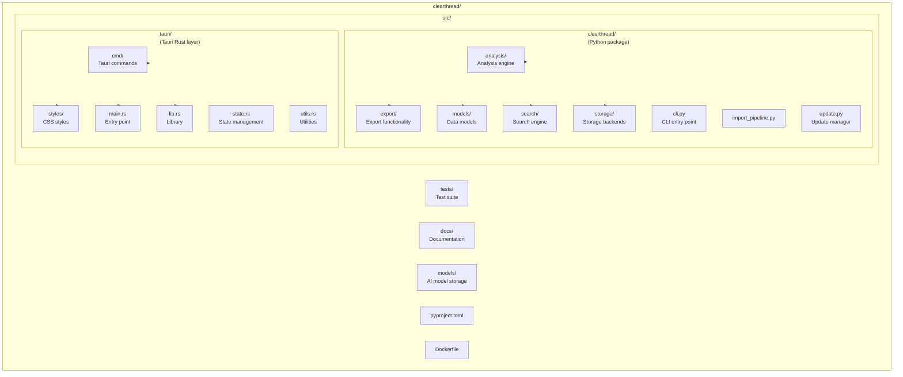
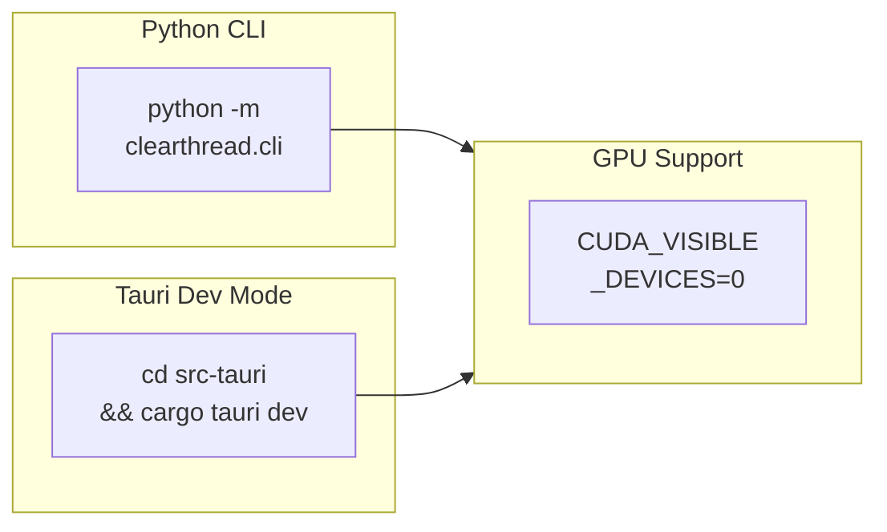
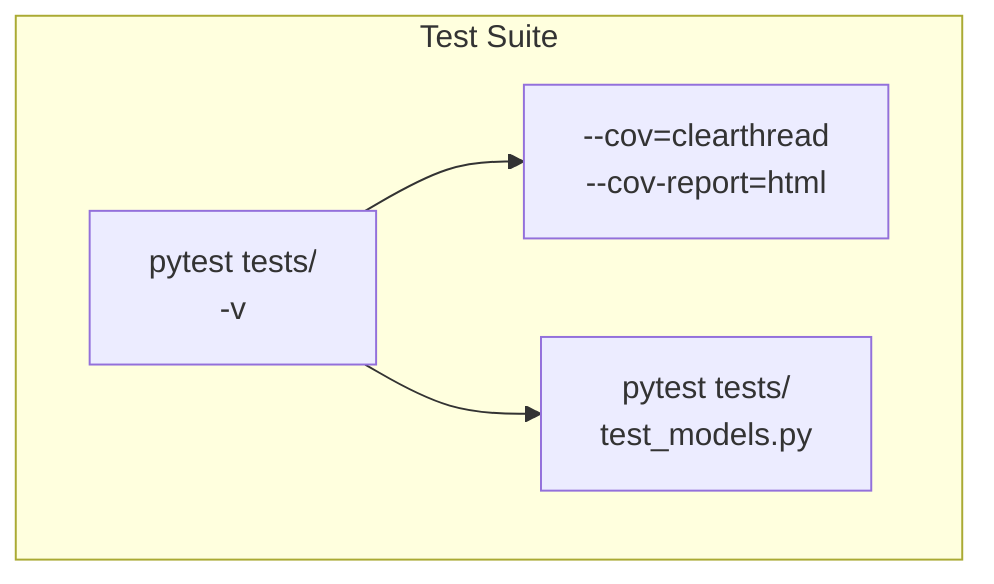
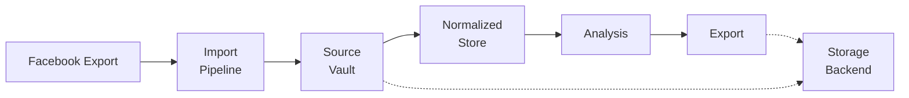
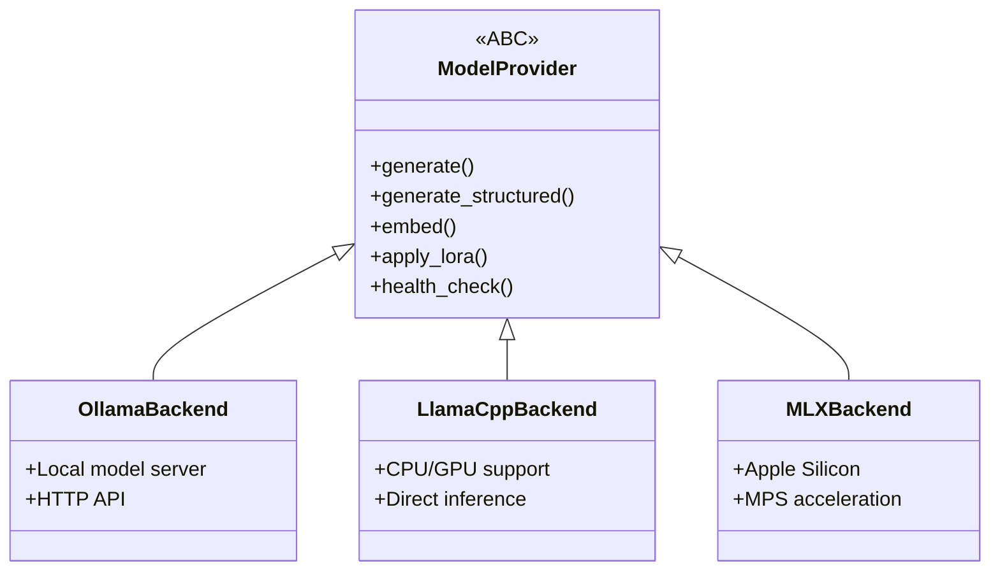
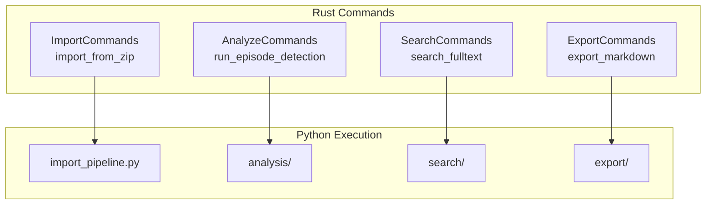
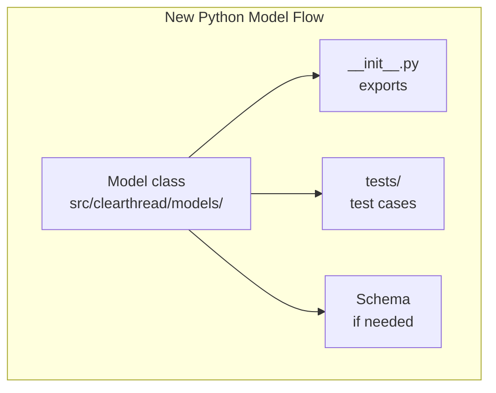
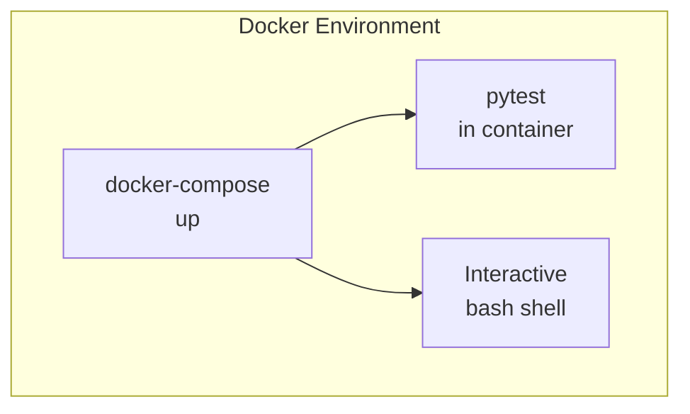

# ClearThread Developer Guide

## Project Structure



## Building

### Prerequisites

- Python 3.10+
- Rust 1.77+
- Node.js 18+ (for frontend)

### Python Package

```bash
# Install dependencies
pip install -e ".[dev]"

# Run tests
pytest

# Type checking
mypy src/clearthread

# Linting
ruff check src/clearthread
```

### Tauri Desktop

```bash
# Enter Tauri directory
cd src-tauri

# Install dependencies
cargo build

# Run in dev mode
cargo tauri dev

# Build for production
cargo tauri build
```

### Full Build

```bash
# Build Python package
pip install build
python -m build

# Build Tauri app
cd src-tauri && cargo tauri build && cd ..

# Build Docker image
docker build -t clearthread:latest .
```

## Development Workflow

### Running the App



```bash
# Run Python CLI
python -m clearthread.cli

# Run Tauri dev mode
cd src-tauri && cargo tauri dev

# Run with GPU support
CUDA_VISIBLE_DEVICES=0 python -m clearthread.cli
```

### Testing



```bash
# Run all tests
pytest tests/ -v

# Run with coverage
pytest tests/ --cov=clearthread --cov-report=html

# Run specific test file
pytest tests/test_models.py -v
```

### Code Style

```bash
# Format code
ruff format src/clearthread

# Check types
mypy src/clearthread

# Fix imports
ruff check --fix src/clearthread
```

## Architecture

### Data Flow



### Model Provider



### Tauri Commands



## Adding New Features

### New Tauri Command

1. Add function to `src-tauri/src/cmd/your_module.rs`
2. Register in `src-tauri/src/main.rs`
3. Add frontend component in `src-tauri/src/components/`
4. Connect via `invoke` in React

### New Python Model

1. Create model class in `src/clearthread/models/`
2. Add to `__init__.py` exports
3. Add tests in `tests/`
4. Update schema if needed



## Docker Development



```bash
# Build and run
docker-compose up

# Run tests in container
docker-compose run app pytest

# Interactive shell
docker-compose run app bash
```

## Contributing

1. Fork the repository
2. Create a feature branch
3. Make your changes
4. Add tests
5. Submit a pull request
