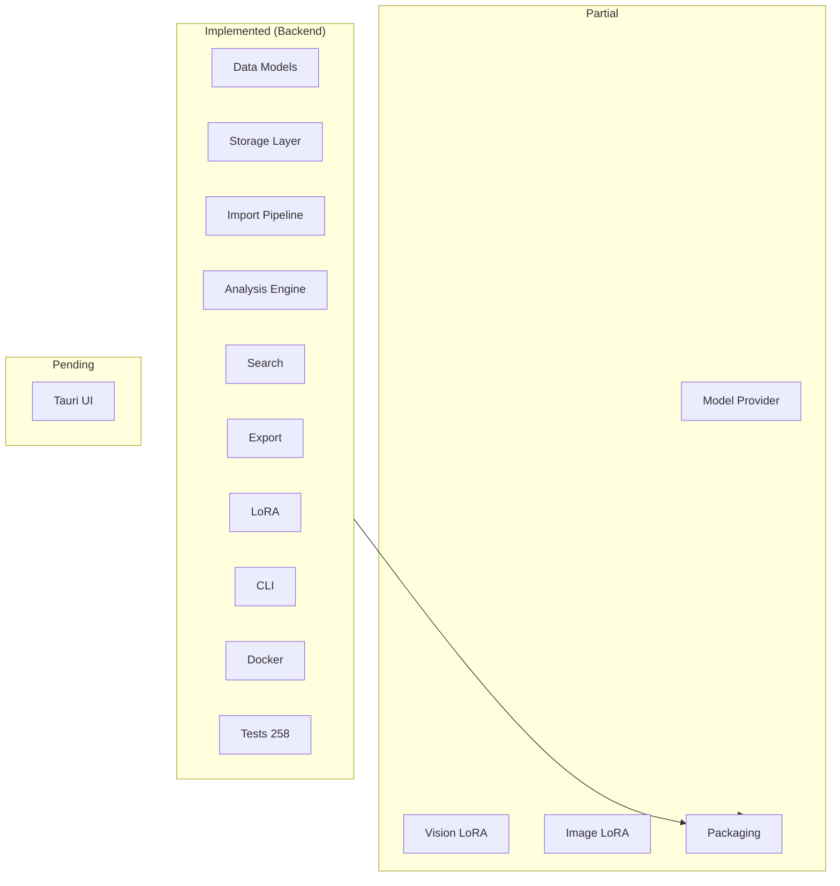
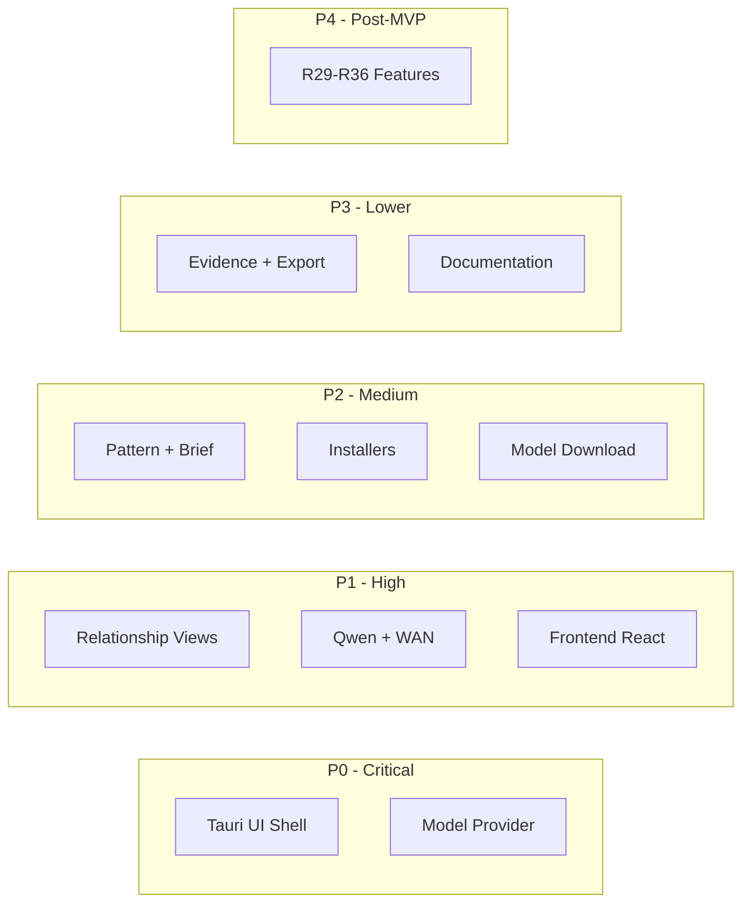

# ClearThread Remaining Features Spec

## Overview

The ClearThread backend (Python core) is **implemented and verified** with 258 passing unit tests and a successful Docker build. This document spec's the remaining features, organized by priority and phase.

### Current State Summary

| Area | Status | Details |
|------|--------|---------|
| **Data Models** | Implemented | Message, Participant, Episode, Finding, ProvenanceRecord, RelationshipChapter, TherapyBrief, ReflectionQuestion, LoRAAdapter, Persona |
| **Storage Layer** | Implemented | SourceDataVault (R2), NormalizedStore (R3), MediaStore (R1/R6), EncryptionLayer (R14) |
| **Import Pipeline** | Implemented | ZIP/directory parsing, encoding fix, deduplication, streaming, checkpoint recovery |
| **Analysis Engine** | Implemented | EpisodeEngine, PatternAnalyzer (12+ patterns), GrowthAnalyzer, ReflectionQuestionGenerator |
| **Search** | Implemented | FullTextSearchEngine (TF/recency), SemanticSearchEngine (cosine), unified SearchEngine |
| **Export** | Implemented | Markdown, PDF (A4/Letter), JSON with evidence |
| **LoRA** | Implemented | LoRAAdapter, LoRAComposition, Persona, LoRAStore, text/vision/image presets |
| **CLI** | Implemented | import, analyze, search, export, serve commands |
| **Docker** | Implemented | Multi-stage build, CUDA/MPS/ROCm, tauri-builder |
| **Tests** | Implemented | 258 unit tests passing |
| **Tauri UI** | Pending | Rust frontend with Tauri framework |
| **Model Provider** | Partial | LoRA infrastructure done; Ollama/llama.cpp/MLX backends pending |
| **Vision LoRA** | Partial | Schema and storage done; Qwen2.5-VL integration pending |
| **Image LoRA** | Partial | Schema and storage done; WAN 2.1 integration pending |
| **Packaging** | Partial | Docker done; platform installers pending |



---

## Phase A: Tauri Desktop UI (Priority: Critical)

### A.1 Tauri Application Shell

**Requirement:** Create the Tauri desktop application shell that hosts the ClearThread interface.

**Scope:**
- Rust Tauri application entry point
- Window configuration (minimum 1024x768, resizable)
- Menu bar with standard actions (File, Edit, View, Help)
- Tray icon for background operation
- Dark/light theme support

**Files to create:**
- `src-tauri/` directory (Tauri project root)
- `src-tauri/Cargo.toml` (Rust dependencies)
- `src-tauri/build.rs` (build script)
- `src-tauri/tauri.conf.json` (Tauri configuration)
- `src-tauri/src/main.rs` (Rust entry point)
- `src-tauri/src/lib.rs` (Rust library)
- `src-tauri/src/cmd/` (Rust command handlers for Python bridge)

**Key Rust dependencies:**
```toml
[dependencies]
tauri = { version = "2.0", features = ["tray-icon"] }
tauri-plugin-tray = "2.0"
tauri-plugin-shell = "2.0"
serde = { version = "1.0", features = ["derive"] }
serde_json = "1.0"
tokio = { version = "1.0", features = ["full"] }
```

**Implementation approach:**
- Tauri 2.0 with Rust backend and WebView2/WebKitGTK frontend
- Python analysis core runs as a subprocess or is embedded via PyO3
- Rust commands call Python via stdin/stdout or gRPC

### A.2 Import Dashboard View

**Requirement:** Visual interface for importing Facebook/Messenger data exports.

**Components:**
1. **File picker** - ZIP or directory selection
2. **Import progress** - Real-time progress bar with file-by-file updates
3. **Data health preview** - Summary of import results (messages, conversations, participants, duplicates)
4. **Encoding fix indicator** - Shows Latin-1 fixes applied
5. **Resume capability** - Resume interrupted imports

**UI Layout:**
```
┌─────────────────────────────────────────────────────┐
│  Import Dashboard                                    │
├─────────────────────────────────────────────────────┤
│  [Select ZIP or Directory]                           │
│                                                      │
│  Import Progress                                     │
│  ┌──────────────────────────────────────┐           │
│  │ ████████████████░░░░░░░░░░░░  67%   │           │
│  └──────────────────────────────────────┘           │
│  Processing: messages/inbox/janesmith_123/...        │
│                                                      │
│  Data Health Preview                                 │
│  Messages:     12,847                                │
│  Conversations: 23                                   │
│  Participants:  15                                   │
│  Duplicates:    142                                  │
│  Encoding fixes: 89                                  │
│                                                      │
│  [Import]  [Cancel]  [View Report]                   │
└─────────────────────────────────────────────────────┘
```

### A.3 Relationship Library View

**Requirement:** Main view showing all imported relationships/conversations.

**Components:**
1. **Conversation list** - Sorted by recency, with participant names and message counts
2. **Participant avatars** - Visual indicators for user vs. others
3. **Search bar** - Filter conversations by participant name or content
4. **Exclusion controls** - Toggle visibility of excluded participants
5. **Conversation detail panel** - Message thread preview

### A.4 Relationship Timeline View

**Requirement:** Visual timeline of relationship history.

**Components:**
1. **Chronological timeline** - Messages displayed chronologically with visual grouping
2. **Episode markers** - Detected episodes shown as segments on the timeline
3. **Zoom controls** - Day/week/month/year zoom levels
4. **Participant filtering** - Show/hide specific participants
5. **Content type indicators** - Text, media, reactions, links

### A.5 Episode Review Inbox

**Requirement:** Interface for reviewing detected episodes.

**Components:**
1. **Episode cards** - Each proposed episode shown as a card with:
   - Confidence score
   - Episode type (time-gap, thread-reply, semantic-cluster, entity-topic)
   - Message count and date range
   - Preview of context messages
2. **Review actions** - Accept, reject, edit boundary
3. **Batch operations** - Accept/reject multiple episodes
4. **Custom topic management** - Add/edit custom topics

### A.6 Pattern Findings View

**Requirement:** Display of detected interaction patterns.

**Components:**
1. **Pattern cards** - Each finding shown with:
   - Pattern name (e.g., "Initiation Imbalance")
   - Confidence level (percentage)
   - Evidence count
   - Counterexamples (if any)
2. **Evidence viewer** - Click to see supporting messages
3. **Filter by pattern type** - Filter by pattern category
4. **User annotation** - Add notes to findings

### A.7 Therapy Brief Builder

**Requirement:** Interface for constructing therapy session briefs.

**Components:**
1. **Brief configuration panel:**
   - Date range selector
   - Relationship/conversation selector
   - Episode selector
   - Topic filter
   - Participant name visibility toggle
   - Sensitive media exclusion toggle
   - Detail level (summary/detailed/full)
2. **Live preview** - Real-time preview of the brief
3. **Section ordering** - Drag-and-drop section reordering
4. **Export options** - Markdown, PDF, JSON

### A.8 Growth and Resilience View

**Requirement:** Display of growth analysis results.

**Components:**
1. **"Patterns That Protected Me"** - Section with evidence-backed patterns
2. **"People Who Showed Up"** - Section with supportive relationship evidence
3. **"Growth Across Time"** - Comparison view showing change over time
4. **Evidence linking** - Click-through to source messages

### A.9 Evidence Reader

**Requirement:** Detailed message viewer with evidence context.

**Components:**
1. **Message thread viewer** - Full message content with reactions, attachments
2. **Context window** - Messages before and after the selected message
3. **Evidence highlighting** - Messages referenced by findings highlighted
4. **Attachment viewer** - Image/video preview for media messages

### A.10 Export Center

**Requirement:** Interface for exporting analysis results.

**Components:**
1. **Export format selection** - Markdown, PDF (A4/Letter), JSON
2. **Content selection** - Choose what to export (episodes, findings, chapters, briefs)
3. **Export progress** - Real-time progress indicator
4. **Export history** - Previous exports listed with timestamps

### A.11 Privacy and Model Settings

**Requirement:** Settings panel for privacy and AI model configuration.

**Components:**
1. **Encryption settings** - Lock/unlock, passphrase management
2. **Model selection** - Choose base model (Qwen2.5, Qwen2.5-VL, WAN 2.1)
3. **LoRA adapter management** - Enable/disable adapters, adjust weights
4. **Persona selection** - Switch between saved personas
5. **GPU backend** - CUDA/MPS/ROCm/CPU selection
6. **Data exclusion controls** - Manage excluded participants and messages

---

## Phase B: AI Model Integration (Priority: High)

### B.1 Model Provider Core

**Requirement:** Unified interface for AI model inference with multiple backends.

**Current state:** LoRA infrastructure is implemented. The ModelProvider interface needs to be created.

**Components:**
1. **ModelProvider interface** - Abstract base class for model backends
2. **OllamaBackend** - Ollama integration (primary backend)
3. **LlamaCppBackend** - llama.cpp integration (CPU fallback)
4. **MLXBackend** - MLX integration (Apple Silicon)
5. **ModelRegistry** - Registry for discovered models
6. **Structured output validation** - JSON schema validation for model outputs

**Files to create:**
- `src/clearthread/models/model_provider.py` - Core interface
- `src/clearthread/models/ollama_backend.py` - Ollama integration
- `src/clearthread/models/llamacpp_backend.py` - llama.cpp integration
- `src/clearthread/models/mlx_backend.py` - MLX integration
- `src/clearthread/models/model_registry.py` - Model discovery and registration

**Key interface:**
```python
class ModelProvider(ABC):
    @abstractmethod
    def generate(self, prompt: str, **kwargs) -> str:
        """Generate text response."""
        ...

    @abstractmethod
    def generate_structured(self, prompt: str, schema: dict) -> dict:
        """Generate structured response validated against schema."""
        ...

    @abstractmethod
    def embed(self, text: str) -> list[float]:
        """Generate embedding vector."""
        ...

    @abstractmethod
    def apply_lora(self, adapter: LoRAAdapter) -> None:
        """Apply a LoRA adapter."""
        ...

    @abstractmethod
    def is_available(self) -> bool:
        """Check if the model backend is available."""
        ...
```

### B.2 Qwen Vision LoRA Integration

**Requirement:** Qwen2.5-VL integration for participant recognition in images.

**Current state:** LoRA schema and storage are implemented. Integration with Qwen2.5-VL model needs to be built.

**Components:**
1. **QwenVisionModelProvider** - Qwen2.5-VL model integration
2. **Participant media collection** - Collect images/videos per participant
3. **Visual feature extraction** - Extract face embeddings, scene descriptions
4. **Vision LoRA training** - Train LoRA adapter from collected media
5. **Participant recognition** - Recognize participants in new images

**Files to create:**
- `src/clearthread/models/qwen_vision.py` - Qwen2.5-VL integration
- `src/clearthread/models/vision_feature_extractor.py` - Feature extraction
- `src/clearthread/models/vision_lora_trainer.py` - LoRA training pipeline

**Training pipeline:**
```
1. Collect 10+ images per participant
2. Extract visual features (face embeddings, scene description)
3. Generate training dataset
4. Train LoRA adapter (safetensors format)
5. Store adapter in models/lora/qwen_vision/
6. Track provenance (training data count, model version)
```

### B.3 WAN Image LoRA Integration

**Requirement:** WAN 2.1 integration for visual style reconstruction and image completion.

**Current state:** LoRA schema and storage are implemented. WAN 2.1 integration needs to be built.

**Components:**
1. **WANImageModelProvider** - WAN 2.1 model integration
2. **Visual style reconstruction** - Reconstruct visual style from conversation media
3. **Image completion** - Complete corrupted/missing images
4. **Visual timeline generation** - Generate visual timeline from conversation media
5. **Context conditioning** - Condition image generation on conversation context

**Files to create:**
- `src/clearthread/models/wan_image.py` - WAN 2.1 integration
- `src/clearthread/models/image_style_reconstructor.py` - Style reconstruction
- `src/clearthread/models/image_completer.py` - Image completion

### B.4 Visual Persona Composition

**Requirement:** Combine Qwen vision + WAN image personas for comprehensive visual analysis.

**Current state:** Persona schema and LoRA composition are implemented. Visual persona combination needs to be built.

**Components:**
1. **Visual persona combination** - Stack Qwen + WAN personas
2. **Independent weight control** - Per-LoRA-type weight adjustment
3. **Visual persona storage** - Store alongside text personas
4. **Visual persona types** - Support different visual persona configurations

**Files to modify:**
- `src/clearthread/models/lora.py` - Add visual persona composition methods

### B.5 Model Download and Caching

**Requirement:** Automatic model download and caching for base models.

**Components:**
1. **Model download manager** - Download models from HuggingFace or local cache
2. **Model version tracking** - Track model versions and detect updates
3. **Cache management** - Manage disk space for cached models
4. **Provenance for model changes** - Track model version in provenance records

**Files to create:**
- `src/clearthread/models/model_downloader.py` - Download management
- `src/clearthread/models/model_cache.py` - Cache management

---

## Phase C: Frontend Implementation (Priority: High)

### C.1 Frontend Technology Stack

**Recommendation:** Use a lightweight frontend framework compatible with Tauri.

| Component | Technology | Rationale |
|-----------|-----------|-----------|
| **UI Framework** | React + TypeScript | Mature ecosystem, Tauri integration |
| **Styling** | CSS Modules + Tailwind | Lightweight, no heavy dependencies |
| **State Management** | React Context + useReducer | Simple, no external dependencies |
| **HTTP Client** | fetch API | Built-in, no dependencies |
| **Routing** | React Router (if SPA) | Standard, well-documented |
| **Charts** | D3.js or Recharts | For timeline visualization |

### C.2 Frontend Directory Structure

```
src-tauri/
├── Cargo.toml
├── build.rs
├── tauri.conf.json
├── src/
│   ├── main.rs           # Rust entry point
│   ├── lib.rs            # Rust library
│   └── cmd/              # Rust command handlers
│       ├── import.rs
│       ├── analyze.rs
│       ├── search.rs
│       ├── export.rs
│       └── settings.rs
└── src/                  # Frontend source (if using web frontend)
    ├── index.html
    ├── main.tsx
    ├── App.tsx
    ├── components/
    │   ├── ImportDashboard.tsx
    │   ├── RelationshipLibrary.tsx
    │   ├── TimelineView.tsx
    │   ├── EpisodeInbox.tsx
    │   ├── PatternFindings.tsx
    │   ├── TherapyBriefBuilder.tsx
    │   ├── GrowthView.tsx
    │   ├── EvidenceReader.tsx
    │   ├── ExportCenter.tsx
    │   └── SettingsPanel.tsx
    └── styles/
        ├── main.css
        └── theme.css
```

### C.3 Python-Rust Communication

**Approach:** Use Tauri's event system for Python-Rust communication.

```
┌─────────────────────────────────────────────────────────────┐
│                    Tauri Application                         │
│  ┌─────────────────────────────────────────────────────┐   │
│  │                  Rust Commands                       │   │
│  │  ┌──────────┐ ┌──────────┐ ┌──────────┐ ┌────────┐  │   │
│  │  │  Import  │ │ Analyze  │ │  Search  │ │ Export │  │   │
│  │  └──────────┘ └──────────┘ └──────────┘ └────────┘  │   │
│  └─────────────────────────────────────────────────────┘   │
│  ┌─────────────────────────────────────────────────────┐   │
│  │              Python Analysis Core                    │   │
│  │  ┌────────────────────────────────────────────────┐  │   │
│  │  │              PyO3 / subprocess bridge            │  │   │
│  │  └────────────────────────────────────────────────┘  │   │
│  └─────────────────────────────────────────────────────┘   │
└─────────────────────────────────────────────────────────────┘
```

**Communication methods:**
1. **Tauri commands** - Rust calls Python via subprocess (for analysis operations)
2. **Tauri events** - Python emits events to Rust UI (for progress updates)
3. **File-based** - Shared filesystem for data exchange (for large datasets)

---

## Phase D: Packaging and Deployment (Priority: Medium)

### D.1 Platform Installers

**Requirement:** Create platform-specific installers for the Tauri desktop application.

| Platform | Format | Tool | Notes |
|----------|--------|------|-------|
| **Linux** | .deb, .rpm | tauri-bundler | Debian/RedHat compatible |
| **macOS** | .dmg | tauri-bundler | Universal binary (Intel + Apple Silicon) |
| **Windows** | .msi, .exe | tauri-bundler | Windows 10+ |

**Files to create:**
- `src-tauri/bundles/` (bundle configurations)
- `src-tauri/tauri.linux.conf.json`
- `src-tauri/tauri.macos.conf.json`
- `src-tauri/tauri.windows.conf.json`

### D.2 Auto-Update Mechanism

**Requirement:** Automatic updates for the desktop application.

**Components:**
1. **Update checker** - Check for new versions on release
2. **Download manager** - Download update packages
3. **Install manager** - Apply updates (with rollback support)
4. **Update notification** - Notify user of available updates

**Files to create:**
- `src-tauri/src/cmd/update.rs` - Update command handler
- `src/clearthread/update.py` - Python update logic

### D.3 User Documentation

**Requirement:** User-facing documentation for the ClearThread application.

**Documents to create:**
1. **User Guide** - Complete guide to using ClearThread
2. **Therapy Brief Preparation Guide** - How to prepare therapy briefs
3. **Persona Customization Guide** - How to create and manage personas
4. **FAQ** - Frequently asked questions

**Files to create:**
- `docs/user-guide.md`
- `docs/therapy-brief-guide.md`
- `docs/persona-guide.md`
- `docs/faq.md`

### D.4 Developer Documentation

**Requirement:** Developer-facing documentation for contributors.

**Documents to create:**
1. **API Reference** - Complete API documentation
2. **Data Model Documentation** - Detailed data model descriptions
3. **LoRA Architecture Guide** - LoRA design and usage
4. **Docker Deployment Guide** - Docker deployment instructions
5. **Contributing Guide** - How to contribute to ClearThread

**Files to create:**
- `docs/api-reference.md`
- `docs/data-models.md`
- `docs/lora-architecture.md`
- `docs/docker-deployment.md`
- `docs/contributing.md`

---

## Phase E: Post-MVP Features (Priority: Lower)

### E.1 Post and Engagement Analytics (R29)

**Requirement:** Analytics for Facebook posts and engagement patterns.

**Components:**
1. **Post frequency analysis** - Track posting patterns over time
2. **Engagement metrics** - Track reactions, comments, shares
3. **Content type distribution** - Distribution of text, media, links
4. **Peak activity periods** - Identify peak messaging times

**Files to create:**
- `src/clearthread/analysis/post_analyzer.py`
- `src/clearthread/models/post_analytics.py`

### E.2 Relationship Safety Review (R30)

**Requirement:** Automated safety review of relationships.

**Components:**
1. **Safety pattern detection** - Detect potentially harmful patterns
2. **Safety score calculation** - Calculate relationship safety score
3. **Evidence-based findings** - Support findings with message evidence
4. **Non-diagnostic framing** - Present findings without diagnosis

**Files to create:**
- `src/clearthread/analysis/safety_review.py`
- `src/clearthread/models/safety_finding.py`

### E.3 Evidence Export Packages (R31)

**Requirement:** Export evidence packages for therapy sessions.

**Components:**
1. **Evidence package builder** - Build comprehensive evidence packages
2. **Therapy-ready formatting** - Format for therapist review
3. **Selective export** - Choose specific evidence items
4. **Annotation support** - Include user annotations

**Files to modify:**
- `src/clearthread/export/engine.py` - Add evidence package export

### E.4 Cross-Relationship Pattern Book (R32)

**Requirement:** Identify patterns that appear across multiple relationships.

**Components:**
1. **Cross-relationship analysis** - Analyze patterns across all relationships
2. **Pattern book generation** - Generate pattern book
3. **Pattern frequency tracking** - Track how often patterns appear
4. **Pattern comparison** - Compare patterns across relationships

**Files to create:**
- `src/clearthread/analysis/cross_relationship.py`
- `src/clearthread/models/pattern_book.py`

### E.5 Privacy and Oversharing Audit (R33)

**Requirement:** Audit data for privacy concerns and oversharing patterns.

**Components:**
1. **Privacy audit** - Identify sensitive data exposure
2. **Oversharing detection** - Detect oversharing patterns
3. **Privacy recommendations** - Generate privacy recommendations
4. **Exclusion management** - Manage data exclusions

**Files to create:**
- `src/clearthread/analysis/privacy_audit.py`
- `src/clearthread/models/privacy_record.py`

### E.6 Reality Reconstruction (R34)

**Requirement:** Reconstruct the user's perspective of shared events.

**Components:**
1. **Dual-perspective comparison** - Compare user vs. other participant perspectives
2. **Event reconstruction** - Reconstruct shared events from both perspectives
3. **Discrepancy detection** - Identify discrepancies in recollection
4. **Evidence-based reconstruction** - Ground reconstruction in message evidence

**Files to create:**
- `src/clearthread/analysis/reality_reconstruction.py`
- `src/clearthread/models/reality_record.py`

### E.7 Backup and Recovery (R36)

**Requirement:** Backup and recovery for ClearThread data.

**Components:**
1. **Backup creation** - Create backups of ClearThread data
2. **Backup verification** - Verify backup integrity
3. **Recovery** - Restore from backups
4. **Incremental backup** - Support incremental backups

**Files to create:**
- `src/clearthread/storage/backup.py`
- `src/clearthread/storage/recovery.py`

---

## Implementation Priority Matrix



| Priority | Phase | Features | Effort |
|----------|-------|----------|--------|
| **P0** | A | Tauri UI Shell + Core Views | High |
| **P0** | B | Model Provider Core + Ollama Backend | High |
| **P1** | A | Relationship Library + Timeline + Episode Inbox | Medium |
| **P1** | B | Qwen Vision + WAN Image LoRA | Medium |
| **P1** | C | Frontend Implementation (React) | High |
| **P2** | A | Pattern Findings + Therapy Brief + Growth View | Medium |
| **P2** | D | Platform Installers + Auto-Update | Medium |
| **P2** | B | Model Download + Caching | Low |
| **P3** | A | Evidence Reader + Export Center + Settings | Medium |
| **P3** | D | User + Developer Documentation | Medium |
| **P4** | E | Post-MVP Features (R29-R36) | Low each |

---

## File Structure After Implementation

```
clearthread/
├── docs/
│   ├── architecture.md
│   ├── design.md
│   ├── tasks.md
│   ├── remaining-features.md    # THIS FILE
│   ├── user-guide.md
│   ├── therapy-brief-guide.md
│   ├── persona-guide.md
│   ├── faq.md
│   ├── api-reference.md
│   ├── data-models.md
│   ├── lora-architecture.md
│   ├── docker-deployment.md
│   └── contributing.md
├── src/
│   ├── clearthread/
│   │   ├── __init__.py
│   │   ├── cli.py
│   │   ├── import_pipeline.py
│   │   ├── analysis/
│   │   │   ├── __init__.py
│   │   │   ├── episode_engine.py
│   │   │   ├── pattern_analyzer.py
│   │   │   ├── growth_analyzer.py
│   │   │   ├── reflection_questions.py
│   │   │   ├── post_analyzer.py              # POST-MVP
│   │   │   ├── safety_review.py               # POST-MVP
│   │   │   ├── cross_relationship.py            # POST-MVP
│   │   │   ├── privacy_audit.py                # POST-MVP
│   │   │   └── reality_reconstruction.py       # POST-MVP
│   │   ├── export/
│   │   │   ├── __init__.py
│   │   │   ├── engine.py
│   │   │   ├── markdown.py
│   │   │   ├── pdf.py
│   │   │   └── json_export.py
│   │   ├── models/
│   │   │   ├── __init__.py
│   │   │   ├── base.py
│   │   │   ├── message.py
│   │   │   ├── participant.py
│   │   │   ├── episode.py
│   │   │   ├── finding.py
│   │   │   ├── provenance.py
│   │   │   ├── reflection_question.py
│   │   │   ├── relationship_chapter.py
│   │   │   ├── therapy_brief.py
│   │   │   ├── lora.py
│   │   │   ├── model_provider.py              # NEW
│   │   │   ├── ollama_backend.py              # NEW
│   │   │   ├── llamacpp_backend.py            # NEW
│   │   │   ├── mlx_backend.py                 # NEW
│   │   │   ├── model_registry.py              # NEW
│   │   │   ├── model_downloader.py            # NEW
│   │   │   ├── model_cache.py                 # NEW
│   │   │   ├── qwen_vision.py                 # NEW
│   │   │   ├── vision_feature_extractor.py    # NEW
│   │   │   ├── vision_lora_trainer.py         # NEW
│   │   │   ├── wan_image.py                   # NEW
│   │   │   ├── image_style_reconstructor.py   # NEW
│   │   │   ├── image_completer.py             # NEW
│   │   │   ├── post_analytics.py              # POST-MVP
│   │   │   ├── safety_finding.py              # POST-MVP
│   │   │   ├── pattern_book.py                # POST-MVP
│   │   │   ├── privacy_record.py              # POST-MVP
│   │   │   └── reality_record.py              # POST-MVP
│   │   ├── search/
│   │   │   ├── __init__.py
│   │   │   ├── engine.py
│   │   │   ├── fulltext.py
│   │   │   └── semantic.py
│   │   ├── storage/
│   │   │   ├── __init__.py
│   │   │   ├── source_vault.py
│   │   │   ├── normalized_store.py
│   │   │   ├── media_store.py
│   │   │   ├── encryption.py
│   │   │   ├── backup.py                      # POST-MVP
│   │   │   └── recovery.py                    # POST-MVP
│   │   └── update.py                          # NEW
│   └── tauri/                                 # NEW (frontend)
│       ├── Cargo.toml
│       ├── build.rs
│       ├── tauri.conf.json
│       ├── src/
│       │   ├── main.rs
│       │   ├── lib.rs
│       │   └── cmd/
│       │       ├── import.rs
│       │       ├── analyze.rs
│       │       ├── search.rs
│       │       ├── export.rs
│       │       ├── settings.rs
│       │       └── update.rs
│       └── src/                               # React frontend
│           ├── index.html
│           ├── main.tsx
│           ├── App.tsx
│           ├── components/
│           │   ├── ImportDashboard.tsx
│           │   ├── RelationshipLibrary.tsx
│           │   ├── TimelineView.tsx
│           │   ├── EpisodeInbox.tsx
│           │   ├── PatternFindings.tsx
│           │   ├── TherapyBriefBuilder.tsx
│           │   ├── GrowthView.tsx
│           │   ├── EvidenceReader.tsx
│           │   ├── ExportCenter.tsx
│           │   └── SettingsPanel.tsx
│           └── styles/
│               ├── main.css
│               └── theme.css
├── tests/
│   ├── test_analysis.py
│   ├── test_cli.py
│   ├── test_export.py
│   ├── test_import.py
│   ├── test_lora.py
│   ├── test_models.py
│   ├── test_search.py
│   ├── test_storage.py
│   ├── test_model_provider.py                 # NEW
│   ├── test_qwen_vision.py                    # NEW
│   ├── test_wan_image.py                      # NEW
│   └── test_tauri_commands.py                 # NEW
├── Dockerfile
├── docker-compose.yml
├── flake.nix
├── pyproject.toml
├── README.md
└── LICENSE
```

---

## Summary of Remaining Work

### Implemented (Backend - Verified)
- 258 unit tests passing
- Docker build successful
- All core Python modules implemented
- LoRA infrastructure complete
- Storage, import, analysis, search, export all implemented

### Remaining by Category

| Category | Files to Create | Files to Modify | Status |
|----------|-----------------|-----------------|--------|
| **Tauri UI Shell** | 8 | 0 | Pending |
| **Core Views (10 views)** | 10 | 1 | Pending |
| **Model Provider Core** | 5 | 1 | Pending |
| **Qwen Vision LoRA** | 3 | 1 | Pending |
| **WAN Image LoRA** | 3 | 1 | Pending |
| **Model Download/Caching** | 2 | 0 | Pending |
| **Platform Installers** | 3 | 1 | Pending |
| **Auto-Update** | 2 | 0 | Pending |
| **Documentation** | 8 | 0 | Pending |
| **Post-MVP Features** | 10 | 2 | Pending |
| **Backup/Recovery** | 2 | 0 | Pending |
| **Total** | ~56 | ~7 | |
