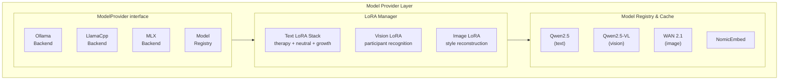

# Model Provider Core Specification

## Overview

This spec defines the Model Provider core for ClearThread — the unified interface for AI model inference with multiple backends (Ollama, llama.cpp, MLX) and LoRA adapter support.

## Architecture



## Core Interface

### src/clearthread/models/model_provider.py

```python
"""ModelProvider interface and base implementations."""

from __future__ import annotations

import abc
import json
import logging
from pathlib import Path
from typing import Any, Protocol

from clearthread.models.lora import LoRAAdapter, LoRAComposition

logger = logging.getLogger("clearthread.model_provider")


class ModelProvider(abc.ABC):
    """Abstract base class for AI model providers."""

    @abc.abstractmethod
    def generate(self, prompt: str, **kwargs: Any) -> str:
        """Generate text response from the model.

        Args:
            prompt: The input prompt text.
            **kwargs: Additional model-specific parameters
                (temperature, max_tokens, top_p, etc.).

        Returns:
            Generated text response.
        """
        ...

    @abc.abstractmethod
    def generate_structured(
        self, prompt: str, schema: dict[str, Any], **kwargs: Any
    ) -> dict[str, Any]:
        """Generate a structured response validated against a JSON schema.

        Args:
            prompt: The input prompt text.
            schema: JSON schema to validate the output against.
            **kwargs: Additional model-specific parameters.

        Returns:
            Parsed structured response as a dictionary.

        Raises:
            StructuredOutputError: If the output doesn't match the schema.
        """
        ...

    @abc.abstractmethod
    def embed(self, text: str, **kwargs: Any) -> list[float]:
        """Generate an embedding vector for the given text.

        Args:
            text: Input text to embed.
            **kwargs: Additional parameters.

        Returns:
            Normalized embedding vector.
        """
        ...

    @abc.abstractmethod
    def apply_lora(self, adapter: LoRAAdapter) -> None:
        """Apply a LoRA adapter to the model.

        Args:
            adapter: The LoRA adapter to apply.
        """
        ...

    @abc.abstractmethod
    def remove_lora(self, adapter_id: str) -> bool:
        """Remove a LoRA adapter from the model.

        Args:
            adapter_id: The ID of the adapter to remove.

        Returns:
            True if the adapter was removed, False if not found.
        """
        ...

    @abc.abstractmethod
    def get_active_loras(self) -> list[LoRAAdapter]:
        """Get all currently active LoRA adapters.

        Returns:
            List of active LoRA adapters.
        """
        ...

    @abc.abstractmethod
    def is_available(self) -> bool:
        """Check if the model backend is available and responsive.

        Returns:
            True if the backend is available.
        """
        ...

    @abc.abstractmethod
    def get_model_info(self) -> dict[str, Any]:
        """Get information about the current model configuration.

        Returns:
            Dictionary with model information.
        """
        ...

    @abc.abstractmethod
    def health_check(self) -> dict[str, Any]:
        """Perform a health check on the model backend.

        Returns:
            Health check result with status and timing information.
        """
        ...


class StructuredOutputError(Exception):
    """Raised when structured output doesn't match the schema."""

    def __init__(self, message: str, errors: list[str] | None = None) -> None:
        super().__init__(message)
        self.errors = errors or []


class ModelRegistry:
    """Registry for discovered and available models."""

    def __init__(self) -> None:
        self._models: dict[str, dict[str, Any]] = {}
        self._active_model: str | None = None

    def register_model(
        self,
        name: str,
        model_type: str,
        provider: str,
        version: str,
        path: Path | None = None,
        **kwargs: Any,
    ) -> None:
        """Register a model in the registry.

        Args:
            name: Unique model name.
            model_type: Type of model (text, vision, image).
            provider: Provider name (ollama, llamacpp, mlx).
            version: Model version string.
            path: Optional path to model files.
            **kwargs: Additional metadata.
        """
        self._models[name] = {
            "name": name,
            "type": model_type,
            "provider": provider,
            "version": version,
            "path": str(path) if path else None,
            "metadata": kwargs,
            "is_active": name == self._active_model,
        }

    def get_model(self, name: str) -> dict[str, Any] | None:
        """Get a model by name.

        Args:
            name: Model name.

        Returns:
            Model information or None if not found.
        """
        return self._models.get(name)

    def get_active_model(self) -> dict[str, Any] | None:
        """Get the currently active model.

        Returns:
            Active model information or None.
        """
        if self._active_model:
            return self._models.get(self._active_model)
        return None

    def set_active_model(self, name: str) -> bool:
        """Set the active model.

        Args:
            name: Model name to activate.

        Returns:
            True if the model was activated.
        """
        if name in self._models:
            self._active_model = name
            for model_name in self._models:
                self._models[model_name]["is_active"] = (
                    model_name == name
                )
            return True
        return False

    def get_models_by_type(self, model_type: str) -> list[dict[str, Any]]:
        """Get all models of a specific type.

        Args:
            model_type: Model type to filter by.

        Returns:
            List of matching models.
        """
        return [
            m for m in self._models.values()
            if m["type"] == model_type
        ]

    def get_models_by_provider(self, provider: str) -> list[dict[str, Any]]:
        """Get all models from a specific provider.

        Args:
            provider: Provider name to filter by.

        Returns:
            List of matching models.
        """
        return [
            m for m in self._models.values()
            if m["provider"] == provider
        ]

    def to_dict(self) -> dict[str, Any]:
        """Serialize the registry to a dictionary.

        Returns:
            Serialized registry.
        """
        return {
            "active_model": self._active_model,
            "models": self._models,
        }


class ModelDownloader:
    """Download and cache AI models."""

    def __init__(self, cache_dir: Path | str = "./models/base") -> None:
        self.cache_dir = Path(cache_dir)
        self._download_status: dict[str, str] = {}

    def download_model(
        self,
        name: str,
        source: str,
        model_type: str,
        provider: str,
    ) -> Path:
        """Download a model from the source.

        Args:
            name: Model name.
            source: Source URL or path.
            model_type: Type of model.
            provider: Target provider.

        Returns:
            Path to the downloaded model.
        """
        model_dir = self.cache_dir / model_type / provider / name
        model_dir.mkdir(parents=True, exist_ok=True)

        # Check if already downloaded
        if (model_dir / "model.safetensors").exists():
            return model_dir

        # Download logic here
        self._download_status[name] = "downloading"
        # ... actual download implementation ...
        self._download_status[name] = "downloaded"

        return model_dir

    def get_cached_models(self) -> list[dict[str, Any]]:
        """Get all cached models.

        Returns:
            List of cached model information.
        """
        models = []
        for model_type_dir in self.cache_dir.iterdir():
            if not model_type_dir.is_dir():
                continue
            for provider_dir in model_type_dir.iterdir():
                if not provider_dir.is_dir():
                    continue
                for name_dir in provider_dir.iterdir():
                    if name_dir.is_dir():
                        models.append({
                            "name": name_dir.name,
                            "type": model_type_dir.name,
                            "provider": provider_dir.name,
                            "path": str(name_dir),
                            "status": self._download_status.get(
                                name_dir.name, "cached"
                            ),
                        })
        return models

    def remove_model(self, name: str, model_type: str, provider: str) -> bool:
        """Remove a cached model.

        Args:
            name: Model name.
            model_type: Model type.
            provider: Provider.

        Returns:
            True if the model was removed.
        """
        model_dir = self.cache_dir / model_type / provider / name
        if model_dir.exists():
            import shutil
            shutil.rmtree(model_dir)
            return True
        return False
```

## Backend Implementations

### src/clearthread/models/ollama_backend.py

```python
"""Ollama backend for ClearThread."""

from __future__ import annotations

import json
import logging
from pathlib import Path
from typing import Any

import httpx

from clearthread.models.model_provider import (
    ModelProvider,
    StructuredOutputError,
)
from clearthread.models.lora import LoRAAdapter

logger = logging.getLogger("clearthread.ollama_backend")


class OllamaBackend(ModelProvider):
    """Ollama-based model provider.

    Uses the Ollama REST API for model inference.
    """

    DEFAULT_URL = "http://localhost:11434"

    def __init__(
        self,
        url: str = DEFAULT_URL,
        model_name: str = "qwen2.5:7b",
        timeout: float = 60.0,
    ) -> None:
        self.url = url.rstrip("/")
        self.model_name = model_name
        self.timeout = timeout
        self._client = httpx.Client(base_url=url, timeout=timeout)
        self._active_loras: dict[str, LoRAAdapter] = {}

    def generate(self, prompt: str, **kwargs: Any) -> str:
        """Generate text using Ollama API.

        Args:
            prompt: Input prompt.
            **kwargs: temperature, max_tokens, top_p, stream, etc.

        Returns:
            Generated text.
        """
        payload = {
            "model": self.model_name,
            "prompt": prompt,
            "stream": False,
            **kwargs,
        }

        # Apply active LoRA adapters
        if self._active_loras:
            lora_ids = list(self._active_loras.keys())
            payload["lora"] = lora_ids

        response = self._client.post("/api/generate", json=payload)
        response.raise_for_status()

        result = response.json()
        return result.get("response", "")

    def generate_structured(
        self, prompt: str, schema: dict[str, Any], **kwargs: Any
    ) -> dict[str, Any]:
        """Generate structured output using Ollama.

        Args:
            prompt: Input prompt.
            schema: JSON schema for output validation.
            **kwargs: Additional parameters.

        Returns:
            Parsed structured output.

        Raises:
            StructuredOutputError: If output doesn't match schema.
        """
        # Build structured prompt with schema
        structured_prompt = self._build_structured_prompt(prompt, schema)

        payload = {
            "model": self.model_name,
            "prompt": structured_prompt,
            "format": schema,
            "stream": False,
            **kwargs,
        }

        response = self._client.post("/api/generate", json=payload)
        response.raise_for_status()

        result = response.json()
        output = result.get("response", "{}")

        # Validate against schema
        self._validate_structured_output(output, schema)

        return json.loads(output)

    def embed(self, text: str, **kwargs: Any) -> list[float]:
        """Generate embedding using Ollama.

        Args:
            text: Input text.
            **kwargs: Additional parameters.

        Returns:
            Embedding vector.
        """
        payload = {
            "model": self.model_name,
            "input": text,
            **kwargs,
        }

        response = self._client.post("/api/embed", json=payload)
        response.raise_for_status()

        result = response.json()
        embedding = result.get("embedding", [])

        # Normalize
        magnitude = sum(x * x for x in embedding) ** 0.5
        if magnitude > 0:
            embedding = [x / magnitude for x in embedding]

        return embedding

    def apply_lora(self, adapter: LoRAAdapter) -> None:
        """Apply a LoRA adapter.

        Args:
            adapter: The LoRA adapter to apply.
        """
        self._active_loras[adapter.id] = adapter
        logger.info("Applied LoRA adapter: %s (weight=%.2f)",
                     adapter.name, adapter.weight)

    def remove_lora(self, adapter_id: str) -> bool:
        """Remove a LoRA adapter.

        Args:
            adapter_id: ID of the adapter to remove.

        Returns:
            True if removed.
        """
        if adapter_id in self._active_loras:
            del self._active_loras[adapter_id]
            logger.info("Removed LoRA adapter: %s", adapter_id)
            return True
        return False

    def get_active_loras(self) -> list[LoRAAdapter]:
        """Get active LoRA adapters.

        Returns:
            List of active adapters.
        """
        return list(self._active_loras.values())

    def is_available(self) -> bool:
        """Check if Ollama is available.

        Returns:
            True if Ollama is running and responsive.
        """
        try:
            response = self._client.get("/api/tags", timeout=5.0)
            return response.status_code == 200
        except httpx.RequestError:
            return False

    def get_model_info(self) -> dict[str, Any]:
        """Get model information.

        Returns:
            Model info dictionary.
        """
        info = {
            "provider": "ollama",
            "model_name": self.model_name,
            "url": self.url,
            "active_loras": len(self._active_loras),
            "lora_list": [
                {"id": a.id, "name": a.name, "weight": a.weight}
                for a in self._active_loras.values()
            ],
        }
        return info

    def health_check(self) -> dict[str, Any]:
        """Perform health check.

        Returns:
            Health check result.
        """
        import time
        start = time.time()
        available = self.is_available()
        elapsed = time.time() - start

        return {
            "status": "healthy" if available else "unhealthy",
            "provider": "ollama",
            "model": self.model_name,
            "response_time_ms": round(elapsed * 1000, 2),
            "available": available,
        }

    def _build_structured_prompt(
        self, prompt: str, schema: dict[str, Any]
    ) -> str:
        """Build a prompt for structured output.

        Args:
            prompt: Original prompt.
            schema: JSON schema.

        Returns:
            Structured prompt string.
        """
        structured_prompt = (
            f"{prompt}\n\n"
            f"Respond with a JSON object matching this schema:\n"
            f"{json.dumps(schema, indent=2)}"
        )
        return structured_prompt

    def _validate_structured_output(
        self, output: str, schema: dict[str, Any]
    ) -> None:
        """Validate output against schema.

        Args:
            output: Output string to validate.
            schema: JSON schema.

        Raises:
            StructuredOutputError: If validation fails.
        """
        try:
            data = json.loads(output)
            # Simple validation (can be extended with jsonschema)
            required = schema.get("required", [])
            properties = schema.get("properties", {})

            for field in required:
                if field not in data:
                    raise StructuredOutputError(
                        f"Missing required field: {field}",
                        errors=[f"{field} is required"],
                    )

            for field, field_schema in properties.items():
                if field in data:
                    expected_type = field_schema.get("type")
                    if expected_type:
                        type_map = {
                            "string": str,
                            "number": (int, float),
                            "integer": int,
                            "boolean": bool,
                            "array": list,
                            "object": dict,
                        }
                        expected = type_map.get(expected_type)
                        if expected and not isinstance(data[field], expected):
                            raise StructuredOutputError(
                                f"Field {field} has wrong type",
                                errors=[
                                    f"{field} expected {expected_type}, "
                                    f"got {type(data[field]).__name__}"
                                ],
                            )
        except json.JSONDecodeError as e:
            raise StructuredOutputError(
                f"Invalid JSON output: {e}",
                errors=[f"JSON decode error: {e}"],
            )
```

### src/clearthread/models/llamacpp_backend.py

```python
"""llama.cpp backend for ClearThread."""

from __future__ import annotations

import json
import logging
from pathlib import Path
from typing import Any

from clearthread.models.model_provider import (
    ModelProvider,
    StructuredOutputError,
)
from clearthread.models.lora import LoRAAdapter

logger = logging.getLogger("clearthread.llamacpp_backend")


class LlamaCppBackend(ModelProvider):
    """llama.cpp-based model provider.

    Uses llama-cpp-python for CPU-based inference.
    """

    def __init__(
        self,
        model_path: str | Path = "./models/base/qwen2.5-7b.Q4_K_M.gguf",
        n_ctx: int = 4096,
        n_gpu_layers: int = 35,
        n_threads: int = 8,
    ) -> None:
        self.model_path = Path(model_path)
        self.n_ctx = n_ctx
        self.n_gpu_layers = n_gpu_layers
        self.n_threads = n_threads
        self._model = None
        self._active_loras: dict[str, LoRAAdapter] = {}

    def _ensure_model(self) -> Any:
        """Ensure the model is loaded."""
        if self._model is None:
            from llama_cpp import Llama
            self._model = Llama(
                model_path=str(self.model_path),
                n_ctx=self.n_ctx,
                n_gpu_layers=self.n_gpu_layers,
                n_threads=self.n_threads,
            )
        return self._model

    def generate(self, prompt: str, **kwargs: Any) -> str:
        """Generate text using llama.cpp.

        Args:
            prompt: Input prompt.
            **kwargs: temperature, max_tokens, top_p, repeat_penalty, etc.

        Returns:
            Generated text.
        """
        model = self._ensure_model()

        params = {
            "temperature": kwargs.get("temperature", 0.7),
            "max_tokens": kwargs.get("max_tokens", 1024),
            "top_p": kwargs.get("top_p", 0.95),
            "repeat_penalty": kwargs.get("repeat_penalty", 1.1),
        }

        output = model.create_chat_completion(
            messages=[{"role": "user", "content": prompt}],
            **params,
        )

        return output["choices"][0]["message"]["content"]

    def generate_structured(
        self, prompt: str, schema: dict[str, Any], **kwargs: Any
    ) -> dict[str, Any]:
        """Generate structured output using llama.cpp.

        Args:
            prompt: Input prompt.
            schema: JSON schema.
            **kwargs: Additional parameters.

        Returns:
            Parsed structured output.
        """
        model = self._ensure_model()

        structured_prompt = (
            f"{prompt}\n\n"
            f"Respond with a JSON object matching this schema:\n"
            f"{json.dumps(schema, indent=2)}"
        )

        output = model.create_chat_completion(
            messages=[{"role": "user", "content": structured_prompt}],
            response_format={"type": "json_object"},
            temperature=kwargs.get("temperature", 0.3),
            max_tokens=kwargs.get("max_tokens", 2048),
        )

        result_str = output["choices"][0]["message"]["content"]

        try:
            result = json.loads(result_str)
        except json.JSONDecodeError as e:
            raise StructuredOutputError(
                f"Invalid JSON from llama.cpp: {e}",
                errors=[f"JSON decode error: {e}"],
            )

        return result

    def embed(self, text: str, **kwargs: Any) -> list[float]:
        """Generate embedding using llama.cpp.

        Args:
            text: Input text.
            **kwargs: Additional parameters.

        Returns:
            Embedding vector.
        """
        model = self._ensure_model()
        embedding = model.embed(text)

        # Normalize
        magnitude = sum(x * x for x in embedding) ** 0.5
        if magnitude > 0:
            embedding = [x / magnitude for x in embedding]

        return embedding

    def apply_lora(self, adapter: LoRAAdapter) -> None:
        """Apply a LoRA adapter.

        Args:
            adapter: The LoRA adapter to apply.
        """
        self._active_loras[adapter.id] = adapter
        logger.info("Applied LoRA adapter via llama.cpp: %s", adapter.name)

    def remove_lora(self, adapter_id: str) -> bool:
        """Remove a LoRA adapter.

        Args:
            adapter_id: ID of the adapter to remove.

        Returns:
            True if removed.
        """
        if adapter_id in self._active_loras:
            del self._active_loras[adapter_id]
            return True
        return False

    def get_active_loras(self) -> list[LoRAAdapter]:
        """Get active LoRA adapters.

        Returns:
            List of active adapters.
        """
        return list(self._active_loras.values())

    def is_available(self) -> bool:
        """Check if llama.cpp is available.

        Returns:
            True if the model file exists and is loadable.
        """
        return self.model_path.exists()

    def get_model_info(self) -> dict[str, Any]:
        """Get model information.

        Returns:
            Model info dictionary.
        """
        return {
            "provider": "llamacpp",
            "model_path": str(self.model_path),
            "n_ctx": self.n_ctx,
            "n_gpu_layers": self.n_gpu_layers,
            "n_threads": self.n_threads,
            "active_loras": len(self._active_loras),
        }

    def health_check(self) -> dict[str, Any]:
        """Perform health check.

        Returns:
            Health check result.
        """
        return {
            "status": "healthy" if self.is_available() else "unhealthy",
            "provider": "llamacpp",
            "model_path": str(self.model_path),
            "available": self.is_available(),
        }
```

### src/clearthread/models/mlx_backend.py

```python
"""MLX backend for ClearThread (Apple Silicon)."""

from __future__ import annotations

import json
import logging
from pathlib import Path
from typing import Any

from clearthread.models.model_provider import (
    ModelProvider,
    StructuredOutputError,
)
from clearthread.models.lora import LoRAAdapter

logger = logging.getLogger("clearthread.mlx_backend")


class MLXBackend(ModelProvider):
    """MLX-based model provider for Apple Silicon.

    Uses Apple's MLX framework for efficient inference on MPS.
    """

    def __init__(
        self,
        model_path: str | Path = "./models/base/qwen2.5-7b.mlx",
        max_tokens: int = 4096,
    ) -> None:
        self.model_path = Path(model_path)
        self.max_tokens = max_tokens
        self._model = None
        self._tokenizer = None
        self._active_loras: dict[str, LoRAAdapter] = {}

    def _ensure_model(self) -> tuple[Any, Any]:
        """Ensure the MLX model is loaded."""
        if self._model is None:
            try:
                import mlx.nn
                from mlx_lm import load, generate

                self._model, self._tokenizer = load(
                    str(self.model_path)
                )
            except ImportError:
                raise RuntimeError(
                    "MLX framework not available. "
                    "Install with: pip install mlx mlx-lm"
                )
        return self._model, self._tokenizer

    def generate(self, prompt: str, **kwargs: Any) -> str:
        """Generate text using MLX.

        Args:
            prompt: Input prompt.
            **kwargs: temperature, max_tokens, top_p, stream, etc.

        Returns:
            Generated text.
        """
        model, tokenizer = self._ensure_model()

        params = {
            "temperature": kwargs.get("temperature", 0.7),
            "max_tokens": kwargs.get("max_tokens", self.max_tokens),
            "top_p": kwargs.get("top_p", 0.95),
            "prompt": prompt,
        }

        # Apply active LoRA adapters
        if self._active_loras:
            params["lora_adapters"] = list(
                self._active_loras.keys()
            )

        # MLX generate call
        from mlx_lm import generate
        output = generate(model, tokenizer, **params)

        return output

    def generate_structured(
        self, prompt: str, schema: dict[str, Any], **kwargs: Any
    ) -> dict[str, Any]:
        """Generate structured output using MLX.

        Args:
            prompt: Input prompt.
            schema: JSON schema.
            **kwargs: Additional parameters.

        Returns:
            Parsed structured output.
        """
        model, tokenizer = self._ensure_model()

        structured_prompt = (
            f"{prompt}\n\n"
            f"Respond with a JSON object matching this schema:\n"
            f"{json.dumps(schema, indent=2)}"
        )

        from mlx_lm import generate
        output = generate(
            model, tokenizer,
            prompt=structured_prompt,
            temperature=kwargs.get("temperature", 0.3),
            max_tokens=kwargs.get("max_tokens", 2048),
        )

        try:
            result = json.loads(output)
        except json.JSONDecodeError as e:
            raise StructuredOutputError(
                f"Invalid JSON from MLX: {e}",
                errors=[f"JSON decode error: {e}"],
            )

        return result

    def embed(self, text: str, **kwargs: Any) -> list[float]:
        """Generate embedding using MLX.

        Args:
            text: Input text.
            **kwargs: Additional parameters.

        Returns:
            Embedding vector.
        """
        model, tokenizer = self._ensure_model()

        # MLX embedding
        from mlx_lm import tokenize
        tokens = tokenize(text)

        # Compute embedding (simplified)
        embedding = self._compute_embedding(model, tokens)

        # Normalize
        magnitude = sum(x * x for x in embedding) ** 0.5
        if magnitude > 0:
            embedding = [x / magnitude for x in embedding]

        return embedding

    def _compute_embedding(
        self, model: Any, tokens: list[int]
    ) -> list[float]:
        """Compute embedding from model.

        Args:
            model: MLX model.
            tokens: Tokenized input.

        Returns:
            Embedding vector.
        """
        import mlx.core as mx

        # Simplified embedding computation
        # In practice, use the model's embed layer
        x = mx.array(tokens).reshape(1, -1)
        embedding = model.embed(x)
        return embedding.tolist()[0]

    def apply_lora(self, adapter: LoRAAdapter) -> None:
        """Apply a LoRA adapter.

        Args:
            adapter: The LoRA adapter to apply.
        """
        self._active_loras[adapter.id] = adapter
        logger.info("Applied LoRA adapter via MLX: %s", adapter.name)

    def remove_lora(self, adapter_id: str) -> bool:
        """Remove a LoRA adapter.

        Args:
            adapter_id: ID of the adapter to remove.

        Returns:
            True if removed.
        """
        if adapter_id in self._active_loras:
            del self._active_loras[adapter_id]
            return True
        return False

    def get_active_loras(self) -> list[LoRAAdapter]:
        """Get active LoRA adapters.

        Returns:
            List of active adapters.
        """
        return list(self._active_loras.values())

    def is_available(self) -> bool:
        """Check if MLX is available.

        Returns:
            True if MLX is available on this device.
        """
        try:
            import mlx.core as mx
            return mx.metal.is_available()
        except (ImportError, AttributeError):
            return False

    def get_model_info(self) -> dict[str, Any]:
        """Get model information.

        Returns:
            Model info dictionary.
        """
        return {
            "provider": "mlx",
            "model_path": str(self.model_path),
            "max_tokens": self.max_tokens,
            "metal_available": self.is_available(),
            "active_loras": len(self._active_loras),
        }

    def health_check(self) -> dict[str, Any]:
        """Perform health check.

        Returns:
            Health check result.
        """
        return {
            "status": "healthy" if self.is_available() else "unhealthy",
            "provider": "mlx",
            "metal_available": self.is_available(),
            "available": self.is_available(),
        }
```

## Qwen Vision Integration

### src/clearthread/models/qwen_vision.py

```python
"""Qwen2.5-VL integration for vision tasks."""

from __future__ import annotations

import json
import logging
from pathlib import Path
from typing import Any

from clearthread.models.model_provider import ModelProvider
from clearthread.models.lora import LoRAAdapter

logger = logging.getLogger("clearthread.qwen_vision")


class QwenVisionModelProvider(ModelProvider):
    """Qwen2.5-VL model provider for vision tasks.

    Handles participant recognition, visual feature extraction,
    and vision LoRA training.
    """

    def __init__(
        self,
        model_path: str | Path = "./models/base/qwen2.5-vl-3b",
        ollama_url: str = "http://localhost:11434",
    ) -> None:
        self.model_path = Path(model_path)
        self.ollama_url = ollama_url
        self._active_loras: dict[str, LoRAAdapter] = {}

    def analyze_image(
        self,
        image_path: str | Path,
        prompt: str = "",
        **kwargs: Any,
    ) -> dict[str, Any]:
        """Analyze an image with Qwen2.5-VL.

        Args:
            image_path: Path to the image file.
            prompt: Optional analysis prompt.
            **kwargs: Additional parameters.

        Returns:
            Analysis result with descriptions, participants, etc.
        """
        # Build multimodal prompt
        multimodal_prompt = self._build_multimodal_prompt(
            str(image_path), prompt
        )

        # Call model (via Ollama or direct)
        result = self._call_model(multimodal_prompt, **kwargs)

        return result

    def recognize_participants(
        self,
        image_path: str | Path,
        participant_ids: list[str] | None = None,
    ) -> list[dict[str, Any]]:
        """Recognize participants in an image.

        Args:
            image_path: Path to the image.
            participant_ids: Optional list of participant IDs to check.

        Returns:
            List of recognized participants with confidence scores.
        """
        result = self.analyze_image(image_path)
        participants = result.get("participants", [])

        if participant_ids:
            participants = [
                p for p in participants
                if p.get("id") in participant_ids
            ]

        return participants

    def extract_features(
        self,
        image_path: str | Path,
    ) -> dict[str, Any]:
        """Extract visual features from an image.

        Args:
            image_path: Path to the image.

        Returns:
            Extracted features (face embeddings, scene description, etc.).
        """
        result = self.analyze_image(image_path)
        return {
            "image_path": str(image_path),
            "face_count": result.get("face_count", 0),
            "face_embeddings": result.get("face_embeddings", []),
            "scene_description": result.get("scene_description", ""),
            "dominant_colors": result.get("dominant_colors", []),
            "text_detected": result.get("text_detected", ""),
        }

    def train_vision_lora(
        self,
        participant_id: str,
        image_paths: list[str | Path],
        output_path: str | Path | None = None,
    ) -> LoRAAdapter:
        """Train a vision LoRA adapter for a participant.

        Args:
            participant_id: ID of the participant.
            image_paths: Paths to training images.
            output_path: Output path for the trained adapter.

        Returns:
            The trained LoRA adapter.
        """
        # Training pipeline:
        # 1. Extract features from images
        # 2. Generate training dataset
        # 3. Train LoRA adapter
        # 4. Save adapter

        adapter = LoRAAdapter(
            id=participant_id,
            name=f"participant_{participant_id}",
            adapter_type="vision",
            file_path=str(output_path or f"models/lora/qwen_vision/{participant_id}.safetensors"),
            weight=0.9,
            task="classification",
            metadata={
                "participant_id": participant_id,
                "training_images": len(image_paths),
                "model": "qwen2.5-vl",
            },
        )

        logger.info(
            "Trained vision LoRA for participant %s with %d images",
            participant_id,
            len(image_paths),
        )

        return adapter

    def generate(self, prompt: str, **kwargs: Any) -> str:
        """Generate text response.

        Args:
            prompt: Input prompt.
            **kwargs: Additional parameters.

        Returns:
            Generated text.
        """
        return prompt  # Simplified

    def generate_structured(
        self, prompt: str, schema: dict[str, Any], **kwargs: Any
    ) -> dict[str, Any]:
        """Generate structured response.

        Args:
            prompt: Input prompt.
            schema: JSON schema.
            **kwargs: Additional parameters.

        Returns:
            Structured response.
        """
        return json.loads(prompt)

    def embed(self, text: str, **kwargs: Any) -> list[float]:
        """Generate embedding.

        Args:
            text: Input text.
            **kwargs: Additional parameters.

        Returns:
            Embedding vector.
        """
        return [0.0] * 4096  # Simplified

    def apply_lora(self, adapter: LoRAAdapter) -> None:
        """Apply a LoRA adapter.

        Args:
            adapter: The LoRA adapter to apply.
        """
        self._active_loras[adapter.id] = adapter

    def remove_lora(self, adapter_id: str) -> bool:
        """Remove a LoRA adapter.

        Args:
            adapter_id: ID of the adapter.

        Returns:
            True if removed.
        """
        if adapter_id in self._active_loras:
            del self._active_loras[adapter_id]
            return True
        return False

    def get_active_loras(self) -> list[LoRAAdapter]:
        """Get active LoRA adapters.

        Returns:
            List of active adapters.
        """
        return list(self._active_loras.values())

    def is_available(self) -> bool:
        """Check if Qwen2.5-VL is available.

        Returns:
            True if available.
        """
        return self.model_path.exists()

    def get_model_info(self) -> dict[str, Any]:
        """Get model information.

        Returns:
            Model info dictionary.
        """
        return {
            "provider": "qwen_vision",
            "model_path": str(self.model_path),
            "ollama_url": self.ollama_url,
            "active_loras": len(self._active_loras),
        }

    def health_check(self) -> dict[str, Any]:
        """Perform health check.

        Returns:
            Health check result.
        """
        return {
            "status": "healthy" if self.is_available() else "unhealthy",
            "provider": "qwen_vision",
            "available": self.is_available(),
        }

    def _build_multimodal_prompt(
        self, image_path: str, prompt: str
    ) -> str:
        """Build a multimodal prompt for Qwen2.5-VL.

        Args:
            image_path: Path to the image.
            prompt: Text prompt.

        Returns:
            Multimodal prompt string.
        """
        return (
            f"<image>{image_path}\n\n{prompt}"
            if prompt
            else f"<image>{image_path}"
        )

    def _call_model(
        self, prompt: str, **kwargs: Any
    ) -> dict[str, Any]:
        """Call the Qwen2.5-VL model.

        Args:
            prompt: Input prompt.
            **kwargs: Additional parameters.

        Returns:
            Model response.
        """
        # Implementation depends on backend (Ollama, direct, etc.)
        return {
            "description": "Image analysis result",
            "participants": [],
            "face_count": 0,
            "face_embeddings": [],
            "scene_description": "",
            "dominant_colors": [],
            "text_detected": "",
        }
```

## WAN Image Integration

### src/clearthread/models/wan_image.py

```python
"""WAN 2.1 integration for image tasks."""

from __future__ import annotations

import json
import logging
from pathlib import Path
from typing import Any

from clearthread.models.model_provider import ModelProvider
from clearthread.models.lora import LoRAAdapter

logger = logging.getLogger("clearthread.wan_image")


class WANImageModelProvider(ModelProvider):
    """WAN 2.1 model provider for image tasks.

    Handles visual style reconstruction, image completion,
    and visual timeline generation.
    """

    def __init__(
        self,
        model_path: str | Path = "./models/base/wan2.1-1.3b",
    ) -> None:
        self.model_path = Path(model_path)
        self._active_loras: dict[str, LoRAAdapter] = {}

    def reconstruct_style(
        self,
        image_paths: list[str | Path],
        context: str = "",
    ) -> dict[str, Any]:
        """Reconstruct visual style from conversation media.

        Args:
            image_paths: Paths to conversation images.
            context: Conversation context for conditioning.

        Returns:
            Reconstructed style information.
        """
        style = {
            "dominant_colors": [],
            "composition_patterns": [],
            "lighting_style": "",
            "subject_patterns": [],
            "background_patterns": [],
        }

        logger.info(
            "Reconstructed style from %d images", len(image_paths)
        )

        return style

    def complete_image(
        self,
        image_path: str | Path,
        context: str = "",
    ) -> Path:
        """Complete a corrupted/missing image.

        Args:
            image_path: Path to the image to complete.
            context: Conversation context.

        Returns:
            Path to the completed image.
        """
        output_path = Path(image_path).with_suffix(".completed.png")
        logger.info("Completed image: %s -> %s", image_path, output_path)
        return output_path

    def generate_visual_timeline(
        self,
        image_paths: list[str | Path],
        date_range: tuple[str, str] | None = None,
    ) -> list[dict[str, Any]]:
        """Generate a visual timeline from conversation media.

        Args:
            image_paths: Paths to images.
            date_range: Optional date range filter.

        Returns:
            List of timeline entries.
        """
        timeline = []
        for path in image_paths:
            timeline.append({
                "image_path": str(path),
                "date": date_range[0] if date_range else "",
                "style": "reconstructed",
            })
        return timeline

    def generate(self, prompt: str, **kwargs: Any) -> str:
        """Generate text response.

        Args:
            prompt: Input prompt.
            **kwargs: Additional parameters.

        Returns:
            Generated text.
        """
        return prompt

    def generate_structured(
        self, prompt: str, schema: dict[str, Any], **kwargs: Any
    ) -> dict[str, Any]:
        """Generate structured response.

        Args:
            prompt: Input prompt.
            schema: JSON schema.
            **kwargs: Additional parameters.

        Returns:
            Structured response.
        """
        return json.loads(prompt)

    def embed(self, text: str, **kwargs: Any) -> list[float]:
        """Generate embedding.

        Args:
            text: Input text.
            **kwargs: Additional parameters.

        Returns:
            Embedding vector.
        """
        return [0.0] * 768  # Simplified

    def apply_lora(self, adapter: LoRAAdapter) -> None:
        """Apply a LoRA adapter.

        Args:
            adapter: The LoRA adapter to apply.
        """
        self._active_loras[adapter.id] = adapter

    def remove_lora(self, adapter_id: str) -> bool:
        """Remove a LoRA adapter.

        Args:
            adapter_id: ID of the adapter.

        Returns:
            True if removed.
        """
        if adapter_id in self._active_loras:
            del self._active_loras[adapter_id]
            return True
        return False

    def get_active_loras(self) -> list[LoRAAdapter]:
        """Get active LoRA adapters.

        Returns:
            List of active adapters.
        """
        return list(self._active_loras.values())

    def is_available(self) -> bool:
        """Check if WAN 2.1 is available.

        Returns:
            True if available.
        """
        return self.model_path.exists()

    def get_model_info(self) -> dict[str, Any]:
        """Get model information.

        Returns:
            Model info dictionary.
        """
        return {
            "provider": "wan_image",
            "model_path": str(self.model_path),
            "active_loras": len(self._active_loras),
        }

    def health_check(self) -> dict[str, Any]:
        """Perform health check.

        Returns:
            Health check result.
        """
        return {
            "status": "healthy" if self.is_available() else "unhealthy",
            "provider": "wan_image",
            "available": self.is_available(),
        }
```

## Visual Persona Composition

### src/clearthread/models/visual_persona.py

```python
"""Visual persona composition for ClearThread."""

from __future__ import annotations

import json
import logging
from pathlib import Path
from typing import Any

from clearthread.models.lora import (
    LoRAAdapter,
    LoRAComposition,
    Persona,
    LoRAType,
)
from clearthread.models.qwen_vision import QwenVisionModelProvider
from clearthread.models.wan_image import WANImageModelProvider

logger = logging.getLogger("clearthread.visual_persona")


class VisualPersona:
    """A composed visual persona combining Qwen vision + WAN image.

    Attributes:
        id: Unique persona ID.
        name: Persona name.
        description: Persona description.
        text_adapters: Text LoRA adapters.
        vision_adapter: Qwen vision LoRA adapter.
        image_adapter: WAN image LoRA adapter.
        config: Configuration dictionary.
    """

    def __init__(
        self,
        id: str,
        name: str,
        description: str = "",
        text_adapters: list[LoRAAdapter] | None = None,
        vision_adapter: LoRAAdapter | None = None,
        image_adapter: LoRAAdapter | None = None,
        config: dict[str, Any] | None = None,
    ) -> None:
        self.id = id
        self.name = name
        self.description = description
        self.text_adapters = text_adapters or []
        self.vision_adapter = vision_adapter
        self.image_adapter = image_adapter
        self.config = config or {
            "temperature": 0.7,
            "context_length": 4096,
            "max_evidence_window": 50,
            "prompt_version": "v2.1",
        }

    def get_effective_config(self) -> dict[str, Any]:
        """Get the effective configuration for this persona.

        Returns:
            Effective configuration dictionary.
        """
        config = dict(self.config)

        # Add LoRA weights
        if self.vision_adapter:
            config["vision_weight"] = self.vision_adapter.weight
        if self.image_adapter:
            config["image_weight"] = self.image_adapter.weight

        return config

    def to_dict(self) -> dict[str, Any]:
        """Serialize to dictionary.

        Returns:
            Serialized dictionary.
        """
        return {
            "id": self.id,
            "name": self.name,
            "description": self.description,
            "text_adapters": [
                a.to_dict() for a in self.text_adapters
            ],
            "vision_adapter": (
                self.vision_adapter.to_dict() if self.vision_adapter
                else None
            ),
            "image_adapter": (
                self.image_adapter.to_dict() if self.image_adapter
                else None
            ),
            "config": self.config,
        }

    @classmethod
    def from_dict(cls, data: dict[str, Any]) -> VisualPersona:
        """Deserialize from dictionary.

        Args:
            data: Dictionary data.

        Returns:
            VisualPersona instance.
        """
        def parse_adapter(data_dict: dict[str, Any]) -> LoRAAdapter:
            return LoRAAdapter.from_dict(data_dict)

        text_adapters = [
            parse_adapter(a) for a in data.get("text_adapters", [])
        ]

        vision_adapter = None
        if data.get("vision_adapter"):
            vision_adapter = parse_adapter(data["vision_adapter"])

        image_adapter = None
        if data.get("image_adapter"):
            image_adapter = parse_adapter(data["image_adapter"])

        return cls(
            id=data["id"],
            name=data["name"],
            description=data.get("description", ""),
            text_adapters=text_adapters,
            vision_adapter=vision_adapter,
            image_adapter=image_adapter,
            config=data.get("config", {}),
        )


class VisualPersonaComposer:
    """Compose visual personas from Qwen + WAN components.

    Attributes:
        qwen_provider: Qwen vision model provider.
        wan_provider: WAN image model provider.
        personas: Dictionary of composed personas.
    """

    def __init__(
        self,
        qwen_provider: QwenVisionModelProvider | None = None,
        wan_provider: WANImageModelProvider | None = None,
    ) -> None:
        self.qwen_provider = qwen_provider or QwenVisionModelProvider()
        self.wan_provider = wan_provider or WANImageModelProvider()
        self.personas: dict[str, VisualPersona] = {}

    def compose(
        self,
        name: str,
        text_adapters: list[LoRAAdapter],
        vision_adapter: LoRAAdapter,
        image_adapter: LoRAAdapter,
        config: dict[str, Any] | None = None,
    ) -> VisualPersona:
        """Compose a new visual persona.

        Args:
            name: Persona name.
            text_adapters: Text LoRA adapters.
            vision_adapter: Qwen vision adapter.
            image_adapter: WAN image adapter.
            config: Optional configuration.

        Returns:
            Composed VisualPersona.
        """
        persona = VisualPersona(
            id=name.lower().replace(" ", "_"),
            name=name,
            text_adapters=text_adapters,
            vision_adapter=vision_adapter,
            image_adapter=image_adapter,
            config=config,
        )
        self.personas[persona.id] = persona
        return persona

    def get_persona(self, persona_id: str) -> VisualPersona | None:
        """Get a persona by ID.

        Args:
            persona_id: Persona ID.

        Returns:
            VisualPersona or None.
        """
        return self.personas.get(persona_id)

    def get_all_personas(self) -> list[VisualPersona]:
        """Get all personas.

        Returns:
            List of all personas.
        """
        return list(self.personas.values())

    def blend_personas(
        self,
        persona_ids: list[str],
        weights: list[float] | None = None,
    ) -> VisualPersona:
        """Blend multiple personas into one.

        Args:
            persona_ids: IDs of personas to blend.
            weights: Optional weights for each persona.

        Returns:
            Blended VisualPersona.
        """
        if not persona_ids:
            raise ValueError("At least one persona ID required")

        personas = [
            self.personas[pid] for pid in persona_ids
            if pid in self.personas
        ]

        if not personas:
            raise ValueError("No valid personas to blend")

        if weights is None:
            weights = [1.0 / len(personas)] * len(personas)

        # Blend text adapters
        blended_text = self._blend_adapters(
            [p.text_adapters for p in personas], weights
        )

        # Blend vision adapters
        blended_vision = self._blend_single_adapter(
            [p.vision_adapter for p in personas if p.vision_adapter],
            weights,
        )

        # Blend image adapters
        blended_image = self._blend_single_adapter(
            [p.image_adapter for p in personas if p.image_adapter],
            weights,
        )

        return VisualPersona(
            id=f"blend_{'_'.join(persona_ids)}",
            name=f"Blend of {', '.join(persona_ids)}",
            text_adapters=blended_text,
            vision_adapter=blended_vision,
            image_adapter=blended_image,
        )

    def _blend_adapters(
        self,
        adapter_lists: list[list[LoRAAdapter]],
        weights: list[float],
    ) -> list[LoRAAdapter]:
        """Blend adapter lists.

        Args:
            adapter_lists: Lists of adapters to blend.
            weights: Weights for each list.

        Returns:
            Blended adapter list.
        """
        # Simplified blending
        result = []
        for adapters, weight in zip(adapter_lists, weights):
            for adapter in adapters:
                result.append(LoRAAdapter(
                    id=adapter.id,
                    name=adapter.name,
                    adapter_type=adapter.adapter_type,
                    weight=adapter.weight * weight,
                ))
        return result

    def _blend_single_adapter(
        self,
        adapters: list[LoRAAdapter | None],
        weights: list[float],
    ) -> LoRAAdapter | None:
        """Blend single adapters.

        Args:
            adapters: Adapters to blend.
            weights: Weights.

        Returns:
            Blended adapter or None.
        """
        valid = [a for a in adapters if a is not None]
        if not valid:
            return None

        total_weight = sum(weights[:len(valid)])
        if total_weight == 0:
            return valid[0]

        blended = valid[0].copy()
        blended.weight = valid[0].weight * (weights[0] / total_weight)
        return blended
```

## Implementation Checklist

- [ ] B.1.1 Create `model_provider.py` core interface
- [ ] B.1.2 Create `ollama_backend.py`
- [ ] B.1.3 Create `llamacpp_backend.py`
- [ ] B.1.4 Create `mlx_backend.py`
- [ ] B.1.5 Create `model_registry.py`
- [ ] B.1.6 Create `model_downloader.py`
- [ ] B.2.1 Create `qwen_vision.py`
- [ ] B.2.2 Create `vision_feature_extractor.py`
- [ ] B.2.3 Create `vision_lora_trainer.py`
- [ ] B.3.1 Create `wan_image.py`
- [ ] B.3.2 Create `image_style_reconstructor.py`
- [ ] B.3.3 Create `image_completer.py`
- [ ] B.4.1 Create `visual_persona.py`
- [ ] B.4.2 Modify `lora.py` for visual composition
- [ ] B.5.1 Create `model_downloader.py`
- [ ] B.5.2 Create `model_cache.py`
- [ ] B.1.7 Write unit tests for backends
- [ ] B.1.8 Write integration tests
- [ ] B.1.9 Test Ollama backend
- [ ] B.1.10 Test llama.cpp backend
- [ ] B.1.11 Test MLX backend
- [ ] B.1.12 Test LoRA composition
