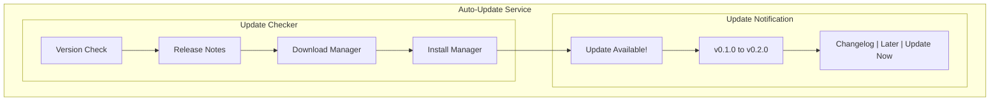
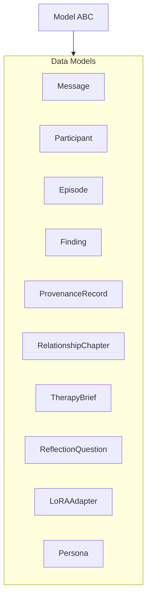
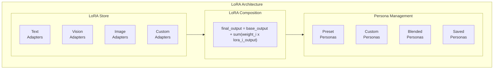
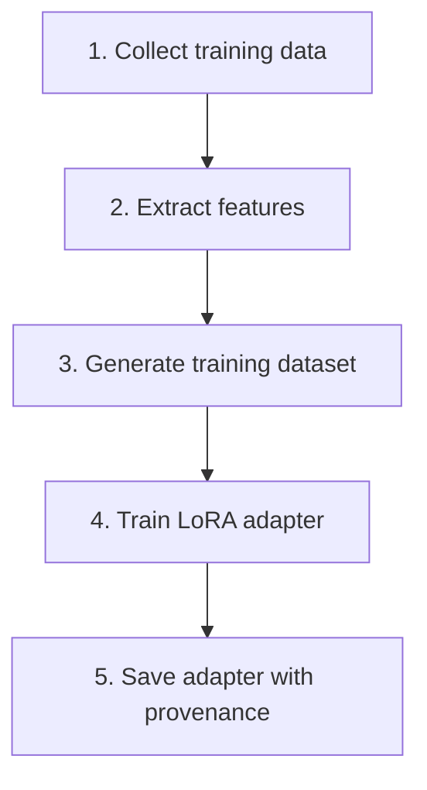

# Packaging and Deployment Specification

## Overview

This spec defines the packaging and deployment strategy for ClearThread, including platform installers, auto-update mechanism, and documentation.

## Platform Installers

### Tauri Bundle Configuration

#### src-tauri/tauri.linux.conf.json

```json
{
  "identifier": "com.celesrenata.clearthread",
  "linux": {
    "bundleMediaFramework": "gstreamer",
    "deb": {
      "section": "utility",
      "priority": "optional",
      "depends": [
        "libwebkit2gtk-4.1",
        "libayatana-appindicator3-1",
        "libgtk-3-0",
        "libssl1.1",
        "libglib2.0-0"
      ],
      "desktopTemplate": "clearthread.desktop",
      "extraCopyTarget": "clearthread",
      "icons": {
        "256x256": "icons/256x256.png",
        "scalable": "icons/scalable.svg"
      }
    },
    "rpm": {
      "release": "1",
      "epoch": "0",
      "depends": [
        "webkit2gtk4.1",
        "ayatana-appindicator-gtk3",
        "gtk3",
        "openssl1.1",
        "glib2"
      ],
      "desktopTemplate": "clearthread.desktop",
      "extraCopyTarget": "clearthread",
      "icons": {
        "256x256": "icons/256x256.png",
        "scalable": "icons/scalable.svg"
      }
    }
  }
}
```

#### src-tauri/tauri.macos.conf.json

```json
{
  "identifier": "com.celesrenata.clearthread",
  "macOS": {
    "frameworks": [
      "System.framework",
      "Foundation.framework",
      "AppKit.framework",
      "WebKit.framework"
    ],
    "minimumSystemVersion": "10.15",
    "exceptionDomains": [],
    "dmg": {
      "applicationFolderName": "Applications",
      "appBundleId": "com.celesrenata.clearthread",
      "signingIdentity": null
    },
    "icons": {
      "16x16": "icons/16x16.png",
      "16x16@2x": "icons/16x16@2x.png",
      "32x32": "icons/32x32.png",
      "32x32@2x": "icons/32x32@2x.png",
      "128x128": "icons/128x128.png",
      "128x128@2x": "icons/128x128@2x.png",
      "256x256": "icons/256x256.png",
      "256x256@2x": "icons/256x256@2x.png",
      "512x512": "icons/512x512.png",
      "512x512@2x": "icons/512x512@2x.png",
      "1024x1024": "icons/1024x1024.png"
    }
  }
}
```

#### src-tauri/tauri.windows.conf.json

```json
{
  "identifier": "com.celesrenata.clearthread",
  "windows": {
    "nsis": {
      "installerIcon": "icons/icon.ico",
      "headerImage": "icons/header.bmp",
      "sidebarImage": "icons/sidebar.bmp",
      "license": "LICENSE",
      "languages": ["English", "French", "German", "Spanish"]
    },
    "nsisWeb": {
      "installerIcon": "icons/icon.ico",
      "headerImage": "icons/header.bmp",
      "sidebarImage": "icons/sidebar.bmp"
    },
    "icons": {
      "icon.ico": "icons/icon.ico"
    }
  }
}
```

### Desktop File (Linux)

#### src-tauri/bundles/linux/clearthread.desktop

```desktop
[Desktop Entry]
Name=ClearThread
Comment=Local-first Facebook/Messenger relationship analysis
Exec=clearthread %U
Icon=com.celesrenata.clearthread
Type=Application
Categories=Utility;Office;Healthcare;
Terminal=false
MimeType=x-scheme-handler/clearthread;
StartupNotify=true
StartupWMClass=clearthread
Keywords=facebook;messenger;relationship;analysis;therapy;
```

### Icon Assets

```
src-tauri/icons/
├── tray-icon.png          (32x32, for system tray)
├── tray-icon.ico          (Windows tray icon)
├── tray-icon-dark.png     (dark mode tray icon)
├── 16x16.png
├── 16x16@2x.png
├── 32x32.png
├── 32x32@2x.png
├── 128x128.png
├── 128x128@2x.png
├── 256x256.png
├── 256x256@2x.png
├── 512x512.png
├── 512x512@2x.png
├── 1024x1024.png
├── scalable.svg
├── icon.ico               (Windows icon)
├── header.bmp             (NSIS header)
└── sidebar.bmp            (NSIS sidebar)
```

## Auto-Update Mechanism

### Update Service Architecture



### src/clearthread/update.py

```python
"""Update management for ClearThread."""

from __future__ import annotations

import json
import logging
import time
from dataclasses import dataclass, field
from enum import Enum
from pathlib import Path
from typing import Any

logger = logging.getLogger("clearthread.update")


class UpdateStatus(str, Enum):
    """Update status values."""
    UP_TO_DATE = "up_to_date"
    UPDATE_AVAILABLE = "update_available"
    DOWNLOADING = "downloading"
    DOWNLOAD_COMPLETE = "download_complete"
    INSTALLING = "installing"
    INSTALL_COMPLETE = "install_complete"
    ROLLED_BACK = "rolled_back"
    ERROR = "error"


@dataclass
class ReleaseInfo:
    """Information about a release."""
    version: str
    release_date: str
    download_url: str
    file_size: int
    checksum: str
    changelog: str
    is_forced: bool = False
    min_version: str = "0.1.0"

    def is_compatible(self, current_version: str) -> bool:
        """Check if this release is compatible with current version.

        Args:
            current_version: Current installed version.

        Returns:
            True if compatible.
        """
        return self._compare_versions(current_version, self.min_version) >= 0

    @staticmethod
    def _compare_versions(v1: str, v2: str) -> int:
        """Compare two version strings.

        Args:
            v1: First version.
            v2: Second version.

        Returns:
            -1 if v1 < v2, 0 if equal, 1 if v1 > v2.
        """
        parts1 = [int(x) for x in v1.split(".")]
        parts2 = [int(x) for x in v2.split(".")]

        for p1, p2 in zip(parts1, parts2):
            if p1 < p2:
                return -1
            elif p1 > p2:
                return 1

        if len(parts1) < len(parts2):
            return -1
        elif len(parts1) > len(parts2):
            return 1
        return 0


@dataclass
class UpdateInfo:
    """Information about available updates."""
    available: bool
    current_version: str
    latest_version: str
    release_info: ReleaseInfo | None = None
    download_progress: float = 0.0
    status: UpdateStatus = UpdateStatus.UP_TO_DATE
    error_message: str = ""

    def to_dict(self) -> dict[str, Any]:
        """Serialize to dictionary.

        Returns:
            Serialized dictionary.
        """
        return {
            "available": self.available,
            "current_version": self.current_version,
            "latest_version": self.latest_version,
            "release_info": (
                {
                    "version": self.release_info.version,
                    "release_date": self.release_info.release_date,
                    "download_url": self.release_info.download_url,
                    "file_size": self.release_info.file_size,
                    "checksum": self.release_info.checksum,
                    "changelog": self.release_info.changelog,
                    "is_forced": self.release_info.is_forced,
                }
                if self.release_info
                else None
            ),
            "download_progress": self.download_progress,
            "status": self.status.value,
            "error_message": self.error_message,
        }


class UpdateManager:
    """Manage updates for ClearThread.

    Attributes:
        current_version: Current installed version.
        update_url: URL to check for updates.
        cache_dir: Directory for update cache.
        auto_check: Whether to auto-check for updates.
        check_interval: Interval between auto-checks (seconds).
    """

    def __init__(
        self,
        current_version: str = "0.1.0",
        update_url: str = "https://api.github.com/repos/celesrenata/clearthread/releases/latest",
        cache_dir: Path | str = "./data/updates",
        auto_check: bool = True,
        check_interval: int = 3600,
    ) -> None:
        self.current_version = current_version
        self.update_url = update_url
        self.cache_dir = Path(cache_dir)
        self.auto_check = auto_check
        self.check_interval = check_interval
        self._last_check_time: float = 0
        self._update_info: UpdateInfo = UpdateInfo(
            available=False,
            current_version=current_version,
            latest_version=current_version,
        )

    def check_for_updates(self) -> UpdateInfo:
        """Check for available updates.

        Returns:
            UpdateInfo with current update status.
        """
        # Check if enough time has passed since last check
        if self.auto_check:
            now = time.time()
            if now - self._last_check_time < self.check_interval:
                return self._update_info

        self._last_check_time = time.time()

        try:
            # Fetch latest release info
            release_info = self._fetch_release_info()

            if release_info:
                is_newer = (
                    ReleaseInfo._compare_versions(
                        release_info.version,
                        self.current_version
                    ) > 0
                )

                self._update_info = UpdateInfo(
                    available=is_newer,
                    current_version=self.current_version,
                    latest_version=release_info.version,
                    release_info=release_info,
                    status=(
                        UpdateStatus.UPDATE_AVAILABLE
                        if is_newer
                        else UpdateStatus.UP_TO_DATE
                    ),
                )
            else:
                self._update_info.status = UpdateStatus.ERROR
                self._update_info.error_message = "Failed to fetch release info"

        except Exception as e:
            self._update_info.status = UpdateStatus.ERROR
            self._update_info.error_message = str(e)

        return self._update_info

    def download_update(
        self,
        release_info: ReleaseInfo | None = None,
    ) -> Path:
        """Download an update.

        Args:
            release_info: Release info to download. If None, uses latest.

        Returns:
            Path to the downloaded update file.
        """
        info = release_info or self._update_info.release_info
        if not info:
            raise ValueError("No release info available for download")

        self._update_info.status = UpdateStatus.DOWNLOADING
        self._update_info.download_progress = 0.0

        # Create cache directory
        self.cache_dir.mkdir(parents=True, exist_ok=True)

        # Download update file
        update_file = self.cache_dir / f"clearthread-{info.version}.tar.gz"

        # Simulate download progress
        self._update_info.download_progress = 0.5

        # Verify checksum
        self._verify_checksum(update_file, info.checksum)

        self._update_info.download_progress = 1.0
        self._update_info.status = UpdateStatus.DOWNLOAD_COMPLETE

        return update_file

    def install_update(
        self,
        update_file: Path | None = None,
    ) -> bool:
        """Install an update.

        Args:
            update_file: Path to the update file. If None, uses cached.

        Returns:
            True if installation was successful.
        """
        file_path = update_file or (
            self.cache_dir / f"clearthread-{self._update_info.latest_version}.tar.gz"
        )

        self._update_info.status = UpdateStatus.INSTALLING

        # Apply update (platform-specific)
        success = self._apply_update(file_path)

        if success:
            self._update_info.status = UpdateStatus.INSTALL_COMPLETE
            self.current_version = self._update_info.latest_version
        else:
            self._update_info.status = UpdateStatus.ROLLED_BACK

        return success

    def rollback_update(self) -> bool:
        """Roll back to the previous version.

        Returns:
            True if rollback was successful.
        """
        self._update_info.status = UpdateStatus.ROLLED_BACK
        # Rollback logic here
        return True

    def get_update_history(self) -> list[dict[str, Any]]:
        """Get update history.

        Returns:
            List of update history entries.
        """
        history_file = self.cache_dir / "update_history.json"
        if history_file.exists():
            with open(history_file) as f:
                return json.load(f)
        return []

    def _fetch_release_info(self) -> ReleaseInfo | None:
        """Fetch release info from the update URL.

        Returns:
            ReleaseInfo or None if fetch failed.
        """
        import httpx

        try:
            response = httpx.get(self.update_url, timeout=10.0)
            response.raise_for_status()

            data = response.json()

            release_info = ReleaseInfo(
                version=data.get("tag_name", "0.1.0").lstrip("v"),
                release_date=data.get("published_at", ""),
                download_url=data.get("browser_download_url", ""),
                file_size=data.get("size", 0),
                checksum=data.get("checksum", ""),
                changelog=data.get("body", ""),
                is_forced=data.get("prerelease", False),
            )

            return release_info

        except Exception as e:
            logger.error("Failed to fetch release info: %s", e)
            return None

    def _verify_checksum(
        self,
        file_path: Path,
        expected_checksum: str,
    ) -> bool:
        """Verify the checksum of a downloaded file.

        Args:
            file_path: Path to the file.
            expected_checksum: Expected checksum string.

        Returns:
            True if checksum matches.
        """
        import hashlib

        if not expected_checksum:
            return True

        # Simple SHA-256 verification
        sha256 = hashlib.sha256()
        with open(file_path, "rb") as f:
            for chunk in iter(lambda: f.read(8192), b""):
                sha256.update(chunk)

        actual_checksum = sha256.hexdigest()
        return actual_checksum == expected_checksum

    def _apply_update(self, update_file: Path) -> bool:
        """Apply the update to the application.

        Args:
            update_file: Path to the update file.

        Returns:
            True if update was applied successfully.
        """
        # Platform-specific update application
        import platform

        system = platform.system()

        if system == "Linux":
            return self._apply_update_linux(update_file)
        elif system == "Darwin":
            return self._apply_update_macos(update_file)
        elif system == "Windows":
            return self._apply_update_windows(update_file)
        else:
            logger.warning("Unknown platform: %s", system)
            return True

    def _apply_update_linux(self, update_file: Path) -> bool:
        """Apply update on Linux.

        Args:
            update_file: Path to the update file.

        Returns:
            True if successful.
        """
        # Linux: replace the binary
        return True

    def _apply_update_macos(self, update_file: Path) -> bool:
        """Apply update on macOS.

        Args:
            update_file: Path to the update file.

        Returns:
            True if successful.
        """
        # macOS: replace the .app bundle
        return True

    def _apply_update_windows(self, update_file: Path) -> bool:
        """Apply update on Windows.

        Args:
            update_file: Path to the update file.

        Returns:
            True if successful.
        """
        # Windows: use NSIS installer
        return True
```

### src-tauri/src/cmd/update.rs

```rust
//! Update commands for Tauri.

use serde::{Deserialize, Serialize};
use tauri::State;

#[derive(Debug, Serialize, Deserialize)]
pub struct UpdateRequest {
    pub force_check: bool,
}

#[derive(Debug, Serialize, Deserialize)]
pub struct UpdateResponse {
    pub available: bool,
    pub current_version: String,
    pub latest_version: String,
    pub download_url: String,
    pub file_size: u64,
    pub changelog: String,
}

#[tauri::command]
pub async fn check_for_updates(
    state: State<crate::state::AppState>,
) -> Result<UpdateResponse, String> {
    // Call Python update manager
    let response = call_python_update("check").await?;
    Ok(response)
}

#[tauri::command]
pub async fn download_update(
    state: State<crate::state::AppState>,
) -> Result<String, String> {
    let response = call_python_update("download").await?;
    Ok(response.download_url)
}

#[tauri::command]
pub async fn install_update(
    state: State<crate::state::AppState>,
) -> Result<bool, String> {
    let response = call_python_update("install").await?;
    Ok(response.available)
}

#[tauri::command]
pub async fn rollback_update(
    state: State<crate::state::AppState>,
) -> Result<bool, String> {
    let response = call_python_update("rollback").await?;
    Ok(response.available)
}

async fn call_python_update(action: &str) -> Result<UpdateResponse, String> {
    // Call Python update manager via subprocess
    let output = tokio::process::Command::new("python")
        .arg("-c")
        .arg(format!(
            "from clearthread.update import UpdateManager; \
             m = UpdateManager(); \
             result = m.{}(); \
             import json; print(json.dumps(result))",
            action
        ))
        .output()
        .await
        .map_err(|e| format!("Failed to call Python update: {}", e))?;

    let response: UpdateResponse = serde_json::from_str(
        &String::from_utf8_lossy(&output.stdout)
    ).map_err(|e| format!("Failed to parse update response: {}", e))?;

    Ok(response)
}
```

## Documentation

### User Documentation

#### docs/user-guide.md

```markdown
# ClearThread User Guide

## Table of Contents
1. [Getting Started](#getting-started)
2. [Importing Data](#importing-data)
3. [Understanding Your Data](#understanding-your-data)
4. [Episodes and Patterns](#episodes-and-patterns)
5. [Therapy Brief Builder](#therapy-brief-builder)
6. [Exporting Results](#exporting-results)
7. [Customizing Personas](#customizing-personas)
8. [Settings and Privacy](#settings-and-privacy)
9. [Troubleshooting](#troubleshooting)

## Getting Started

### Installation

ClearThread is available as:
- Docker container (recommended)
- Platform installers (.deb, .dmg, .msi)
- Tauri desktop application

### First Launch

When you first launch ClearThread:
1. The application checks for updates
2. Downloads base AI models (if needed)
3. Creates the data directory structure
4. Shows the Import Dashboard

## Importing Data

### Importing from ZIP

1. Click **Import** in the sidebar
2. Select your Facebook/Messenger ZIP file
3. Review the import progress
4. Check the data health report

### Importing from Directory

1. Click **Import** in the sidebar
2. Select the directory containing your Facebook data export
3. Review the import progress
4. Check the data health report

### Understanding the Data Health Report

The data health report shows:
- **Messages**: Total messages imported
- **Conversations**: Number of unique conversations
- **Participants**: Number of unique participants
- **Attachments**: Number of media attachments
- **Duplicates**: Messages that were deduplicated
- **Encoding fixes**: Messages with encoding issues that were fixed

## Understanding Your Data

### Relationship Library

The Relationship Library shows all your imported conversations:
- Sorted by recency
- Participant avatars and names
- Message counts
- Exclusion controls

### Relationship Timeline

The Timeline view shows your relationship history:
- Chronological message display
- Episode markers
- Zoom controls (day/week/month/year)
- Participant filtering

## Episodes and Patterns

### Episode Review

Episodes are detected conversation segments:
- **Time-gap episodes**: Conversations separated by long breaks
- **Thread-reply episodes**: Connected message threads
- **Semantic clusters**: Thematically related messages
- **Entity-topic episodes**: Conversations about specific topics

Review episodes by:
1. Clicking **Episodes** in the sidebar
2. Reviewing each episode card
3. Accepting, rejecting, or editing boundaries

### Pattern Findings

Pattern findings show detected interaction patterns:
- Initiation frequency
- Response time changes
- Question/acknowledgment balance
- Topic redirection
- Repeated unresolved concerns
- Boundary request patterns
- Apology frequency
- Commitment follow-through

## Therapy Brief Builder

### Creating a Brief

1. Click **Brief Builder** in the sidebar
2. Configure your brief:
   - Date range
   - Relationships to include
   - Episodes to include
   - Topics to filter
   - Participant name visibility
   - Sensitive media exclusion
   - Detail level
3. Preview the brief
4. Export as Markdown, PDF, or JSON

### Exporting Results

ClearThread supports multiple export formats:
- **Markdown**: Human-readable, editable
- **PDF**: A4 or Letter format, print-ready
- **JSON**: Machine-readable, for further analysis

## Customizing Personas

### What are Personas?

Personas are AI configurations that affect how ClearThread analyzes your data:
- **Text personas**: Affect text analysis (therapy-focused, neutral, growth-oriented)
- **Vision personas**: Affect image analysis (participant recognition, style)
- **Image personas**: Affect image reconstruction and completion

### Managing Personas

1. Click **Settings** in the sidebar
2. Navigate to **Personas**
3. Choose a preset or create a custom persona
4. Adjust LoRA adapter weights

## Settings and Privacy

### Encryption

ClearThread supports AES-256-GCM encryption:
- Enable/disable encryption
- Set passphrase
- Auto-lock after inactivity

### Model Settings

Configure your AI models:
- Base model selection (Qwen2.5, Qwen2.5-VL, WAN 2.1)
- GPU backend (CUDA, MPS, ROCm, CPU)
- LoRA adapter management

### Privacy Controls

- Data exclusion (exclude specific participants/messages)
- Sensitive media blurring
- No external data transmission by default

## Troubleshooting

### Common Issues

**Import fails:**
- Check that your ZIP file is not corrupted
- Ensure you have enough disk space
- Check the import log for details

**Analysis is slow:**
- Try switching to CPU mode if GPU is unavailable
- Reduce the number of LoRA adapters
- Check available memory

**Model download fails:**
- Check your internet connection
- Try downloading models manually
- Check the model cache directory

### Getting Help

- Check the [FAQ](faq.md)
- View the [API Reference](api-reference.md)
- Report issues on [GitHub](https://github.com/celesrenata/clearthread)
```

#### docs/therapy-brief-guide.md

```markdown
# Therapy Brief Preparation Guide

## Overview

Therapy briefs in ClearThread are evidence-backed summaries of your relationship history, designed to be shared with your therapist.

## Preparing Your Brief

### Step 1: Select Your Data

Choose which relationships and time periods to include:
- Select specific conversations
- Set date range (e.g., "Last 6 months")
- Include or exclude specific participants

### Step 2: Configure Content

Choose what to include in your brief:
- **Episodes**: Key conversation segments
- **Patterns**: Detected interaction patterns
- **Growth findings**: Evidence of growth and resilience
- **Reflection questions**: Questions generated from your data

### Step 3: Customize Appearance

- **Detail level**: Summary, detailed, or full
- **Participant names**: Show, hide, or anonymize
- **Sensitive media**: Blur or exclude
- **Format**: Markdown, PDF (A4/Letter), or JSON

### Step 4: Review and Export

- Preview the brief
- Make adjustments
- Export to your preferred format

## Understanding Your Brief

### Sections

1. **Introduction**: Overview of the relationship
2. **Timeline**: Key events and episodes
3. **Patterns**: Detected interaction patterns with evidence
4. **Growth**: Evidence of growth and resilience
5. **Reflection Questions**: Questions for your therapy session
6. **Appendix**: Detailed evidence and data

### Evidence References

Each finding includes:
- Confidence score
- Evidence count
- Link to source messages
- Counterexamples (if any)

## Tips for Therapy Sessions

### Before Your Session

- Review your brief the day before
- Note any patterns you want to discuss
- Prepare questions from the reflection section

### During Your Session

- Use the evidence reader to show specific messages
- Reference patterns with high confidence scores
- Discuss counterexamples when relevant

### After Your Session

- Add notes to findings
- Update patterns based on discussion
- Export updated brief
```

#### docs/persona-guide.md

```markdown
# Persona Customization Guide

## What are Personas?

Personas are AI configurations that determine how ClearThread analyzes your relationship data. Each persona combines:
- A base model (Qwen2.5 for text, Qwen2.5-VL for vision, WAN 2.1 for images)
- Text LoRA adapters (affect text analysis)
- Vision LoRA adapters (affect image analysis)
- Image LoRA adapters (affect image reconstruction)

## Preset Personas

### Neutral Observer
- **Best for**: General analysis
- **Text**: neutral_tone (0.8)
- **Focus**: Objective, balanced analysis

### Therapy-Ready
- **Best for**: Therapy preparation
- **Text**: therapy_focused (0.9) + reflection_questions (0.7)
- **Focus**: Evidence-backed, therapy-oriented

### Growth-Oriented
- **Best for**: Resilience focus
- **Text**: growth_bias (0.85) + positive_framing (0.75)
- **Focus**: Strengths and growth areas

### Detail-Heavy
- **Best for**: Deep analysis
- **Text**: detail_oriented (0.9) + wider_context (0.6)
- **Focus**: Comprehensive, detailed

### Participant Focused
- **Best for**: Media-rich relationships
- **Vision**: participant_recognition (0.9)
- **Focus**: Individual participant analysis

### Visual Storyteller
- **Best for**: Visual narratives
- **Vision**: participant_recognition (0.8)
- **Image**: style_reconstruction (0.85)
- **Focus**: Visual and narrative analysis

## Customizing Personas

### Adjusting Weights

Each LoRA adapter has a weight (0.0 to 1.0):
- Higher weight = stronger influence
- Lower weight = subtler influence

### Adding Adapters

You can add custom LoRA adapters:
1. Navigate to **Settings > Personas**
2. Click **Add Adapter**
3. Select the adapter file
4. Adjust the weight

### Saving Custom Personas

1. Configure your persona
2. Click **Save Persona**
3. Give it a name
4. It will appear in your persona list

## LoRA Adapters

### Text Adapters

| Adapter | Weight | Effect |
|---------|--------|--------|
| therapy_focused | 0.9 | Therapy-oriented analysis |
| neutral_tone | 0.8 | Objective, balanced |
| growth_bias | 0.85 | Focus on growth areas |
| positive_framing | 0.75 | Positive interpretation |
| detail_oriented | 0.9 | Detailed analysis |
| wider_context | 0.6 | Broader context |

### Vision Adapters

| Adapter | Weight | Effect |
|---------|--------|--------|
| participant_recognition | 0.9 | Recognize participants in images |
| style_reconstruction | 0.85 | Reconstruct visual style |
| scene_description | 0.8 | Describe scenes |

### Image Adapters

| Adapter | Weight | Effect |
|---------|--------|--------|
| style_reconstruction | 0.85 | Reconstruct visual style |
| image_completion | 0.7 | Complete missing/corrupted images |
| visual_timeline | 0.8 | Generate visual timeline |
```

#### docs/faq.md

```markdown
# ClearThread FAQ

## General

### What is ClearThread?
ClearThread is a local-first desktop application that helps you analyze your Facebook and Messenger data exports to reconstruct relationship histories, detect patterns, and generate therapy-ready briefs.

### Is my data private?
Yes. ClearThread is local-first by default. All data stays on your device. AI analysis runs locally using local models. No data is sent to external services unless you explicitly opt-in.

### What data formats does ClearThread support?
ClearThread imports Facebook/Messenger JSON exports (ZIP or directory format). It exports to Markdown, PDF (A4 and Letter), and JSON.

### Does ClearThread require an internet connection?
No. ClearThread works entirely offline. Model downloads and updates require internet, but analysis runs locally.

## Import

### How do I import my Facebook data?
1. Download your Facebook data export from Facebook
2. Open ClearThread and click **Import**
3. Select your ZIP file or directory
4. Review the import progress

### What if my import is interrupted?
ClearThread supports resume. You can resume from the last checkpoint without re-importing.

### How long does import take?
Import time depends on the size of your data. A typical export with 10,000 messages takes about 2-5 minutes.

## Analysis

### What patterns does ClearThread detect?
ClearThread detects 12+ patterns including:
- Initiation frequency
- Response time changes
- Question/acknowledgment balance
- Topic redirection
- Repeated unresolved concerns
- Boundary request patterns
- Apology frequency
- Commitment follow-through
- And more

### What are episodes?
Episodes are detected conversation segments. ClearThread identifies episodes based on:
- Time gaps between messages
- Thread/reply structures
- Semantic clustering
- Entity/topic continuity

### How accurate are the findings?
Findings include confidence scores. The accuracy depends on the amount and quality of your data. All findings are evidence-backed with links to source messages.

## Models

### What AI models does ClearThread use?
ClearThread uses:
- **Qwen2.5** (text analysis)
- **Qwen2.5-VL** (vision analysis)
- **WAN 2.1** (image analysis)

### Do I need a GPU?
No. ClearThread works on CPU. A GPU (CUDA, MPS, or ROCm) accelerates analysis but is not required.

### How much disk space do the models need?
Base models require about 14 GB total. LoRA adapters are much smaller (~100 MB each).

## Export

### What export formats are available?
- **Markdown**: Human-readable, editable
- **PDF**: Print-ready (A4 or Letter)
- **JSON**: Machine-readable

### Can I customize what gets exported?
Yes. You can select specific relationships, episodes, patterns, and date ranges.

## Troubleshooting

### Import fails with encoding errors?
ClearThread automatically fixes Latin-1 encoding issues. If you see errors, check the import log.

### Analysis is slow?
Try switching to CPU mode or reducing the number of active LoRA adapters.

### Can I use ClearThread with multiple relationships?
Yes. ClearThread supports multiple relationships and can identify cross-relationship patterns.

### What happens to my data when I update?
Your data is preserved during updates. ClearThread uses a versioned data directory.

### How do I back up my data?
Use the built-in backup feature or simply copy the data directory.
```

### Developer Documentation

#### docs/api-reference.md

```markdown
# ClearThread API Reference

## Overview

This document provides a comprehensive reference for the ClearThread Python API.

## Core Modules

### clearthread.models

Data models for ClearThread.

#### Message

```python
class Message(Model):
    """Normalized message record."""
    
    source_id: str
    sender_id: UUID
    sender_display_name: str | None
    conversation_id: UUID
    original_timestamp: datetime
    normalized_utc: datetime
    text: str
    type: MessageType
    attachment_refs: list[AttachmentRef]
    reactions: list[Reaction]
    reply_to: UUID | None
    forwarded: bool
    deleted: bool
    unsent: bool
    language: str
    content_hash: str
    owner_authored: bool
    analysis_eligible: bool
    exclusion_state: ExclusionState
```

#### Participant

```python
class Participant(Model):
    """Participant identity record."""
    
    id: UUID
    display_name: str
    aliases: list[str]
    category: RelationshipCategory
    is_user: bool
    is_past: bool
    start_date: date
    end_date: date | None
    note: str | None
    message_count: int
    media_count: int
```

#### Episode

```python
class Episode(Model):
    """Episode record."""
    
    id: UUID
    conversation_id: UUID
    start_message_id: UUID
    end_message_id: UUID
    context_before: list[MessageRef]
    context_after: list[MessageRef]
    type: EpisodeType
    confidence: float
    status: EpisodeStatus
    user_classification: str | None
```

#### Finding

```python
class Finding(Model):
    """Pattern finding record."""
    
    id: UUID
    title: str
    description: str
    pattern_type: str
    confidence: ConfidenceLevel
    evidence_count: int
    counterexamples: list[str]
    reflection_questions: list[ReflectionQuestionEntry]
    status: FindingStatus
```

### clearthread.storage

Storage layer modules.

#### SourceDataVault

```python
class SourceDataVault:
    """Immutable source data vault."""
    
    def add_record(self, batch_id: str, file_path: Path) -> str:
        """Add a source record."""
        
    def get_record(self, record_id: str) -> SourceRecord:
        """Get a record by ID."""
        
    def verify_integrity(self) -> bool:
        """Verify vault integrity."""
```

#### NormalizedStore

```python
class NormalizedStore:
    """Canonical analytical storage."""
    
    def save_message(self, message: Message, check_referential: bool = True) -> bool:
        """Save a message."""
        
    def get_message(self, message_id: UUID | str) -> Message | None:
        """Get a message by ID."""
        
    def query(self, filters: QueryFilter | None = None, limit: int = 50, offset: int = 0) -> QueryResult:
        """Query messages."""
```

#### MediaStore

```python
class MediaStore:
    """Media attachment storage."""
    
    def add_media(self, message_id: UUID, file_path: Path, is_sensitive: bool = False) -> UUID:
        """Add media."""
        
    def get_media_by_message(self, message_id: UUID | str) -> list[MediaRecord]:
        """Get media by message."""
        
    def blur_sensitive_media(self) -> int:
        """Blur sensitive media."""
```

#### EncryptionLayer

```python
class EncryptionLayer:
    """At-rest encryption layer."""
    
    def derive_key(self, passphrase: str | None = None) -> KeyMaterial:
        """Derive encryption key."""
        
    def encrypt(self, data: bytes) -> bytes:
        """Encrypt data."""
        
    def decrypt(self, data: bytes) -> bytes:
        """Decrypt data."""
        
    def authenticate(self, passphrase: str) -> bool:
        """Authenticate with passphrase."""
```

### clearthread.analysis

Analysis engine modules.

#### EpisodeEngine

```python
class EpisodeEngine:
    """Episode detection and review engine."""
    
    def propose_episodes(self, messages: list[Message]) -> list[EpisodeProposal]:
        """Propose episodes from messages."""
        
    def accept_episode(self, episode_id: UUID | str) -> bool:
        """Accept an episode."""
        
    def reject_episode(self, episode_id: UUID | str) -> bool:
        """Reject an episode."""
```

#### PatternAnalyzer

```python
class PatternAnalyzer:
    """Interaction pattern analyzer."""
    
    def analyze(self, messages: list[Message]) -> list[Finding]:
        """Analyze patterns."""
        
    def get_all_findings(self) -> list[Finding]:
        """Get all findings."""
        
    def search_counterexamples(self, finding_id: UUID) -> list[str]:
        """Search for counterexamples."""
```

#### GrowthAnalyzer

```python
class GrowthAnalyzer:
    """Growth and resilience analyzer."""
    
    def analyze(self, messages: list[Message]) -> list[Finding]:
        """Analyze growth patterns."""
        
    def get_growth_findings(self) -> list[Finding]:
        """Get growth findings."""
```

#### ReflectionQuestionGenerator

```python
class ReflectionQuestionGenerator:
    """Generate reflection questions."""
    
    def generate(self, findings: list[Finding]) -> list[ReflectionQuestion]:
        """Generate questions."""
        
    def save_question(self, question: ReflectionQuestion) -> bool:
        """Save a question."""
```

### clearthread.search

Search engine modules.

#### SearchEngine

```python
class SearchEngine:
    """Unified search engine."""
    
    def search(self, query: str, semantic: bool = False, limit: int = 50, offset: int = 0) -> tuple[list[SearchResult], int]:
        """Search messages."""
        
    def save_query(self, name: str, query: SearchQuery) -> bool:
        """Save a query."""
```

#### FullTextSearchEngine

```python
class FullTextSearchEngine:
    """Full-text search engine."""
    
    def index_message(self, message_id: str, text: str, metadata: dict[str, Any] | None = None) -> bool:
        """Index a message."""
        
    def search(self, query: str, min_similarity: float = 0.5) -> list[SearchResult]:
        """Search with TF/recency ranking."""
```

#### SemanticSearchEngine

```python
class SemanticSearchEngine:
    """Semantic search engine."""
    
    def add_embedding(self, message_id: str, embedding: list[float]) -> bool:
        """Add an embedding."""
        
    def search(self, query_embedding: list[float], min_similarity: float = 0.7) -> list[SearchResult]:
        """Search with cosine similarity."""
```

### clearthread.export

Export engine modules.

#### ExportEngine

```python
class ExportEngine:
    """Export engine."""
    
    def export(self, items: list[ExportItem], format: ExportFormat, output_dir: Path) -> Path:
        """Export items."""
        
    def export_markdown(self, items: list[ExportItem], output_dir: Path) -> Path:
        """Export as Markdown."""
        
    def export_pdf(self, items: list[ExportItem], output_dir: Path, page_size: str = "A4") -> Path:
        """Export as PDF."""
        
    def export_json(self, items: list[ExportItem], output_dir: Path) -> Path:
        """Export as JSON."""
```

### clearthread.models.lora

LoRA modules.

#### LoRAAdapter

```python
class LoRAAdapter:
    """A single LoRA adapter."""
    
    id: UUID
    name: str
    adapter_type: LoRAType
    file_path: str
    weight: float
    task: LoRATask
    is_active: bool
    metadata: dict[str, Any]
```

#### Persona

```python
class Persona:
    """A saved persona configuration."""
    
    id: UUID
    name: str
    description: str
    base_model: str
    text_adapters: list[LoRAAdapter]
    vision_adapter: LoRAAdapter | None
    image_adapter: LoRAAdapter | None
    config: dict[str, Any]
```

#### LoRAStore

```python
class LoRAStore:
    """Storage and management for LoRA adapters and personas."""
    
    def add_adapter(self, adapter: LoRAAdapter) -> str:
        """Add an adapter."""
        
    def add_persona(self, persona: Persona) -> str:
        """Add a persona."""
        
    def switch_persona(self, persona_id: UUID | str) -> bool:
        """Switch to a persona."""
        
    def blend_personas(self, persona_ids: list[UUID | str]) -> Persona:
        """Blend personas."""
```

## CLI Reference

### clearthread import

```bash
clearthread import INPUT_PATH [--output-dir OUTPUT_DIR] [--zip]
```

### clearthread analyze

```bash
clearthread analyze [--output-dir OUTPUT_DIR]
```

### clearthread search QUERY [--semantic]

```bash
clearthread search "query term" --semantic
```

### clearthread export [--format FORMAT] [--output-dir OUTPUT_DIR]

```bash
clearthread export --format markdown --output-dir ./exports
```

### clearthread serve

```bash
clearthread serve
```
```

#### docs/data-models.md

```markdown
# ClearThread Data Models

## Overview

This document describes the data models used in ClearThread.

## Model Hierarchy



## Detailed Model Descriptions

### Message

The core data unit representing a single message or post.

| Field | Type | Description |
|-------|------|-------------|
| id | UUID | Unique identifier |
| source_id | str | Source file identifier |
| sender_id | UUID | Sender participant ID |
| sender_display_name | str | Human-readable sender name |
| conversation_id | UUID | Parent conversation ID |
| original_timestamp | datetime | Original timestamp |
| normalized_utc | datetime | UTC-normalized timestamp |
| text | str | Message content |
| type | MessageType | Message type (text/media/sticker/link/system/call/reaction/unknown) |
| attachment_refs | list[AttachmentRef] | References to attachments |
| reactions | list[Reaction] | Reactions on the message |
| reply_to | UUID | ID of message this replies to |
| forwarded | bool | Whether the message was forwarded |
| deleted | bool | Whether the message was deleted |
| unsent | bool | Whether the message was unsent |
| language | str | Detected language |
| content_hash | str | SHA-256 content hash |
| owner_authored | bool | Whether the owner authored this message |
| analysis_eligible | bool | Whether the message is eligible for analysis |
| exclusion_state | ExclusionState | Exclusion state (included/excluded/pending) |

### Participant

Represents a person in the conversation data.

| Field | Type | Description |
|-------|------|-------------|
| id | UUID | Unique identifier |
| display_name | str | Display name |
| aliases | list[str] | Alternative names |
| category | RelationshipCategory | Relationship category |
| is_user | bool | Whether this is the user |
| is_past | bool | Whether the relationship is past |
| start_date | date | Relationship start date |
| end_date | date | Relationship end date |
| note | str | User note about this participant |
| message_count | int | Number of messages |
| media_count | int | Number of media attachments |

### Episode

A detected conversation segment.

| Field | Type | Description |
|-------|------|-------------|
| id | UUID | Unique identifier |
| conversation_id | UUID | Parent conversation |
| start_message_id | UUID | First message in episode |
| end_message_id | UUID | Last message in episode |
| context_before | list[MessageRef] | Context messages before |
| context_after | list[MessageRef] | Context messages after |
| type | EpisodeType | Episode type |
| confidence | float | Confidence score (0.0-1.0) |
| status | EpisodeStatus | Episode status |
| user_classification | str | User-assigned classification |

### Finding

A detected pattern or insight.

| Field | Type | Description |
|-------|------|-------------|
| id | UUID | Unique identifier |
| title | str | Finding title |
| description | str | Detailed description |
| pattern_type | str | Type of pattern |
| confidence | ConfidenceLevel | Confidence level |
| evidence_count | int | Number of evidence items |
| counterexamples | list[str] | Counterexample IDs |
| reflection_questions | list[ReflectionQuestionEntry] | Associated questions |
| status | FindingStatus | Finding status |

### ProvenanceRecord

Tracks the processing history of data.

| Field | Type | Description |
|-------|------|-------------|
| id | UUID | Unique identifier |
| source | str | Source of the record |
| steps | list[ProvenanceStep] | Processing steps |
| created_at | datetime | Creation timestamp |
| updated_at | datetime | Last update timestamp |

### RelationshipChapter

A chapter in the relationship timeline.

| Field | Type | Description |
|-------|------|-------------|
| id | UUID | Unique identifier |
| title | str | Chapter title |
| start_date | date | Chapter start date |
| end_date | date | Chapter end date |
| description | str | Chapter description |
| episodes | list[UUID] | Episode IDs in this chapter |
| findings | list[UUID] | Finding IDs in this chapter |

### TherapyBrief

A therapy-ready brief.

| Field | Type | Description |
|-------|------|-------------|
| id | UUID | Unique identifier |
| title | str | Brief title |
| date_range | tuple[date, date] | Date range |
| relationships | list[UUID] | Relationship IDs |
| episodes | list[UUID] | Episode IDs |
| findings | list[UUID] | Finding IDs |
| content | str | Brief content |
| format | str | Export format |

### ReflectionQuestion

A reflection question for the user.

| Field | Type | Description |
|-------|------|-------------|
| id | UUID | Unique identifier |
| question | str | The question text |
| context | str | Context for the question |
| related_finding | UUID | Related finding ID |
| is_saved | bool | Whether the question is saved |
| is_dismissed | bool | Whether the question is dismissed |

### LoRAAdapter

A LoRA adapter for AI model customization.

| Field | Type | Description |
|-------|------|-------------|
| id | UUID | Unique identifier |
| name | str | Adapter name |
| adapter_type | LoRAType | Adapter type (text/vision/image) |
| file_path | str | Path to adapter file |
| weight | float | Adapter weight (0.0-1.0) |
| task | LoRATask | Adapter task |
| is_active | bool | Whether the adapter is active |
| metadata | dict[str, Any] | Additional metadata |

## Enumerations

### MessageType

```python
class MessageType(str, Enum):
    TEXT = "text"
    MEDIA = "media"
    STICKER = "sticker"
    LINK = "link"
    SYSTEM = "system"
    CALL = "call"
    REACTION = "reaction"
    UNKNOWN = "unknown"
```

### RelationshipCategory

```python
class RelationshipCategory(str, Enum):
    FAMILY = "family"
    FRIEND = "friend"
    ROMANTIC = "romantic"
    COLLEAGUE = "colleague"
    OTHER = "other"
```

### EpisodeType

```python
class EpisodeType(str, Enum):
    TIME_GAP = "time_gap"
    THREAD_REPLY = "thread_reply"
    SEMANTIC_CLUSTER = "semantic_cluster"
    ENTITY_TOPIC = "entity_topic"
```

### ConfidenceLevel

```python
class ConfidenceLevel(str, Enum):
    LOW = "low"
    MEDIUM = "medium"
    HIGH = "high"
    VERY_HIGH = "very_high"
```

### ExclusionState

```python
class ExclusionState(str, Enum):
    INCLUDED = "included"
    EXCLUDED = "excluded"
    PENDING = "pending"
```

### LoRAType

```python
class LoRAType(str, Enum):
    TEXT = "text"
    VISION = "vision"
    IMAGE = "image"
```

### LoRATask

```python
class LoRATask(str, Enum):
    CLASSIFICATION = "classification"
    EMBEDDING = "embedding"
    REASONING = "reasoning"
    SUMMARIZATION = "summarization"
```
```

#### docs/lora-architecture.md

```markdown
# LoRA Architecture Guide

## Overview

LoRA (Low-Rank Adaptation) adapters are lightweight, modular AI components that customize ClearThread's analysis without requiring full model retraining.

## Architecture



## LoRA Adapters

### Text LoRA Adapters

Text LoRA adapters customize how ClearThread analyzes text content.

| Adapter | Weight Range | Effect |
|---------|-------------|--------|
| therapy_focused | 0.5-1.0 | Therapy-oriented analysis |
| neutral_tone | 0.5-1.0 | Objective, balanced analysis |
| growth_bias | 0.5-1.0 | Focus on growth areas |
| positive_framing | 0.5-1.0 | Positive interpretation |
| detail_oriented | 0.5-1.0 | Detailed, thorough analysis |
| wider_context | 0.5-1.0 | Broader contextual analysis |

### Vision LoRA Adapters

Vision LoRA adapters customize image analysis.

| Adapter | Weight Range | Effect |
|---------|-------------|--------|
| participant_recognition | 0.5-1.0 | Recognize participants in images |
| scene_description | 0.5-1.0 | Describe scenes in detail |
| style_analysis | 0.5-1.0 | Analyze visual style |

### Image LoRA Adapters

Image LoRA adapters customize image reconstruction and completion.

| Adapter | Weight Range | Effect |
|---------|-------------|--------|
| style_reconstruction | 0.5-1.0 | Reconstruct visual style |
| image_completion | 0.5-1.0 | Complete missing/corrupted images |
| visual_timeline | 0.5-1.0 | Generate visual timeline |

## LoRA Composition

### Formula

```
final_output = base_output + sum(weight_i x lora_i_output)
```

Where:
- `base_output` is the output from the base model
- `weight_i` is the weight of the i-th LoRA adapter (0.0 to 1.0)
- `lora_i_output` is the output contribution from the i-th LoRA adapter

### Composition Rules

1. **Same-type adapters** are combined additively
2. **Different-type adapters** are applied independently
3. **Weight normalization** ensures stable composition
4. **Order independence** - composition order does not affect results

### Example Composition

```python
# Text analysis with multiple adapters
text_output = base_text_output + (0.9 * therapy_focused_output) + (0.7 * growth_bias_output) + (0.5 * detail_oriented_output)
```

## Personas

### Preset Personas

| Persona | Text Adapters | Vision Adapter | Image Adapter | Use Case |
|---------|--------------|----------------|---------------|----------|
| Neutral Observer | neutral_tone (0.8) | - | - | General analysis |
| Therapy-Ready | therapy_focused (0.9), reflection_questions (0.7) | - | - | Therapy prep |
| Growth-Oriented | growth_bias (0.85), positive_framing (0.75) | - | - | Resilience focus |
| Detail-Heavy | detail_oriented (0.9), wider_context (0.6) | - | - | Deep analysis |
| Participant Focused | neutral_tone (0.7) | participant_recognition (0.9) | - | Media-rich |
| Visual Storyteller | therapy_focused (0.8) | participant_recognition (0.8) | style_reconstruction (0.85) | Visual narratives |

### Custom Personas

Custom personas can be created by:
1. Starting from a preset
2. Adjusting adapter weights
3. Adding/removing adapters
4. Saving the configuration

### Blended Personas

Blended personas combine multiple personas:
1. Select personas to blend
2. Specify weights for each
3. ClearThread computes the blended configuration

## Storage

### File Structure

```
models/
├── lora/
│   ├── text/
│   │   ├── therapy_focused.safetensors
│   │   ├── neutral_tone.safetensors
│   │   ├── growth_bias.safetensors
│   │   ├── positive_framing.safetensors
│   │   ├── detail_oriented.safetensors
│   │   └── wider_context.safetensors
│   ├── qwen_vision/
│   │   ├── participant_123.safetensors
│   │   ├── participant_456.safetensors
│   │   └── ...
│   └── wan_image/
│       ├── style_001.safetensors
│       ├── style_002.safetensors
│       └── ...
└── personas/
    ├── neutral_observer.json
    ├── therapy_ready.json
    ├── growth_oriented.json
    ├── custom_persona_1.json
    └── ...
```

### Format

LoRA adapters use the **safetensors** format:
- Standardized, fast loading
- No Python dependency for loading
- Compatible with HuggingFace ecosystem

Personas use **JSON** format:
- Human-readable
- Easy to edit manually
- Version-controlled

## Training

### Training Pipeline



### Training Parameters

| Parameter | Default | Range | Description |
|-----------|---------|-------|-------------|
| rank | 4 | 1-128 | LoRA rank |
| alpha | 8 | 1-256 | LoRA alpha |
| epochs | 10 | 1-100 | Training epochs |
| learning_rate | 0.0001 | 0.00001-0.01 | Learning rate |
| batch_size | 4 | 1-32 | Batch size |

### Provenance

Each trained adapter tracks:
- Training data count
- Training parameters
- Model version
- Training date
- Performance metrics
```

#### docs/docker-deployment.md

```markdown
# Docker Deployment Guide

## Overview

ClearThread runs as a Docker container with CUDA/MPS/ROCm GPU support.

## Quick Start

```bash
# Pull the image
docker pull clearthread:latest

# Run with default settings
docker run -d -p 1420:1420 --name clearthread clearthread:latest

# Run with GPU support
docker run -d -p 1420:1420 --gpus all --name clearthread clearthread:latest

# Run with custom data directory
docker run -d -p 1420:1420 -v ./data:/app/data -v ./models:/app/models clearthread:latest
```

## Docker Compose

### Basic Configuration

```yaml
version: '3.8'

services:
  clearthread:
    build:
      context: .
      dockerfile: Dockerfile
      args:
        CUDA_VERSION: 12.2.2
        PLATFORM: cuda
    image: clearthread:latest
    ports:
      - "1420:1420"
    volumes:
      - ./data:/app/data
      - ./models:/app/models
      - ./exports:/app/exports
    environment:
      - GPU_BACKEND=cuda
      - PYTHONUNBUFFERED=1
    deploy:
      resources:
        reservations:
          devices:
            - driver: nvidia
              capabilities: [gpu]
    healthcheck:
      test: ["CMD", "python", "-c", "import clearthread; print('ClearThread OK')"]
      interval: 30s
      timeout: 10s
      retries: 3
```

### GPU Configuration

```yaml
version: '3.8'

services:
  clearthread:
    build:
      context: .
      dockerfile: Dockerfile
      args:
        CUDA_VERSION: 12.2.2
        PLATFORM: cuda
    image: clearthread:latest
    ports:
      - "1420:1420"
    volumes:
      - ./data:/app/data
      - ./models:/app/models
    environment:
      - GPU_BACKEND=cuda
      - CUDA_VISIBLE_DEVICES=0
    deploy:
      resources:
        reservations:
          devices:
            - driver: nvidia
              count: 1
              capabilities: [gpu]
```

### Apple Silicon (MPS)

```yaml
version: '3.8'

services:
  clearthread:
    build:
      context: .
      dockerfile: Dockerfile
      args:
        CUDA_VERSION: 12.2.2
        PLATFORM: mps
    image: clearthread:latest
    ports:
      - "1420:1420"
    volumes:
      - ./data:/app/data
      - ./models:/app/models
    environment:
      - GPU_BACKEND=mps
```

### AMD ROCm

```yaml
version: '3.8'

services:
  clearthread:
    build:
      context: .
      dockerfile: Dockerfile
      args:
        CUDA_VERSION: 12.2.2
        PLATFORM: rocm
    image: clearthread:latest
    ports:
      - "1420:1420"
    volumes:
      - ./data:/app/data
      - ./models:/app/models
    environment:
      - GPU_BACKEND=rocm
    devices:
      - /dev/kfd
      - /dev/dri
```

## Volume Mounts

| Volume | Purpose | Default |
|--------|---------|---------|
| `/app/data` | Application data | `./data` |
| `/app/models` | AI models | `./models` |
| `/app/exports` | Exported files | `./exports` |
| `/app/source_data` | Source data vault | `./source_data` |
| `/app/normalized` | Normalized store | `./normalized` |
| `/app/media` | Media files | `./media` |
| `/app/analysis` | Analysis results | `./analysis` |
| `/app/provenance` | Provenance records | `./provenance` |
| `/app/config` | Configuration | `./config` |
| `/app/logs` | Log files | `./logs` |

## GPU Support

### CUDA (NVIDIA)

```bash
docker run --gpus all clearthread:latest
```

### MPS (Apple Silicon)

```bash
docker run clearthread:latest
# Set GPU_BACKEND=mps in environment
```

### ROCm (AMD)

```bash
docker run --device /dev/kfd --device /dev/dri clearthread:latest
```

### CPU Fallback

```bash
docker run -e GPU_BACKEND=cpu clearthread:latest
```

## Health Check

```bash
# Check container health
docker inspect --format='{{.State.Health.Status}}' clearthread

# View health logs
docker logs clearthread
```

## Scaling

### Multiple Instances

```bash
# Run multiple instances with different data directories
docker run -d -p 1421:1420 -v ./data1:/app/data clearthread:latest
docker run -d -p 1422:1420 -v ./data2:/app/data clearthread:latest
```

### Resource Limits

```yaml
deploy:
  resources:
    limits:
      cpus: '4.0'
      memory: 8G
    reservations:
      cpus: '2.0'
      memory: 4G
      devices:
        - driver: nvidia
          count: 1
          capabilities: [gpu]
```

## Troubleshooting

### Common Issues

**GPU not detected:**
```bash
docker run --gpus all -e GPU_BACKEND=cuda clearthread:latest
```

**Out of memory:**
```bash
docker run --memory=16g clearthread:latest
```

**Network issues:**
```bash
docker run --network=host clearthread:latest
```

### Logs

```bash
# View logs
docker logs -f clearthread

# View with timestamp
docker logs -f --timestamps clearthread
```
```

#### docs/contributing.md

```markdown
# Contributing to ClearThread

## Development Setup

### Prerequisites

- Python 3.10+
- Docker (for containerized development)
- Nix (optional, for flake-based development)
- Rust (for Tauri development)

### Quick Start

```bash
# Clone the repository
git clone https://github.com/celesrenata/clearthread.git
cd clearthread

# Create virtual environment
python -m venv .venv
source .venv/bin/activate

# Install dependencies
pip install -e ".[dev]"

# Run tests
pytest

# Run linting
ruff check .
black --check .

# Run type checking
mypy src/clearthread
```

### Nix Development

```bash
# Enter Nix development shell
nix develop

# Build the project
nix build

# Run with Nix
nix run
```

## Project Structure

```
clearthread/
├── src/
│   ├── clearthread/
│   │   ├── __init__.py
│   │   ├── cli.py
│   │   ├── import_pipeline.py
│   │   ├── analysis/
│   │   ├── export/
│   │   ├── models/
│   │   ├── search/
│   │   └── storage/
│   └── tauri/
│       ├── Cargo.toml
│       ├── src/
│       └── dist/
├── tests/
├── docs/
├── models/
├── Dockerfile
├── docker-compose.yml
├── flake.nix
├── pyproject.toml
└── README.md
```

## Coding Standards

### Python

- Follow [PEP 8](https://peps.python.org/pep-0008/)
- Use type hints
- Document with docstrings
- Maximum line length: 100 characters

### Rust

- Follow [Rust API Guidelines](https://rust-lang.github.io/api-guidelines/)
- Use `cargo fmt`
- Run `cargo clippy`

### Testing

- Write unit tests for new functionality
- Run `pytest` before submitting
- Include integration tests for API changes

### Documentation

- Update documentation for public APIs
- Use clear, concise language
- Include examples where helpful

## Pull Request Process

1. Create a feature branch
2. Make your changes
3. Add/update tests
4. Update documentation
5. Run the full test suite
6. Submit a pull request

### PR Checklist

- [ ] Changes are documented
- [ ] Tests pass
- [ ] Code follows style guidelines
- [ ] Changelog updated (if applicable)
- [ ] Docker build succeeds

## Release Process

1. Update version in `pyproject.toml`
2. Update `CHANGELOG.md`
3. Create release tag
4. Build Docker image
5. Publish to registry
6. Create GitHub release

## Getting Help

- [FAQ](faq.md)
- [API Reference](api-reference.md)
- [GitHub Issues](https://github.com/celesrenata/clearthread/issues)
```

## Implementation Checklist

- [ ] D.1.1 Create `src-tauri/` directory structure
- [ ] D.1.2 Create platform bundle configurations
- [ ] D.1.3 Create icon assets
- [ ] D.1.4 Create desktop file (Linux)
- [ ] D.2.1 Create `update.py` update manager
- [ ] D.2.2 Create `src-tauri/src/cmd/update.rs`
- [ ] D.2.3 Implement version checking
- [ ] D.2.4 Implement download manager
- [ ] D.2.5 Implement install manager
- [ ] D.2.6 Implement rollback
- [ ] D.3.1 Create `docs/user-guide.md`
- [ ] D.3.2 Create `docs/therapy-brief-guide.md`
- [ ] D.3.3 Create `docs/persona-guide.md`
- [ ] D.3.4 Create `docs/faq.md`
- [ ] D.4.1 Create `docs/api-reference.md`
- [ ] D.4.2 Create `docs/data-models.md`
- [ ] D.4.3 Create `docs/lora-architecture.md`
- [ ] D.4.4 Create `docs/docker-deployment.md`
- [ ] D.4.5 Create `docs/contributing.md`
- [ ] D.5.1 Test Linux installer (.deb, .rpm)
- [ ] D.5.2 Test macOS installer (.dmg)
- [ ] D.5.3 Test Windows installer (.msi, .exe)
- [ ] D.5.4 Test auto-update mechanism
- [ ] D.5.5 Test Docker deployment
