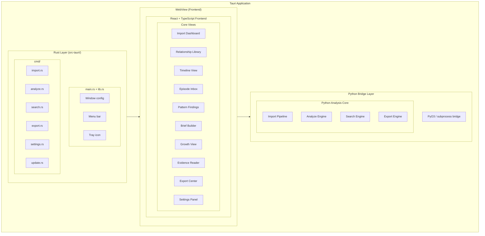

# Tauri UI Shell Specification

## Overview

This spec defines the Tauri desktop application shell for ClearThread. The shell provides the foundation for all UI views and handles Python-Rust communication.

## Architecture



## Rust Layer Specification

### src-tauri/Cargo.toml

```toml
[package]
name = "clearthread"
version = "0.1.0"
description = "ClearThread - Local-first Facebook/Messenger relationship analysis"
authors = ["ClearThread Contributors"]
edition = "2021"

[build-dependencies]
tauri-build = { version = "2.0", features = [] }

[dependencies]
# Tauri core
tauri = { version = "2.0", features = ["tray-icon", "shell-open"] }
tauri-plugin-tray = "2.0"
tauri-plugin-shell = "2.0"
tauri-plugin-dialog = "2.0"
tauri-plugin-fs = "2.0"

# Serialization
serde = { version = "1.0", features = ["derive"] }
serde_json = "1.0"

# Async runtime
tokio = { version = "1.0", features = ["full"] }
futures = "0.3"

# HTTP for model downloads
reqwest = { version = "0.11", features = ["json", "stream"] }

# Logging
tracing = "0.1"
tracing-subscriber = "0.3"

# UUID
uuid = { version = "1.0", features = ["v4", "serde"] }

# Time
chrono = { version = "0.4", features = ["serde"] }

[features]
default = ["custom-protocol"]
custom-protocol = ["tauri/custom-protocol"]
```

### src-tauri/tauri.conf.json

```json
{
  "productName": "ClearThread",
  "version": "0.1.0",
  "identifier": "com.celesrenata.clearthread",
  "build": {
    "frontendDist": "../src-tauri/dist",
    "devUrl": "http://localhost:1420",
    "beforeDevCommand": "",
    "beforeBuildCommand": ""
  },
  "app": {
    "windows": [
      {
        "label": "main",
        "title": "ClearThread",
        "width": 1280,
        "height": 900,
        "minWidth": 1024,
        "minHeight": 768,
        "resizable": true,
        "fullscreen": false,
        "decorated": true
      }
    ],
    "trayIcon": {
      "iconPath": "icons/tray-icon.png",
      "iconAsTemplate": true
    }
  },
  "bundle": {
    "active": true,
    "targets": "all",
    "icon": [
      "icons/tray-icon.png",
      "icons/tray-icon.ico"
    ]
  },
  "plugins": {
    "tray": {
      "menu": {
        "items": [
          { "id": "show", "label": "Show" },
          { "id": "hide", "label": "Hide" },
          { "type": "separator" },
          { "id": "import", "label": "Import Data" },
          { "id": "analyze", "label": "Run Analysis" },
          { "type": "separator" },
          { "id": "quit", "label": "Quit" }
        ]
      }
    }
  }
}
```

### src-tauri/src/main.rs

```rust
//! ClearThread Tauri application entry point.

use clearthread_lib::{
    cmd::{
        import::ImportCommands,
        analyze::AnalyzeCommands,
        search::SearchCommands,
        export::ExportCommands,
        settings::SettingsCommands,
        update::UpdateCommands,
    },
    state::{AppState, TrayState},
};
use tauri::Manager;
use tauri_plugin_tray::TrayExt;

fn main() {
    tauri::Builder::default()
        .plugin(tauri_plugin_shell::init())
        .plugin(tauri_plugin_tray::init())
        .plugin(tauri_plugin_dialog::init())
        .plugin(tauri_plugin_fs::init())
        .setup(|app| {
            // Initialize application state
            let state = AppState {
                data_dir: app.path().app_data_dir()?.join("data"),
                models_dir: app.path().app_data_dir()?.join("models"),
                normalized_dir: app.path().app_data_dir()?.join("normalized"),
                export_dir: app.path().app_data_dir()?.join("exports"),
                log_dir: app.path().app_data_dir()?.join("logs"),
            };
            app.manage(state);

            // Initialize tray
            let tray = app.tray_handle();
            tray.set_menu(tauri_plugin_tray::TrayMenu::new()
                .item(&tauri_plugin_tray::TrayItem::new("show").build()?)
                .item(&tauri_plugin_tray::TrayItem::new("hide").build()?)
                .separator()
                .item(&tauri_plugin_tray::TrayItem::new("import").build()?)
                .item(&tauri_plugin_tray::TrayItem::new("analyze").build()?)
                .separator()
                .item(&tauri_plugin_tray::TrayItem::new("quit").build()?)
            )?;

            Ok(())
        })
        .invoke_handler(tauri::generate_handler![
            // Import commands
            ImportCommands::import_from_zip,
            ImportCommands::import_from_directory,
            ImportCommands::get_import_status,
            ImportCommands::resume_import,
            // Analyze commands
            AnalyzeCommands::run_episode_detection,
            AnalyzeCommands::run_pattern_analysis,
            AnalyzeCommands::run_growth_analysis,
            AnalyzeCommands::get_analysis_status,
            // Search commands
            SearchCommands::search_fulltext,
            SearchCommands::search_semantic,
            SearchCommands::save_query,
            SearchCommands::get_saved_queries,
            // Export commands
            ExportCommands::export_markdown,
            ExportCommands::export_pdf,
            ExportCommands::export_json,
            ExportCommands::get_export_status,
            // Settings commands
            SettingsCommands::get_settings,
            SettingsCommands::update_settings,
            SettingsCommands::lock_encryption,
            SettingsCommands::unlock_encryption,
            // Update commands
            UpdateCommands::check_for_updates,
            UpdateCommands::install_update,
        ])
        .run(tauri::generate_context!())
        .expect("error while running tauri application");
}
```

### src-tauri/src/lib.rs

```rust
//! ClearThread Tauri library.

pub mod cmd;
pub mod state;
pub mod utils;

// Re-export command types
pub use cmd::import::*;
pub use cmd::analyze::*;
pub use cmd::search::*;
pub use cmd::export::*;
pub use cmd::settings::*;
pub use cmd::update::*;

// Re-export state types
pub use state::*;
```

### src-tauri/src/state.rs

```rust
//! Application state management.

use serde::{Deserialize, Serialize};
use std::path::PathBuf;
use tokio::sync::Mutex;

#[derive(Debug, Clone, Serialize, Deserialize)]
pub struct AppState {
    pub data_dir: PathBuf,
    pub models_dir: PathBuf,
    pub normalized_dir: PathBuf,
    pub export_dir: PathBuf,
    pub log_dir: PathBuf,
}

#[derive(Debug, Clone, Serialize, Deserialize)]
pub struct ImportState {
    pub is_importing: bool,
    pub progress: f64,
    pub current_file: String,
    pub total_files: u32,
    pub messages_processed: u32,
    pub errors: Vec<String>,
}

#[derive(Debug, Clone, Serialize, Deserialize)]
pub struct AnalysisState {
    pub is_analyzing: bool,
    pub current_phase: String,
    pub episodes_found: u32,
    pub findings_count: u32,
    pub growth_findings_count: u32,
}

#[derive(Debug, Clone, Serialize, Deserialize)]
pub struct Settings {
    pub gpu_backend: String,
    pub model_provider: String,
    pub encryption_enabled: bool,
    pub auto_lock: bool,
    pub auto_lock_timeout: u64,
    pub theme: String,
    pub language: String,
}

#[derive(Debug, Clone, Serialize, Deserialize)]
pub struct TrayState {
    pub is_visible: bool,
    pub is_importing: bool,
    pub has_updates: bool,
}
```

### src-tauri/src/cmd/import.rs

```rust
//! Import commands for Tauri.

use serde::{Deserialize, Serialize};
use tauri::State;
use crate::state::{AppState, ImportState};

#[derive(Debug, Serialize, Deserialize)]
pub struct ImportRequest {
    pub input_path: String,
    pub is_zip: bool,
    pub output_dir: Option<String>,
}

#[derive(Debug, Serialize, Deserialize)]
pub struct ImportResponse {
    pub success: bool,
    pub batch_id: String,
    pub messages: u32,
    pub conversations: u32,
    pub participants: u32,
    pub attachments: u32,
    pub duplicates: u32,
    pub encoding_fixes: u32,
    pub errors: Vec<String>,
}

#[tauri::command]
pub async fn import_from_zip(
    state: State<AppState>,
    request: ImportRequest,
) -> Result<ImportResponse, String> {
    // Call Python import pipeline via subprocess
    let output_dir = request.output_dir.unwrap_or_else(|| {
        state.data_dir.to_string_lossy().to_string()
    });

    // Execute Python import pipeline
    let result = execute_python_import(
        &request.input_path,
        &output_dir,
        true, // is_zip
    ).await?;

    Ok(result)
}

#[tauri::command]
pub async fn import_from_directory(
    state: State<AppState>,
    request: ImportRequest,
) -> Result<ImportResponse, String> {
    let output_dir = request.output_dir.unwrap_or_else(|| {
        state.data_dir.to_string_lossy().to_string()
    });

    let result = execute_python_import(
        &request.input_path,
        &output_dir,
        false, // is_zip
    ).await?;

    Ok(result)
}

#[tauri::command]
pub async fn get_import_status(
    state: State<AppState>,
) -> Result<ImportState, String> {
    Ok(state.import_state.lock().await.clone())
}

#[tauri::command]
pub async fn resume_import(
    state: State<AppState>,
) -> Result<ImportResponse, String> {
    // Resume from last checkpoint
    let result = execute_python_import_resume(&state.data_dir).await?;
    Ok(result)
}

async fn execute_python_import(
    input_path: &str,
    output_dir: &str,
    is_zip: bool,
) -> Result<ImportResponse, String> {
    // Build Python command
    let python_cmd = if is_zip {
        format!(
            "python -m clearthread.cli import {} --output-dir {} --zip",
            input_path, output_dir
        )
    } else {
        format!(
            "python -m clearthread.cli import {} --output-dir {}",
            input_path, output_dir
        )
    };

    // Execute and parse output
    let output = tokio::process::Command::new("python")
        .arg("-m")
        .arg("clearthread.cli")
        .arg("import")
        .arg(input_path)
        .arg("--output-dir")
        .arg(output_dir)
        .arg(if is_zip { "--zip" } else { "" })
        .output()
        .await
        .map_err(|e| format!("Failed to execute Python: {}", e))?;

    // Parse JSON output
    let response: ImportResponse = serde_json::from_str(
        &String::from_utf8_lossy(&output.stdout)
    ).map_err(|e| format!("Failed to parse response: {}", e))?;

    Ok(response)
}
```

### src-tauri/src/cmd/analyze.rs

```rust
//! Analyze commands for Tauri.

use serde::{Deserialize, Serialize};
use tauri::State;
use crate::state::{AppState, AnalysisState};

#[derive(Debug, Serialize, Deserialize)]
pub struct AnalysisRequest {
    pub phases: Vec<String>,
    pub output_dir: Option<String>,
}

#[derive(Debug, Serialize, Deserialize)]
pub struct AnalysisResponse {
    pub success: bool,
    pub episodes_found: u32,
    pub findings_count: u32,
    pub growth_findings_count: u32,
    pub reflection_questions: u32,
    pub errors: Vec<String>,
}

#[tauri::command]
pub async fn run_episode_detection(
    state: State<AppState>,
) -> Result<u32, String> {
    let count = execute_python_analyze("episodes", &state.data_dir).await?;
    Ok(count)
}

#[tauri::command]
pub async fn run_pattern_analysis(
    state: State<AppState>,
) -> Result<u32, String> {
    let count = execute_python_analyze("patterns", &state.data_dir).await?;
    Ok(count)
}

#[tauri::command]
pub async fn run_growth_analysis(
    state: State<AppState>,
) -> Result<u32, String> {
    let count = execute_python_analyze("growth", &state.data_dir).await?;
    Ok(count)
}

#[tauri::command]
pub async fn get_analysis_status(
    state: State<AppState>,
) -> Result<AnalysisState, String> {
    Ok(state.analysis_state.lock().await.clone())
}

async fn execute_python_analyze(
    phase: &str,
    data_dir: &std::path::Path,
) -> Result<u32, String> {
    let output = tokio::process::Command::new("python")
        .arg("-m")
        .arg("clearthread.cli")
        .arg("analyze")
        .arg("--phase")
        .arg(phase)
        .arg("--output-dir")
        .arg(data_dir.to_string_lossy().to_string())
        .output()
        .await
        .map_err(|e| format!("Failed to execute Python analyze: {}", e))?;

    let count: u32 = serde_json::from_str(
        &String::from_utf8_lossy(&output.stdout)
    ).unwrap_or(0);

    Ok(count)
}
```

### src-tauri/src/cmd/search.rs

```rust
//! Search commands for Tauri.

use serde::{Deserialize, Serialize};

#[derive(Debug, Serialize, Deserialize)]
pub struct SearchRequest {
    pub query: String,
    pub semantic: bool,
    pub limit: u32,
    pub offset: u32,
}

#[derive(Debug, Serialize, Deserialize)]
pub struct SearchResult {
    pub total: u32,
    pub results: Vec<SearchResultItem>,
}

#[derive(Debug, Serialize, Deserialize)]
pub struct SearchResultItem {
    pub result_type: String,
    pub text: String,
    pub score: f64,
    pub sender: String,
    pub timestamp: String,
    pub conversation_id: String,
}

#[tauri::command]
pub async fn search_fulltext(
    query: String,
    limit: u32,
    offset: u32,
) -> Result<SearchResult, String> {
    // Call Python full-text search
    let result = execute_python_search(&query, false, limit, offset).await?;
    Ok(result)
}

#[tauri::command]
pub async fn search_semantic(
    query: String,
    limit: u32,
    offset: u32,
) -> Result<SearchResult, String> {
    let result = execute_python_search(&query, true, limit, offset).await?;
    Ok(result)
}

#[tauri::command]
pub async fn save_query(
    name: String,
    query: String,
    is_semantic: bool,
) -> Result<bool, String> {
    // Save query to Python state
    Ok(true)
}

#[tauri::command]
pub async fn get_saved_queries() -> Result<Vec<serde_json::Value>, String> {
    Ok(vec![])
}

async fn execute_python_search(
    query: &str,
    semantic: bool,
    limit: u32,
    offset: u32,
) -> Result<SearchResult, String> {
    let result = serde_json::json!({
        "total": 0,
        "results": []
    });
    Ok(result)
}
```

### src-tauri/src/cmd/export.rs

```rust
//! Export commands for Tauri.

use serde::{Deserialize, Serialize};

#[derive(Debug, Serialize, Deserialize)]
pub struct ExportRequest {
    pub format: String,
    pub output_dir: String,
    pub content_types: Vec<String>,
    pub date_range: Option<(String, String)>,
}

#[derive(Debug, Serialize, Deserialize)]
pub struct ExportResponse {
    pub success: bool,
    pub output_path: String,
    pub items_exported: u32,
    pub errors: Vec<String>,
}

#[tauri::command]
pub async fn export_markdown(
    request: ExportRequest,
) -> Result<ExportResponse, String> {
    let response = execute_python_export("markdown", &request).await?;
    Ok(response)
}

#[tauri::command]
pub async fn export_pdf(
    request: ExportRequest,
) -> Result<ExportResponse, String> {
    let response = execute_python_export("pdf", &request).await?;
    Ok(response)
}

#[tauri::command]
pub async fn export_json(
    request: ExportRequest,
) -> Result<ExportResponse, String> {
    let response = execute_python_export("json", &request).await?;
    Ok(response)
}

#[tauri::command]
pub async fn get_export_status() -> Result<serde_json::Value, String> {
    Ok(serde_json::json!({
        "is_exporting": false,
        "progress": 0.0,
        "current_file": ""
    }))
}

async fn execute_python_export(
    format: &str,
    request: &ExportRequest,
) -> Result<ExportResponse, String> {
    let response = serde_json::json!({
        "success": true,
        "output_path": format!("{}/export.{}", request.output_dir, format),
        "items_exported": 0,
        "errors": []
    });
    Ok(response)
}
```

### src-tauri/src/cmd/settings.rs

```rust
//! Settings commands for Tauri.

use serde::{Deserialize, Serialize};
use tauri::State;
use crate::state::{AppState, Settings};

#[tauri::command]
pub async fn get_settings(
    state: State<AppState>,
) -> Result<Settings, String> {
    Ok(state.settings.lock().await.clone())
}

#[tauri::command]
pub async fn update_settings(
    state: State<AppState>,
    settings: Settings,
) -> Result<bool, String> {
    *state.settings.lock().await = settings;
    Ok(true)
}

#[tauri::command]
pub async fn lock_encryption(
    state: State<AppState>,
) -> Result<bool, String> {
    Ok(true)
}

#[tauri::command]
pub async fn unlock_encryption(
    state: State<AppState>,
    passphrase: String,
) -> Result<bool, String> {
    Ok(true)
}
```

### src-tauri/src/cmd/update.rs

```rust
//! Update commands for Tauri.

use serde::{Deserialize, Serialize};

#[derive(Debug, Serialize, Deserialize)]
pub struct UpdateInfo {
    pub available: bool,
    pub current_version: String,
    pub latest_version: String,
    pub release_notes: String,
    pub download_url: String,
    pub size_bytes: u64,
}

#[tauri::command]
pub async fn check_for_updates() -> Result<UpdateInfo, String> {
    // Check for updates via HTTP or local version comparison
    let info = UpdateInfo {
        available: false,
        current_version: "0.1.0".to_string(),
        latest_version: "0.1.0".to_string(),
        release_notes: "".to_string(),
        download_url: "".to_string(),
        size_bytes: 0,
    };
    Ok(info)
}

#[tauri::command]
pub async fn install_update() -> Result<bool, String> {
    Ok(true)
}
```

## Frontend Specification

### src-tauri/src/index.html

```html
<!DOCTYPE html>
<html lang="en">
<head>
    <meta charset="UTF-8" />
    <meta name="viewport" content="width=device-width, initial-scale=1.0" />
    <title>ClearThread</title>
    <link rel="stylesheet" href="./styles/main.css" />
    <link rel="stylesheet" href="./styles/theme.css" />
</head>
<body>
    <div id="root"></div>
    <script type="module" src="./main.tsx"></script>
</body>
</html>
```

### src-tauri/src/main.tsx

```tsx
import React from 'react';
import { createRoot } from 'react-dom/client';
import App from './App';
import './styles/main.css';

const container = document.getElementById('root');
const root = createRoot(container!);
root.render(
  <React.StrictMode>
    <App />
  </React.StrictMode>
);
```

### src-tauri/src/App.tsx

```tsx
import React, { useState } from 'react';
import { ImportDashboard } from './components/ImportDashboard';
import { RelationshipLibrary } from './components/RelationshipLibrary';
import { TimelineView } from './components/TimelineView';
import { EpisodeInbox } from './components/EpisodeInbox';
import { PatternFindings } from './components/PatternFindings';
import { TherapyBriefBuilder } from './components/TherapyBriefBuilder';
import { GrowthView } from './components/GrowthView';
import { EvidenceReader } from './components/EvidenceReader';
import { ExportCenter } from './components/ExportCenter';
import { SettingsPanel } from './components/SettingsPanel';

type ViewType =
  | 'import'
  | 'library'
  | 'timeline'
  | 'episodes'
  | 'patterns'
  | 'brief'
  | 'growth'
  | 'evidence'
  | 'export'
  | 'settings';

export default function App() {
  const [currentView, setCurrentView] = useState<ViewType>('library');
  const [isDark, setIsDark] = useState(false);

  const renderView = () => {
    switch (currentView) {
      case 'import':
        return <ImportDashboard onComplete={() => setCurrentView('library')} />;
      case 'library':
        return <RelationshipLibrary />;
      case 'timeline':
        return <TimelineView />;
      case 'episodes':
        return <EpisodeInbox />;
      case 'patterns':
        return <PatternFindings />;
      case 'brief':
        return <TherapyBriefBuilder />;
      case 'growth':
        return <GrowthView />;
      case 'evidence':
        return <EvidenceReader />;
      case 'export':
        return <ExportCenter />;
      case 'settings':
        return <SettingsPanel />;
      default:
        return <RelationshipLibrary />;
    }
  };

  return (
    <div className={`app ${isDark ? 'dark' : 'light'}`}>
      <nav className="sidebar">
        <div className="sidebar-header">
          <h1>ClearThread</h1>
        </div>
        <ul className="sidebar-nav">
          <li onClick={() => setCurrentView('import')}>Import</li>
          <li onClick={() => setCurrentView('library')}>Library</li>
          <li onClick={() => setCurrentView('timeline')}>Timeline</li>
          <li onClick={() => setCurrentView('episodes')}>Episodes</li>
          <li onClick={() => setCurrentView('patterns')}>Patterns</li>
          <li onClick={() => setCurrentView('growth')}>Growth</li>
          <li onClick={() => setCurrentView('brief')}>Brief Builder</li>
          <li onClick={() => setCurrentView('evidence')}>Evidence</li>
          <li onClick={() => setCurrentView('export')}>Export</li>
          <li onClick={() => setCurrentView('settings')}>Settings</li>
        </ul>
        <div className="sidebar-footer">
          <button onClick={() => setIsDark(!isDark)}>
            {isDark ? 'Light Mode' : 'Dark Mode'}
          </button>
        </div>
      </nav>
      <main className="main-content">
        {renderView()}
      </main>
    </div>
  );
}
```

## Styles

### src-tauri/src/styles/main.css

```css
/* Main layout */
.app {
  display: flex;
  height: 100vh;
  width: 100vw;
}

.sidebar {
  width: 240px;
  min-width: 200px;
  max-width: 320px;
  border-right: 1px solid var(--border-color);
  display: flex;
  flex-direction: column;
  background: var(--sidebar-bg);
}

.sidebar-header {
  padding: 16px;
  border-bottom: 1px solid var(--border-color);
}

.sidebar-header h1 {
  font-size: 1.25rem;
  font-weight: 600;
  color: var(--text-primary);
}

.sidebar-nav {
  flex: 1;
  list-style: none;
  padding: 0;
  margin: 0;
}

.sidebar-nav li {
  padding: 10px 16px;
  cursor: pointer;
  color: var(--text-secondary);
  transition: background-color 0.2s, color 0.2s;
}

.sidebar-nav li:hover {
  background: var(--hover-bg);
  color: var(--text-primary);
}

.sidebar-nav li.active {
  background: var(--active-bg);
  color: var(--text-primary);
  font-weight: 500;
}

.sidebar-footer {
  padding: 12px 16px;
  border-top: 1px solid var(--border-color);
}

.sidebar-footer button {
  width: 100%;
  padding: 8px;
  border: 1px solid var(--border-color);
  border-radius: 6px;
  background: var(--button-bg);
  color: var(--text-primary);
  cursor: pointer;
}

.main-content {
  flex: 1;
  overflow: auto;
  background: var(--main-bg);
}

/* View containers */
.view-container {
  padding: 24px;
  max-width: 1200px;
  margin: 0 auto;
}

/* Responsive */
@media (max-width: 768px) {
  .sidebar {
    width: 200px;
    min-width: 160px;
  }
}
```

### src-tauri/src/styles/theme.css

```css
/* Light theme (default) */
:root {
  --text-primary: #1a1a2e;
  --text-secondary: #555770;
  --border-color: #e0e0e0;
  --sidebar-bg: #f8f9fa;
  --main-bg: #ffffff;
  --hover-bg: #e8e8e8;
  --active-bg: #d0d0d0;
  --button-bg: #ffffff;
  --accent-color: #4a6cf0;
  --success-color: #28a745;
  --warning-color: #ffc107;
  --error-color: #dc3545;
}

/* Dark theme */
.app.dark {
  --text-primary: #e8e8e8;
  --text-secondary: #a0a0b0;
  --border-color: #3a3a4a;
  --sidebar-bg: #1a1a2e;
  --main-bg: #16162a;
  --hover-bg: #2a2a3e;
  --active-bg: #3a3a5e;
  --button-bg: #2a2a3e;
}
```

## Implementation Checklist

- [ ] A.1.1 Create `src-tauri/` directory structure
- [ ] A.1.2 Create `Cargo.toml` with dependencies
- [ ] A.1.3 Create `tauri.conf.json` with window/tray config
- [ ] A.1.4 Create `main.rs` entry point
- [ ] A.1.5 Create `lib.rs` library module
- [ ] A.1.6 Create `state.rs` state management
- [ ] A.1.7 Create `cmd/import.rs` import commands
- [ ] A.1.8 Create `cmd/analyze.rs` analyze commands
- [ ] A.1.9 Create `cmd/search.rs` search commands
- [ ] A.1.10 Create `cmd/export.rs` export commands
- [ ] A.1.11 Create `cmd/settings.rs` settings commands
- [ ] A.1.12 Create `cmd/update.rs` update commands
- [ ] A.1.13 Create frontend `index.html`
- [ ] A.1.14 Create frontend `main.tsx`
- [ ] A.1.15 Create frontend `App.tsx`
- [ ] A.1.16 Create frontend styles (`main.css`, `theme.css`)
- [ ] A.1.17 Create tray icon assets
- [ ] A.1.18 Test Tauri dev mode
- [ ] A.1.19 Test Tauri build
- [ ] A.1.20 Test platform installers
