# ClearThread Implementation Tasks

## Phase 1: Foundation

### Task 1.1: Project Setup

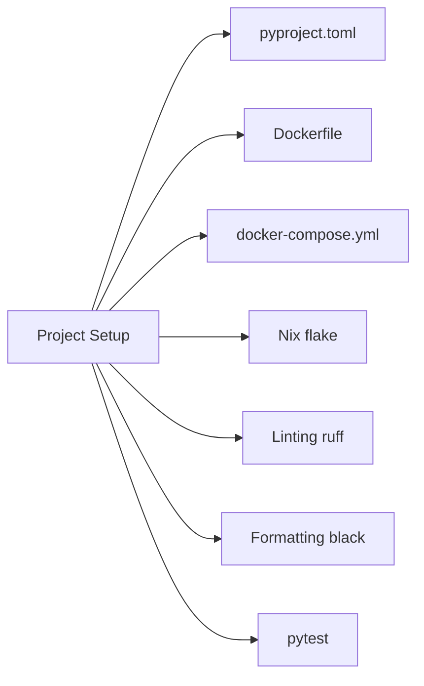

- [ ] Create project directory structure
- [ ] Initialize Python project with `pyproject.toml`
- [ ] Create `Dockerfile` with multi-stage build
- [ ] Create `docker-compose.yml` with CUDA support
- [ ] Set up Nix flake for development environment
- [ ] Configure linting (ruff) and formatting (black)
- [ ] Set up test infrastructure (pytest)

### Task 1.2: Data Models

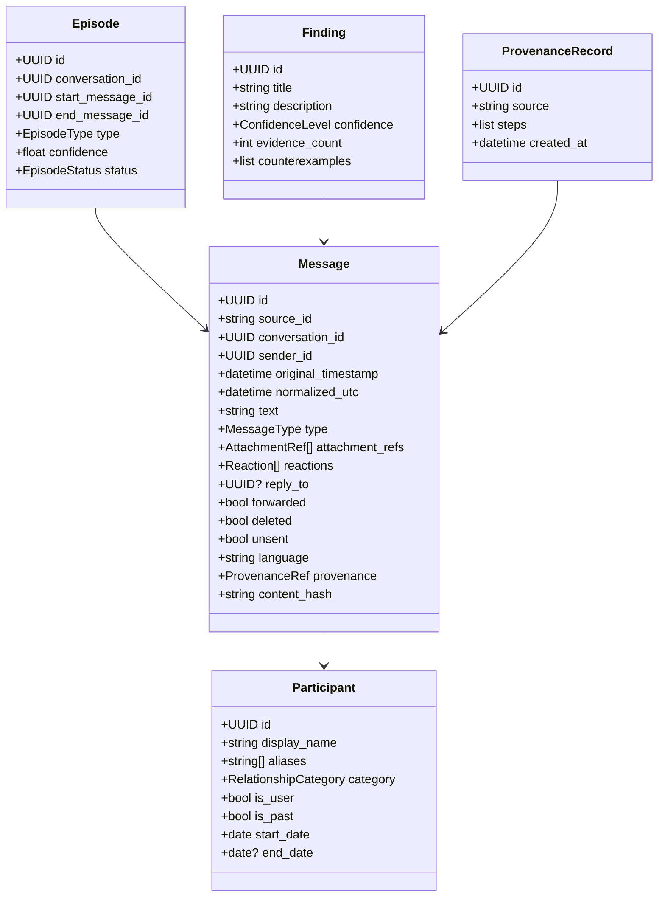

- [ ] Define SQLite schema for normalized store
- [ ] Implement Message model with all fields (R3)
- [ ] Implement Participant model with aliases and categories (R4)
- [ ] Implement Episode model with context messages (R6)
- [ ] Implement Finding model with evidence references (R8)
- [ ] Implement ProvenanceRecord model (R13)
- [ ] Create migration scripts for schema updates

### Task 1.3: Storage Layer

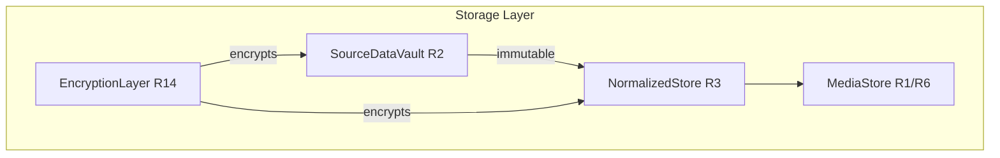

- [ ] Implement SourceDataVault (immutable storage, R2)
- [ ] Implement NormalizedStore with referential integrity (R3)
- [ ] Implement MediaStore for images/videos (R1, R6)
- [ ] Implement encryption layer with AES-256-GCM (R14)
- [ ] Implement key management with OS credential storage (R14)
- [ ] Implement secure deletion (R14)

## Phase 2: Import Pipeline

### Task 2.1: Facebook Data Parsing

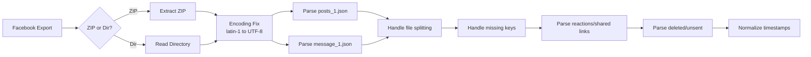

- [ ] Implement ZIP archive extraction (R1)
- [ ] Implement directory parsing (R1)
- [ ] Implement encoding fix (Latin-1 to UTF-8) (R1, R4)
- [ ] Parse `posts_1.json` schema (R1, R29)
- [ ] Parse `message_1.json` schema (R1)
- [ ] Handle file splitting (message_1.json, message_2.json) (R1)
- [ ] Handle missing keys with safe `.get()` (R1)
- [ ] Parse reactions, shared links, group membership (R1)
- [ ] Parse deleted/unsent messages (R1)
- [ ] Normalize timestamps to UTC (R1)

### Task 2.2: Import Processing

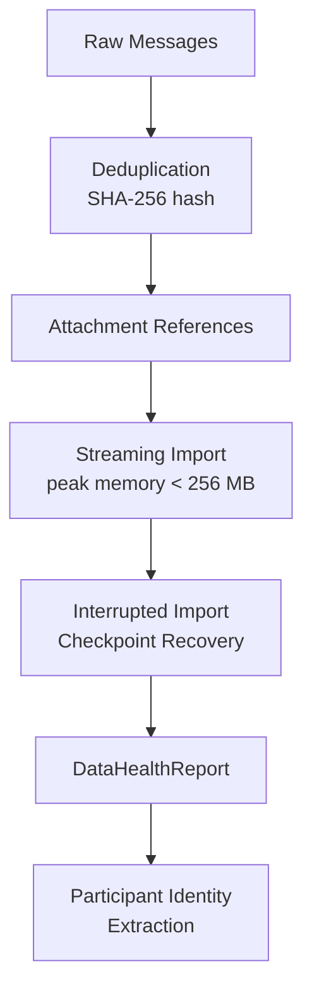

- [ ] Implement message deduplication by SHA-256 hash (R1)
- [ ] Implement attachment reference preservation (R1)
- [ ] Implement streaming import for large archives (R1, R22)
- [ ] Implement interrupted import recovery (R1)
- [ ] Generate DataHealthReport (R1)
- [ ] Implement participant identity extraction (R4)

### Task 2.3: Participant Management

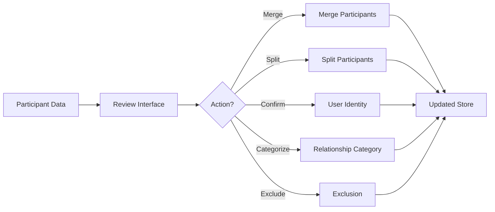

- [ ] Implement participant review interface (R4)
- [ ] Implement participant merge functionality (R4)
- [ ] Implement participant split functionality (R4)
- [ ] Implement user identity confirmation (R4)
- [ ] Implement relationship categorization (R4)
- [ ] Implement participant exclusion (R4)

## Phase 3: AI Model Integration

### Task 3.1: Model Provider Core

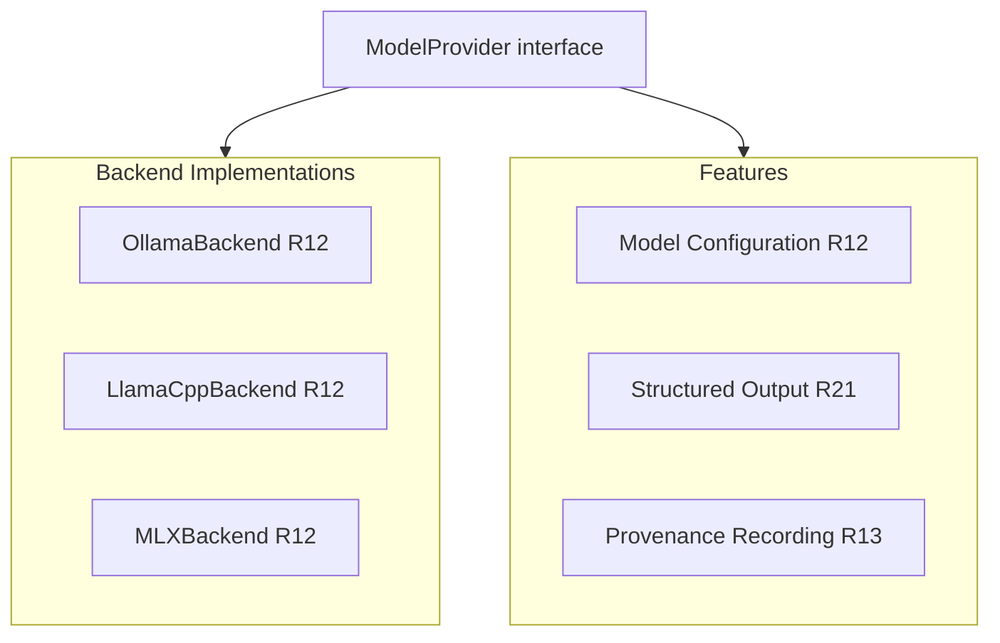

- [ ] Implement ModelProvider interface (R12)
- [ ] Implement Ollama backend (R12)
- [ ] Implement llama.cpp backend (R12)
- [ ] Implement MLX backend (R12)
- [ ] Implement model configuration (R12)
- [ ] Implement structured output validation (R21)
- [ ] Implement provenance recording (R13)

### Task 3.2: Text LoRA Support

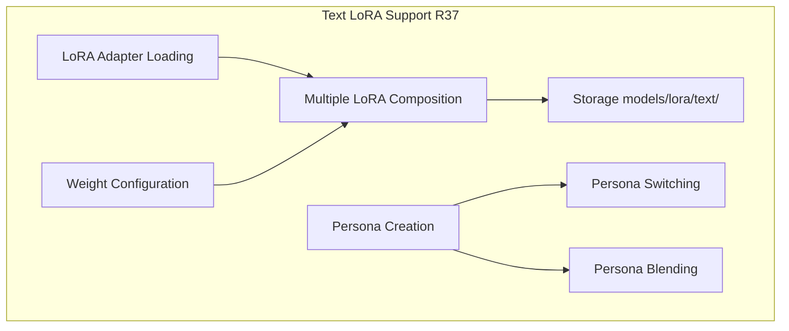

- [ ] Implement LoRA adapter loading (R37)
- [ ] Implement LoRA weight configuration (R37)
- [ ] Implement multiple LoRA composition (R37)
- [ ] Implement LoRA storage in `models/lora/text/` (R37)
- [ ] Implement persona creation and management (R37)
- [ ] Implement persona switching (R37)
- [ ] Implement persona blending (R37)

### Task 3.3: Qwen Vision LoRA

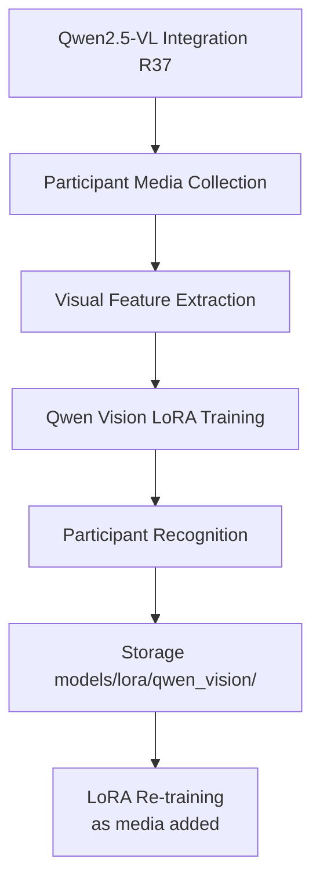

- [ ] Implement Qwen2.5-VL integration (R37)
- [ ] Implement participant media collection (R37)
- [ ] Implement visual feature extraction (R37)
- [ ] Implement Qwen vision LoRA training (R37)
- [ ] Implement participant recognition in images (R37)
- [ ] Implement Qwen vision LoRA storage in `models/lora/qwen_vision/` (R37)
- [ ] Implement LoRA re-training as media is added (R37)

### Task 3.4: WAN Image LoRA

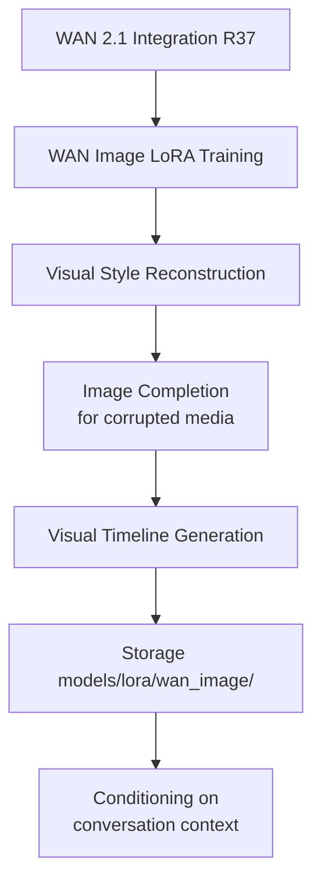

- [ ] Implement WAN 2.1 integration (R37)
- [ ] Implement WAN image LoRA training (R37)
- [ ] Implement visual style reconstruction (R37)
- [ ] Implement image completion for corrupted media (R37)
- [ ] Implement visual timeline generation (R37)
- [ ] Implement WAN LoRA storage in `models/lora/wan_image/` (R37)
- [ ] Implement conditioning on conversation context (R37)

### Task 3.5: Visual Persona Composition

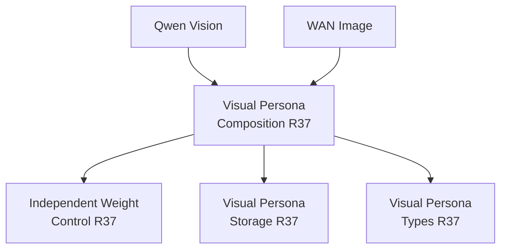

- [ ] Implement Qwen + WAN persona combination (R37)
- [ ] Implement independent weight control per LoRA type (R37)
- [ ] Implement visual persona storage alongside text personas (R37)
- [ ] Implement visual persona types (R37)

## Phase 4: Analysis Engine

### Task 4.1: Episode Engine

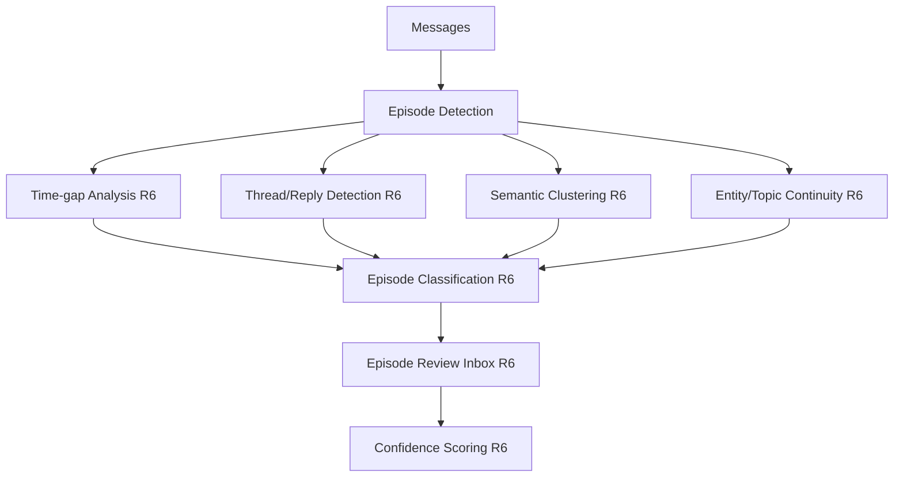

- [ ] Implement time-gap analysis (R6)
- [ ] Implement thread/reply structure detection (R6)
- [ ] Implement semantic clustering (R6)
- [ ] Implement entity and topic continuity (R6)
- [ ] Implement episode classification (R6)
- [ ] Implement episode review inbox (R6)
- [ ] Implement episode boundary editing (R6)
- [ ] Implement confidence scoring (R6)

### Task 4.2: Pattern Analyzer

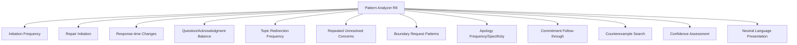

- [ ] Implement initiation frequency detection (R8)
- [ ] Implement repair initiation detection (R8)
- [ ] Implement response-time change detection (R8)
- [ ] Implement question/acknowledgment balance (R8)
- [ ] Implement topic redirection frequency (R8)
- [ ] Implement repeated unresolved concerns (R8)
- [ ] Implement boundary request patterns (R8)
- [ ] Implement apology frequency and specificity (R8)
- [ ] Implement commitment follow-through (R8)
- [ ] Implement counterexample search (R8)
- [ ] Implement confidence assessment (R8)
- [ ] Implement neutral language presentation (R8)

### Task 4.3: Growth Analyzer

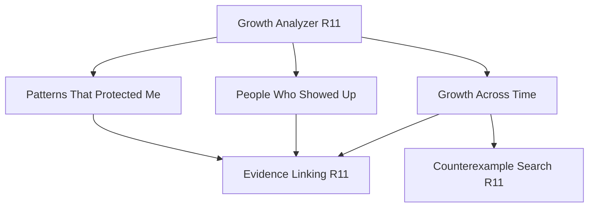

- [ ] Implement "Patterns That Protected Me" detection (R11)
- [ ] Implement "People Who Showed Up" detection (R11)
- [ ] Implement "Growth Across Time" comparison (R11)
- [ ] Implement evidence linking for growth findings (R11)
- [ ] Implement counterexample search for growth (R11)

### Task 4.4: Reflection Question Generation

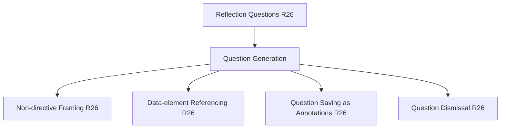

- [ ] Implement reflection question generation (R26)
- [ ] Implement non-directive question framing (R26)
- [ ] Implement data-element referencing (R26)
- [ ] Implement question saving as annotations (R26)
- [ ] Implement question dismissal (R26)

## Phase 5: Search and Retrieval

### Task 5.1: Full-Text Search

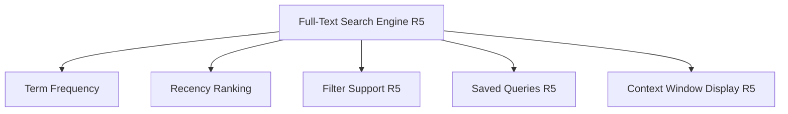

- [ ] Implement full-text search engine (R5)
- [ ] Implement term frequency and recency ranking (R5)
- [ ] Implement filter support (R5)
- [ ] Implement saved queries (R5)
- [ ] Implement context window display (R5)

### Task 5.2: Semantic Search

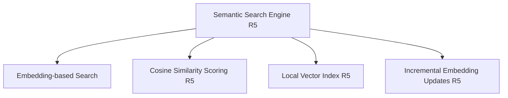

- [ ] Implement embedding-based search (R5)
- [ ] Implement cosine similarity scoring (R5)
- [ ] Implement local vector index (R5)
- [ ] Implement incremental embedding updates (R5)

## Phase 6: User Interface

### Task 6.1: Core Views

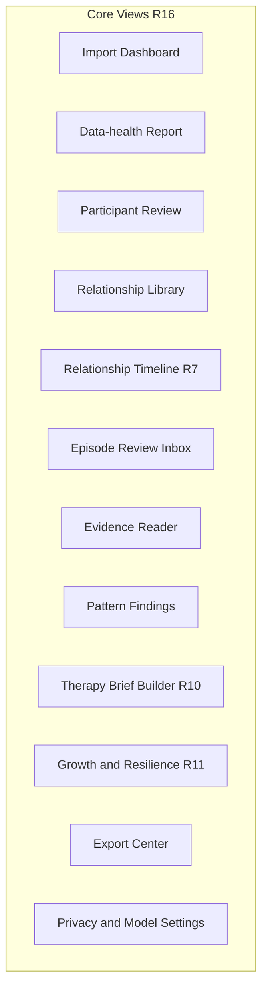

- [ ] Implement Import dashboard (R16)
- [ ] Implement Data-health report view (R16)
- [ ] Implement Participant review interface (R16)
- [ ] Implement Relationship library (R16)
- [ ] Implement Relationship timeline (R7)
- [ ] Implement Episode review inbox (R16)
- [ ] Implement Evidence reader (R16)
- [ ] Implement Pattern findings view (R16)
- [ ] Implement Therapy brief builder (R10)
- [ ] Implement Growth and resilience view (R11)
- [ ] Implement Export center (R16)
- [ ] Implement Privacy and model settings (R16)

### Task 6.2: UI Principles

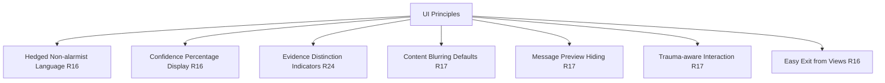

- [ ] Implement hedged, non-alarmist language (R16)
- [ ] Implement confidence percentage display (R16)
- [ ] Implement evidence distinction indicators (R24)
- [ ] Implement content blurring defaults (R17)
- [ ] Implement message preview hiding (R17)
- [ ] Implement trauma-aware interaction (R17)
- [ ] Implement easy exit from views (R16)

## Phase 7: Export and Brief Builder

### Task 7.1: Therapy Brief Builder

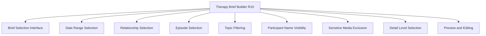

- [ ] Implement brief selection interface (R10)
- [ ] Implement date range selection (R10)
- [ ] Implement relationship selection (R10)
- [ ] Implement episode selection (R10)
- [ ] Implement topic filtering (R10)
- [ ] Implement participant name visibility control (R10)
- [ ] Implement sensitive media exclusion (R10)
- [ ] Implement detail level selection (R10)
- [ ] Implement preview and editing (R10)

### Task 7.2: Export Engine

```mermaid
graph TB
    A[Export Engine R15] --> B[Markdown Export R15]
    A --> C[PDF Export A4/Letter R15]
    A --> D[JSON Export R15]
    A --> E[Evidence Export with Context R15]
    A --> F[Content-type Labeling R15]
    A --> G[Participant Name Warning R15]
    A --> H[Export Progress Indicators R15]
    A --> I[Export Encryption R14]
```

- [ ] Implement Markdown export (R15)
- [ ] Implement PDF export (A4 and Letter) (R15)
- [ ] Implement JSON export (R15)
- [ ] Implement evidence export with context (R15)
- [ ] Implement content-type labeling (R15)
- [ ] Implement participant name warning (R15)
- [ ] Implement export progress indicators (R15)
- [ ] Implement export encryption (R14)

## Phase 8: Docker and Deployment

### Task 8.1: Container Configuration

```mermaid
graph TB
    A[Container Configuration] --> B[Finalize Dockerfile<br/>with CUDA support]
    A --> C[nvidia-container-toolkit<br/>Integration]
    A --> D[MPS Support<br/>Apple Silicon]
    A --> E[ROCm Support<br/>AMD GPUs]
    A --> F[Volume Mounts<br/>Data Persistence]
    A --> G[GPU Detection<br/>in Container]
```

- [ ] Finalize Dockerfile with CUDA support
- [ ] Configure nvidia-container-toolkit integration
- [ ] Configure MPS support for Apple Silicon
- [ ] Configure ROCm support for AMD GPUs
- [ ] Set up volume mounts for data persistence
- [ ] Configure GPU detection in container

### Task 8.2: Model Management

```mermaid
graph TB
    A[Model Management] --> B[Model Download<br/>and Caching]
    A --> C[LoRA Adapter<br/>Management]
    A --> D[Model Version<br/>Tracking]
    A --> E[Provenance for<br/>Model Changes R13]
```

- [ ] Implement model download and caching
- [ ] Implement LoRA adapter management
- [ ] Implement model version tracking
- [ ] Implement provenance for model changes (R13)

### Task 8.3: Application Packaging

```mermaid
graph TB
    A[Application Packaging] --> B[Tauri Desktop<br/>Application]
    A --> C[Platform Installers<br/>deb, rpm, dmg]
    A --> D[Auto-update<br/>Mechanism]
    A --> E[Documentation]
```

- [ ] Package Tauri desktop application
- [ ] Create platform installers (deb, rpm, dmg)
- [ ] Configure auto-update mechanism
- [ ] Create documentation

## Phase 9: Testing and Quality

### Task 9.1: Unit Tests

```mermaid
graph TB
    A[Unit Tests R35] --> B[Import Pipeline]
    A --> C[Encoding Fix]
    A --> D[Deduplication]
    A --> E[Participant Merge/Split]
    A --> F[LoRA Composition]
    A --> G[Provenance Tracking]
    A --> H[Encryption]
    A --> I[Exclusion Logic]
```

- [ ] Test import pipeline (R35)
- [ ] Test encoding fix (R35)
- [ ] Test deduplication (R35)
- [ ] Test participant merge/split (R35)
- [ ] Test LoRA composition (R35)
- [ ] Test provenance tracking (R35)
- [ ] Test encryption (R35)
- [ ] Test exclusion logic (R35)

### Task 9.2: Integration Tests

```mermaid
graph TB
    A[Integration Tests R35] --> B[End-to-end Import]
    A --> C[Analysis Pipeline]
    A --> D[Search Functionality]
    A --> E[Export Functionality]
    A --> F[Model Switching]
    A --> G[Data Integrity]
```

- [ ] Test end-to-end import (R35)
- [ ] Test analysis pipeline (R35)
- [ ] Test search functionality (R35)
- [ ] Test export functionality (R35)
- [ ] Test model switching (R35)
- [ ] Test data integrity (R35)

### Task 9.3: Edge Case Tests

```mermaid
graph TB
    A[Edge Case Tests] --> B[Corrupt ZIP<br/>Handling R1]
    A --> C[Large Archive<br/>Handling R22]
    A --> D[Missing Participant<br/>Attribution R18]
    A --> E[AI Citation<br/>Validation R21]
    A --> F[Prompt Injection<br/>Resilience R35]
    A --> G[No Data Leakage<br/>to External Services R35]
```

- [ ] Test corrupt ZIP handling (R1)
- [ ] Test large archive handling (R22)
- [ ] Test missing participant attribution (R18)
- [ ] Test AI citation validation (R21)
- [ ] Test prompt injection resilience (R35)
- [ ] Test no data leakage to external services (R35)

## Phase 10: Documentation and Polish

### Task 10.1: User Documentation

```mermaid
graph TB
    A[User Documentation] --> B[User Guide]
    A --> C[Therapy Brief<br/>Preparation Guide]
    A --> D[Persona Customization<br/>Guide]
    A --> E[FAQ]
```

- [ ] Write user guide
- [ ] Write therapy brief preparation guide
- [ ] Write persona customization guide
- [ ] Write FAQ

### Task 10.2: Developer Documentation

```mermaid
graph TB
    A[Developer Documentation] --> B[API Interfaces]
    A --> C[Data Models]
    A --> D[LoRA Architecture]
    A --> E[Docker Deployment]
```

- [ ] Document API interfaces
- [ ] Document data models
- [ ] Document LoRA architecture
- [ ] Document Docker deployment

### Task 10.3: Final Integration

```mermaid
graph TB
    A[Final Integration] --> B[All Requirement<br/>Acceptance Criteria]
    A --> C[Full Validation<br/>Suite]
    A --> D[Performance<br/>Benchmarking]
    A --> E[Security Audit]
    A --> F[Release<br/>Preparation]
```

- [ ] Complete all requirement acceptance criteria
- [ ] Run full validation suite
- [ ] Performance benchmarking
- [ ] Security audit
- [ ] Release preparation
