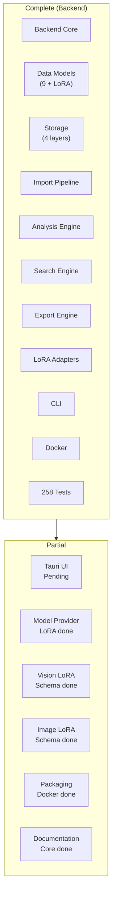
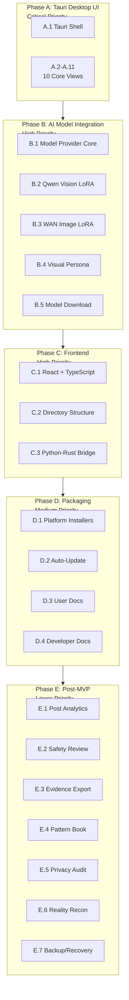
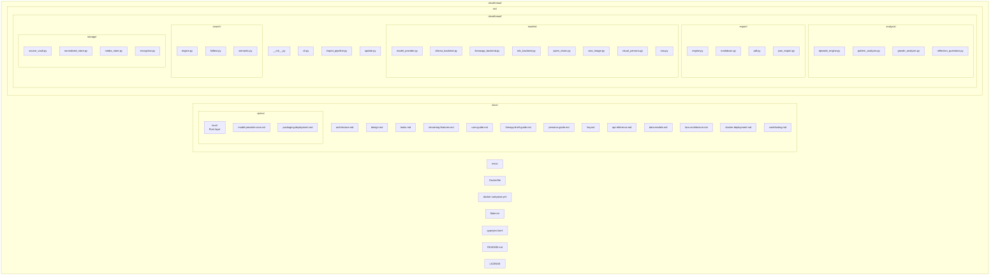

# ClearThread Remaining Features Plan

## Executive Summary

The ClearThread backend is **complete and verified** with 258 passing unit tests and a successful Docker build. This plan details the remaining features needed to complete the product, organized by priority.

### Current State



| Area | Status | Details |
|------|--------|---------|
| **Backend Core** | Complete | All Python modules implemented |
| **Data Models** | Complete | 9 models + LoRA infrastructure |
| **Storage** | Complete | SourceDataVault, NormalizedStore, MediaStore, EncryptionLayer |
| **Import** | Complete | ZIP/directory, encoding fix, dedup, streaming |
| **Analysis** | Complete | EpisodeEngine, PatternAnalyzer, GrowthAnalyzer, ReflectionQuestionGenerator |
| **Search** | Complete | FullText, Semantic, unified SearchEngine |
| **Export** | Complete | Markdown, PDF, JSON |
| **LoRA** | Complete | Adapters, composition, personas, presets |
| **CLI** | Complete | import, analyze, search, export, serve |
| **Docker** | Complete | Multi-stage build, CUDA/MPS/ROCm |
| **Tests** | Complete | 258 unit tests passing |
| **Tauri UI** | Pending | Rust + React frontend |
| **Model Provider** | Partial | LoRA done; Ollama/llama.cpp/MLX backends pending |
| **Vision LoRA** | Partial | Schema done; Qwen2.5-VL integration pending |
| **Image LoRA** | Partial | Schema done; WAN 2.1 integration pending |
| **Packaging** | Partial | Docker done; platform installers pending |
| **Documentation** | Partial | Core docs exist; detailed specs created |

## Spec Files Created

| File | Description |
|------|-------------|
| [`docs/remaining-features.md`](../docs/remaining-features.md) | Comprehensive remaining features spec |
| [`docs/specs/tauri-ui-shell.md`](../docs/specs/tauri-ui-shell.md) | Tauri UI Shell specification |
| [`docs/specs/model-provider-core.md`](../docs/specs/model-provider-core.md) | Model Provider Core specification |
| [`docs/specs/packaging-deployment.md`](../docs/specs/packaging-deployment.md) | Packaging and Deployment specification |

## Implementation Phases



### Phase A: Tauri Desktop UI (Critical Priority)

**Files to create:** ~20 files
**Files to modify:** ~1 file

1. **A.1 Tauri Application Shell** - Rust Tauri 2.0 with React frontend
2. **A.2-A.11** - 10 core views (Import Dashboard, Relationship Library, Timeline, Episode Inbox, Pattern Findings, Therapy Brief Builder, Growth View, Evidence Reader, Export Center, Settings)

### Phase B: AI Model Integration (High Priority)

**Files to create:** ~12 files
**Files to modify:** ~4 files

1. **B.1 Model Provider Core** - Ollama, llama.cpp, MLX backends
2. **B.2 Qwen Vision LoRA** - Qwen2.5-VL integration
3. **B.3 WAN Image LoRA** - WAN 2.1 integration
4. **B.4 Visual Persona Composition** - Qwen + WAN combination
5. **B.5 Model Download/Caching** - Download and cache management

### Phase C: Frontend Implementation (High Priority)

**Files to create:** ~15 files

1. **C.1 React + TypeScript frontend**
2. **C.2 Directory structure**
3. **C.3 Python-Rust communication**

### Phase D: Packaging and Deployment (Medium Priority)

**Files to create:** ~15 files
**Files to modify:** ~2 files

1. **D.1 Platform installers** (.deb, .dmg, .msi)
2. **D.2 Auto-update mechanism**
3. **D.3 User documentation** (4 docs)
4. **D.4 Developer documentation** (6 docs)

### Phase E: Post-MVP Features (Lower Priority)

**Files to create:** ~10 files
**Files to modify:** ~2 files

1. **E.1 Post and engagement analytics (R29)**
2. **E.2 Relationship safety review (R30)**
3. **E.3 Evidence export packages (R31)**
4. **E.4 Cross-relationship pattern book (R32)**
5. **E.5 Privacy and oversharing audit (R33)**
6. **E.6 Reality reconstruction (R34)**
7. **E.7 Backup and recovery (R36)**

## File Structure After Implementation



```
clearthread/
├── docs/
│   ├── architecture.md
│   ├── design.md
│   ├── tasks.md
│   ├── remaining-features.md
│   ├── specs/
│   │   ├── tauri-ui-shell.md
│   │   ├── model-provider-core.md
│   │   └── packaging-deployment.md
│   ├── user-guide.md
│   ├── therapy-brief-guide.md
│   ├── persona-guide.md
│   ├── faq.md
│   ├── api-reference.md
│   ├── data-models.md
│   ├── lora-architecture.md
│   ├── docker-deployment.md
│   └── contributing.md
├── src/
│   ├── clearthread/
│   │   ├── __init__.py
│   │   ├── cli.py
│   │   ├── import_pipeline.py
│   │   ├── analysis/
│   │   ├── export/
│   │   ├── models/
│   │   │   ├── model_provider.py (NEW)
│   │   │   ├── ollama_backend.py (NEW)
│   │   │   ├── llamacpp_backend.py (NEW)
│   │   │   ├── mlx_backend.py (NEW)
│   │   │   ├── qwen_vision.py (NEW)
│   │   │   ├── wan_image.py (NEW)
│   │   │   ├── visual_persona.py (NEW)
│   │   │   └── lora.py (MODIFIED)
│   │   ├── search/
│   │   ├── storage/
│   │   └── update.py (NEW)
│   └── tauri/ (NEW)
│       ├── Cargo.toml
│       ├── build.rs
│       ├── tauri.conf.json
│       ├── src/
│       └── dist/
├── tests/
├── Dockerfile
├── docker-compose.yml
├── flake.nix
├── pyproject.toml
├── README.md
└── LICENSE
```

## Summary

- **Total files to create:** ~72
- **Total files to modify:** ~9
- **Total remaining work:** ~81 files
